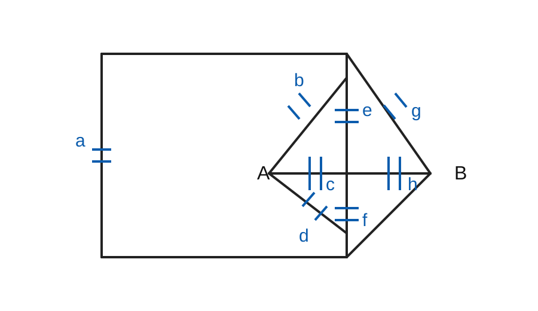
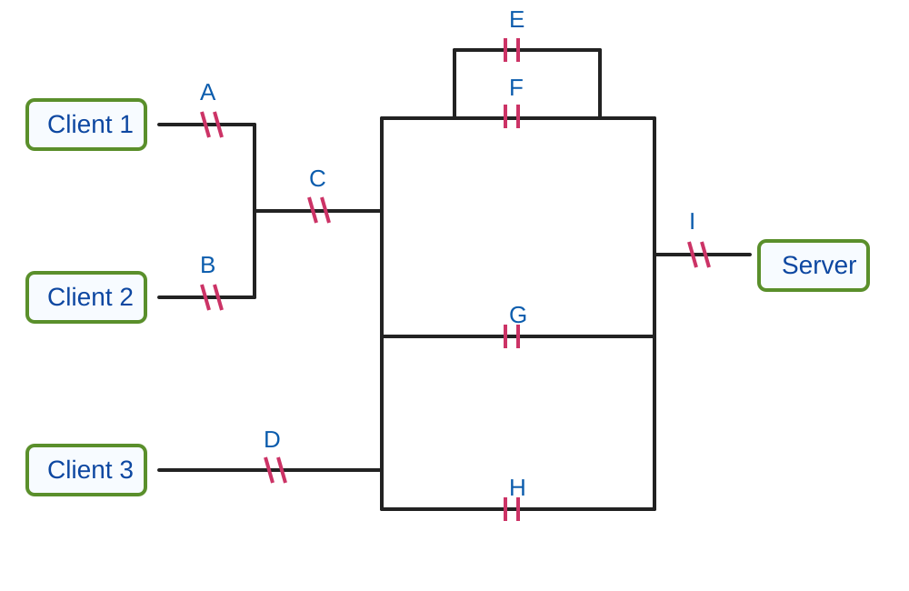
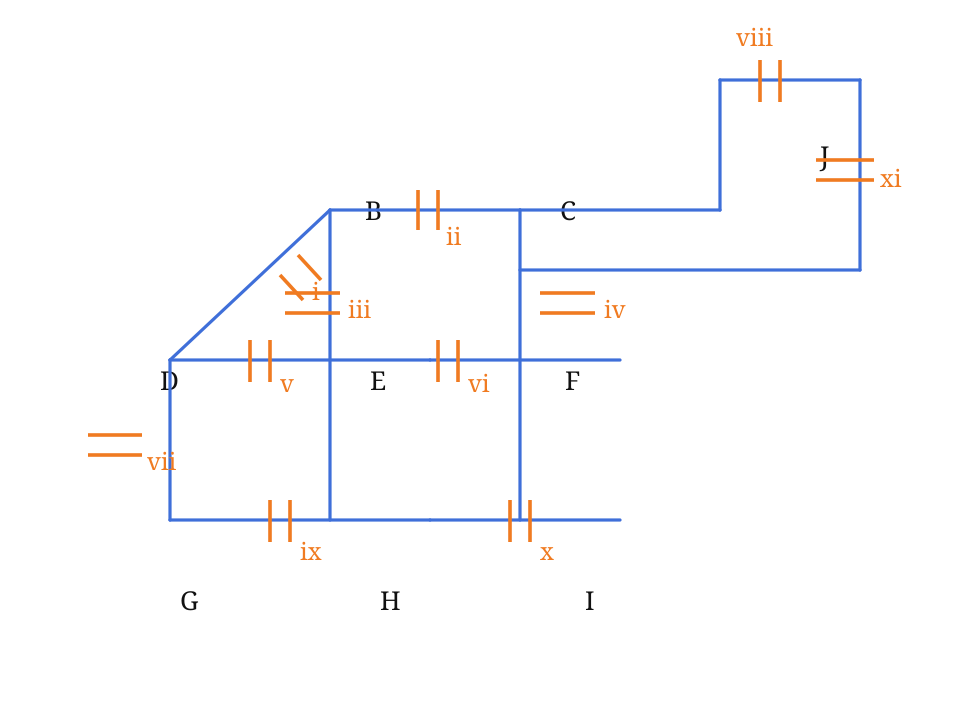

## Keterangan

Dokumen ini menggabungkan seluruh soal dan jawaban yang muncul pada thread ini ke dalam satu berkas Quarto.  
Topologi jaringan digambar ulang dalam format vektor (`.svg`) agar tetap tajam saat dirender.

> Catatan: untuk soal terakhir (UTS 2022), topologi digambar ulang berdasarkan interpretasi visual dari gambar sumber.  
> Solusi numerik mengikuti hasil diskusi pada thread.

---

## Soal 1 — Jaringan 8 Link antara A dan B

### Topologi hasil ekstraksi dan gambar ulang

{fig-alt="Topologi 8 link antara A dan B" width=80%}

### Pernyataan soal

Probabilitas sebuah link bekerja dengan baik adalah $0.6$.

1. Jika sistem diamati pada waktu acak, berapa kemungkinan:
   - tepat dua link bekerja dengan baik?
   - link $g$ dan tepat satu link lagi bekerja dengan baik?
2. Jika secara bersamaan tepat enam link tidak bekerja dengan baik, berapa kemungkinan $A$ dapat berkomunikasi dengan $B$?

### Solusi

Misalkan $X$ = banyaknya link yang bekerja baik. Karena ada 8 link independen dan tiap link ON dengan peluang $0.6$, maka:

$$
X \sim \mathrm{Binomial}(8,0.6)
$$

#### (a)(i) Tepat dua link bekerja baik

$$
P(X=2)=\binom{8}{2}(0.6)^2(0.4)^6
$$

$$
=28(0.36)(0.004096)=0.04128768
$$

**Jawaban:**

$$
\boxed{P(\text{tepat 2 link baik}) \approx 0.0413}
$$

#### (a)(ii) Link $g$ ON dan tepat satu link lain ON

Ada dua cara menuliskannya, dan keduanya ekuivalen:

$$
P(g\text{ ON dan tepat 1 link lain ON})
=
\binom{7}{1}(0.6)^2(0.4)^6
$$

atau

$$
P(g\text{ ON})\cdot P(\text{tepat 1 dari 7 link lain ON})
=
0.6\cdot \binom{7}{1}(0.6)^1(0.4)^6
$$

Keduanya memberi hasil yang sama:

$$
7(0.6)^2(0.4)^6
=
0.01032192
$$

**Jawaban:**

$$
\boxed{P(g\text{ ON dan tepat 1 link lain ON}) \approx 0.01032}
$$

#### (b) Diketahui tepat 6 link OFF

Berarti tepat 2 link ON. Semua pasangan 2-link-ON dianggap sama mungkin.

Total pasangan link ON:

$$
\binom{8}{2}=28
$$

Dari topologi, agar $A$ dapat berkomunikasi dengan $B$ ketika hanya ada 2 link ON, pasangan ON yang efektif adalah dua jalur dua-link langsung:
- $\{b,g\}$
- $\{c,h\}$

Jadi banyak pasangan yang menguntungkan ada 2.

$$
P(A\leftrightarrow B \mid \text{tepat 6 OFF})
=
\frac{2}{28}=\frac{1}{14}
$$

**Jawaban:**

$$
\boxed{\frac{1}{14}\approx 0.0714}
$$

### Ringkasan jawaban Soal 1

$$
\boxed{(a)(i)=0.0413}
\qquad
\boxed{(a)(ii)=0.01032}
\qquad
\boxed{(b)=\frac{1}{14}\approx 0.0714}
$$

---

## Soal 2 — Jaringan 3 Client dan 1 Server

### Topologi hasil ekstraksi dan gambar ulang

{fig-alt="Topologi router untuk 3 client dan 1 server" width=88%}

### Pernyataan soal

Setiap simbol `||` melambangkan sebuah router yang menghubungkan koneksi antara 3 client dan 1 server.  
Satu-satunya hal yang memutus rute adalah router yang OFF.  
Status router hanya ada dua: $\{ON, OFF\}$.  
Semua router independen dan:

$$
P(ON)=0.8
$$

Dengan label router $A,B,C,D,E,F,G,H,I$, tentukan:

1. $P(\text{Client 1 terhubung dengan Client 2})$
2. $P(\text{Client 1, Client 2, dan Client 3 terhubung satu sama lain})$
3. $P(\text{Client 1 terhubung dengan Client 3 dan keduanya terhubung dengan server})$
4. Diketahui tepat 4 router OFF, sisanya ON. Berapa $P(\text{Client 1 terhubung dengan server})$?
5. Diketahui tepat 3 router OFF, sisanya ON. Berapa $P(\text{Client 1 terhubung dengan server})$?

### Solusi

#### (a) Client 1 terhubung dengan Client 2

Agar Client 1 terhubung dengan Client 2, cukup:

- $A$ ON
- $B$ ON

Maka:

$$
P = 0.8^2 = 0.64
$$

$$
\boxed{0.64}
$$

#### (b) Client 1, Client 2, dan Client 3 saling terhubung

Agar ketiganya saling terhubung:

- $A$ ON
- $B$ ON
- $C$ ON
- $D$ ON

Maka:

$$
P = 0.8^4 = 0.4096
$$

$$
\boxed{0.4096}
$$

#### (c) Client 1 terhubung dengan Client 3 dan keduanya terhubung dengan server

Syaratnya:

- $A,C,D,I$ ON
- minimal satu dari $E,F,G,H$ ON

Maka:

$$
P = 0.8^4\left(1-0.2^4\right)
$$

$$
=0.4096(0.9984)=0.40894464
$$

$$
\boxed{0.40894464}
$$

#### (d) Tepat 4 router OFF

Berarti tepat 5 router ON.  
Kita hitung secara kombinatorial bersyarat.

Total konfigurasi 5 router ON:

$$
\binom{9}{5}=126
$$

Agar Client 1 terhubung ke server, router yang wajib ON:

- $A,C,I$
- minimal satu dari $\{E,F,G,H\}$

Karena $A,C,I$ wajib ON, kita memilih 2 router tambahan dari $\{B,D,E,F,G,H\}$, tetapi tidak boleh hanya $\{B,D\}$.

$$
\binom{6}{2}=15
$$

Konfigurasi gagal hanya 1, yaitu $\{B,D\}$.  
Jadi konfigurasi menguntungkan:

$$
15-1=14
$$

Maka:

$$
P=\frac{14}{126}=\frac{1}{9}
$$

$$
\boxed{\frac{1}{9}\approx 0.1111}
$$

#### (e) Tepat 3 router OFF

Berarti tepat 6 router ON.

Total konfigurasi:

$$
\binom{9}{6}=84
$$

Tetap perlu $A,C,I$ ON dan minimal satu dari $\{E,F,G,H\}$ ON.  
Sekarang kita memilih 3 router tambahan dari $\{B,D,E,F,G,H\}$.

$$
\binom{6}{3}=20
$$

Tidak mungkin semua 3 dipilih hanya dari $\{B,D\}$, jadi semua 20 pilihan valid.

$$
P=\frac{20}{84}=\frac{5}{21}
$$

$$
\boxed{\frac{5}{21}\approx 0.2381}
$$

### Ringkasan jawaban Soal 2

$$
\boxed{a=0.64}
\qquad
\boxed{b=0.4096}
\qquad
\boxed{c=0.40894464}
$$

$$
\boxed{d=\frac{1}{9}\approx 0.1111}
\qquad
\boxed{e=\frac{5}{21}\approx 0.2381}
$$

---

## Soal 3 — UTS 2022 Soal 5 Sistem Komunikasi

### Topologi hasil ekstraksi dan gambar ulang

{fig-alt="Topologi link komunikasi UTS 2022" width=82%}

### Pernyataan soal

Setiap elemen `||` melambangkan sebuah link komunikasi.  
Failure antar-link saling independen.  
Peluang sebuah link bekerja baik adalah:

$$
p = 0.9\delta_3 = 0.9 + 0.01\delta_3
$$

Dengan 3 digit terakhir NIM mahasiswa = **1, 2, 3**, maka:

$$
\delta_1=1,\quad \delta_2=2,\quad \delta_3=3
$$

sehingga:

$$
p=0.9+0.01(3)=0.93
$$

Soal:

1. Diketahui tepat 7 link tidak bekerja (4 link ON), probabilitas $D$ dapat berkomunikasi dengan $J$.
2. Diketahui tepat 8 link tidak bekerja (3 link ON), probabilitas $D$ dapat berkomunikasi dengan $J$.
3. Diketahui link $i,v,vii,ix,x$ pasti tidak bekerja, probabilitas $I$ dapat berkomunikasi dengan $J$.
4. Diketahui link $ii,iv,vi,viii,x,xi$ pasti tidak bekerja, probabilitas $B$ dapat berkomunikasi dengan $G$.

### Solusi dan jawaban akhir

#### (a) Tepat 7 link OFF

Dengan pendekatan kombinatorial pada 11 link, diperoleh:

- total konfigurasi 4-link-ON:

$$
\binom{11}{4}=330
$$

- konfigurasi yang membuat $D$ terhubung ke $J$: 31

Maka:

$$
P(D\leftrightarrow J \mid \text{tepat 4 ON})
=
\frac{31}{330}
=
0.093939\ldots
$$

Dibulatkan 3 angka di belakang desimal:

$$
\boxed{0.094}
$$

#### (b) Tepat 8 link OFF

- total konfigurasi 3-link-ON:

$$
\binom{11}{3}=165
$$

- konfigurasi yang membuat $D$ terhubung ke $J$: 3

Maka:

$$
P(D\leftrightarrow J \mid \text{tepat 3 ON})
=
\frac{3}{165}
=
\frac{1}{55}
=
0.0181818\ldots
$$

Dibulatkan 3 angka di belakang desimal:

$$
\boxed{0.018}
$$

#### (c) Link $i,v,vii,ix,x$ pasti OFF

Dari hasil diskusi thread, peluang $I$ terhubung ke $J$ ditulis:

$$
P = p + (1-p)\,p\,(p+p^3-p^4)
$$

Dengan $p=0.93$:

$$
P = 0.93 + 0.07 \cdot 0.93 \cdot (0.93+0.93^3-0.93^4)
=0.994208454849
$$

Dibulatkan 4 angka di belakang desimal:

$$
\boxed{0.9942}
$$

#### (d) Link $ii,iv,vi,viii,x,xi$ pasti OFF

Dari hasil diskusi thread, peluang $B$ terhubung ke $G$ adalah:

$$
P=(1-p)(2p^2-p^4)+p(2p-p^2)^2
$$

Dengan $p=0.93$:

$$
P=(0.07)(2\cdot0.93^2-0.93^4)+0.93(2\cdot0.93-0.93^2)^2
=0.9896306886
$$

Dibulatkan 4 angka di belakang desimal:

$$
\boxed{0.9896}
$$

### Ringkasan jawaban Soal 3

$$
\boxed{a=0.094}
\qquad
\boxed{b=0.018}
\qquad
\boxed{c=0.9942}
\qquad
\boxed{d=0.9896}
$$

---

## Ringkasan seluruh hasil

### Soal 1

- $P(\text{tepat 2 link baik}) = \boxed{0.0413}$
- $P(g \text{ ON dan tepat 1 link lain ON}) = \boxed{0.01032}$
- $P(A\leftrightarrow B \mid \text{tepat 6 OFF}) = \boxed{\frac{1}{14}\approx 0.0714}$

### Soal 2

- $P(\text{Client 1 terhubung Client 2}) = \boxed{0.64}$
- $P(\text{Client 1,2,3 saling terhubung}) = \boxed{0.4096}$
- $P(\text{Client 1 dan Client 3 terhubung ke server}) = \boxed{0.40894464}$
- $P(\text{Client 1 ke server} \mid 4\text{ OFF}) = \boxed{\frac{1}{9}\approx 0.1111}$
- $P(\text{Client 1 ke server} \mid 3\text{ OFF}) = \boxed{\frac{5}{21}\approx 0.2381}$

### Soal 3

- $\boxed{0.094}$
- $\boxed{0.018}$
- $\boxed{0.9942}$
- $\boxed{0.9896}$

---

## Berkas pendukung

- `figures/topology_soal1.svg`
- `figures/topology_soal2.svg`
- `figures/topology_soal3.svg`

Dokumen ini siap dipakai sebagai bahan kuliah, arsip pembahasan, atau dasar untuk dirender menjadi HTML/PDF melalui Quarto.
