# Bab 1. Pendahuluan: Tinjauan Umum atas Buku DNA TISE

## Mengapa Buku DNA Diperlukan

Dalam praktik, inovasi TISE level 5 tidak lahir hanya dari rancangan teoretis, tetapi dari kemampuan banyak pihak untuk membaca visi bersama, memahami perannya, serta menjalankan kontribusinya secara serempak. Karena itu, monograf ini perlu berfungsi seperti **DNA**, yaitu sebagai naskah acuan yang dapat dibaca bersama oleh para stakeholder. Buku ini adalah bagian dari **proses peningkatan readiness** itu sendiri. Gagasan umum tersebut divisualisasikan pada @fig-p0-01, yang memperlihatkan Buku DNA sebagai penghubung antara rekayasawan, stakeholder, agents, dan evolusi rekayasa kemanusiaan.

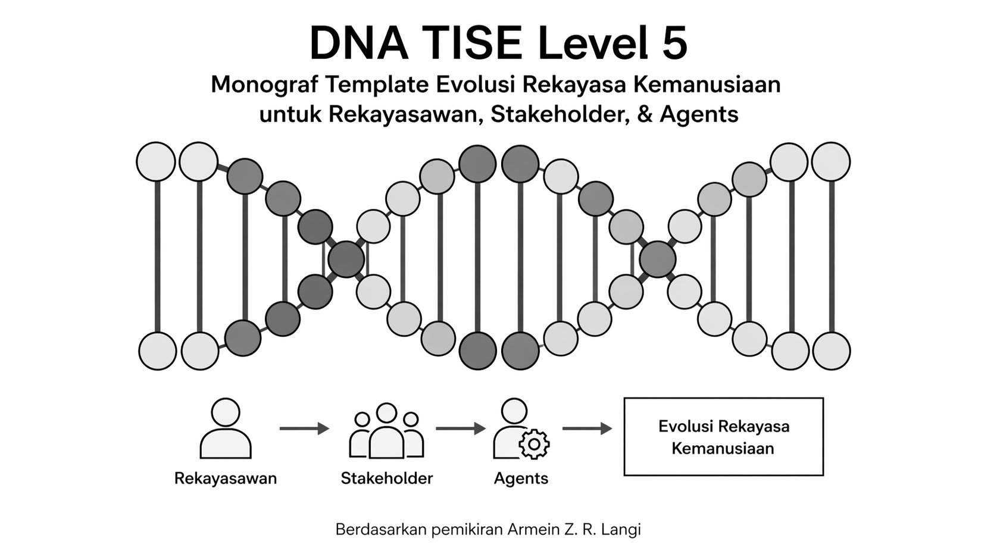{#fig-p0-01}

TISE level 5 memobilisasi para stakeholder agar bersama-sama menjalankan bagiannya untuk mewujudkan misi masing-masing. Namun, konfigurasi stakeholder dan *arrangement* yang mungkin dibentuk biasanya tidak unik. Beberapa konfigurasi dapat sama-sama layak. Karena itu, rekayasa TISE level 5 memerlukan penetapan **visi konfigurasi terbaik**, yaitu konfigurasi yang paling feasible, paling adil, paling produktif, dan paling bermakna bagi keseluruhan sistem. Pergeseran dari rekayasa yang berpusat pada mesin ke rekayasa yang berpusat pada konfigurasi misi dan makna diringkas dalam @fig-p0-02.

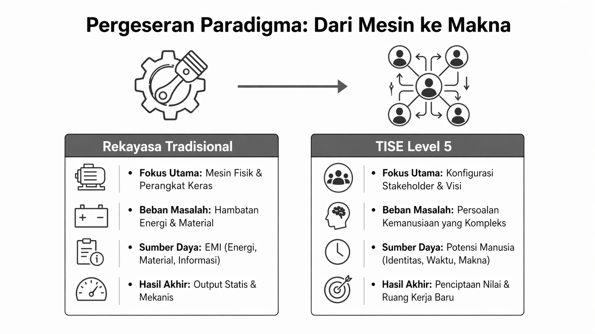{#fig-p0-02}

## Fungsi Ganda Monograf

Monograf ini menjalankan fungsi ganda:

1. sebagai **rujukan konseptual** tentang evolusi rekayasa dari TISE level 0 sampai TISE level 5;
2. sebagai **template DNA** yang dapat dipakai ulang oleh rekayasawan;
3. sebagai **instrumen peningkatan readiness stakeholder**;
4. sebagai **sumber pertanyaan teknis** yang dapat dijawab oleh stakeholder;
5. sebagai **bahan mentah bagi agents** untuk menyusun Dokumen DNA operasional.

Sebagai rujukan konseptual, buku ini perlu menampilkan anatomi keseluruhan tumpukan TISE. Susunan bertingkat dari level 5 sampai level 0 dapat dilihat pada @fig-p0-03, yang memperlihatkan bagaimana visi kemanusiaan tingkat tinggi diturunkan bertahap sampai ke realitas teknis tingkat dasar.

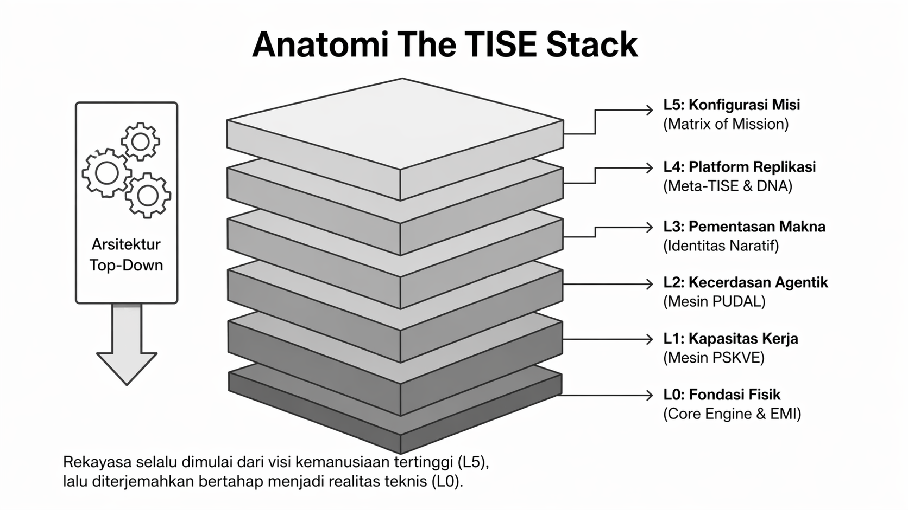{#fig-p0-03}

## Struktur Buku

Struktur buku ini sengaja disusun dari atas ke bawah. Setelah bab pendahuluan yang memberi gambaran utuh, bagian utama dimulai dari TISE level 5 sebagai level tertinggi, lalu turun bertahap sampai TISE level 0. Susunan ini dipilih karena dalam praktik rekayasa kemanusiaan, orientasi solusi harus berangkat dari level tertinggi, yaitu level misi, konfigurasi stakeholder, dan visi sistem, lalu diterjemahkan bertahap ke level yang lebih rendah sampai ke mesin teknis.

Pembagian hirarkis ini memiliki satu benang merah rekayasa yang sama, yaitu **memobilisasi sumber daya yang melimpah untuk dikonversikan menjadi kerja secara terkendali sehingga menghasilkan nilai yang berharga**. Nilai itu dapat hadir sebagai kemampuan untuk mencapai output, behavior, fungsi, target, tujuan, atau misi yang diinginkan. Dalam kerangka ini, level-level yang lebih tinggi memberikan **konteks, arah, dan motivasi**, sedangkan level-level yang lebih rendah memberikan **tumpuan realitas, keterlaksanaan, dan keandalan**. Karena itu, seluruh hirarki TISE perlu dibaca bukan sebagai pecahan-pecahan yang terpisah, melainkan sebagai satu rantai rekayasa yang utuh dari visi sampai realisasi. Relasi top-down ini diperdalam lagi pada @fig-p0-08, yang menempatkan benang merah evolusi rekayasa di tengah seluruh level.

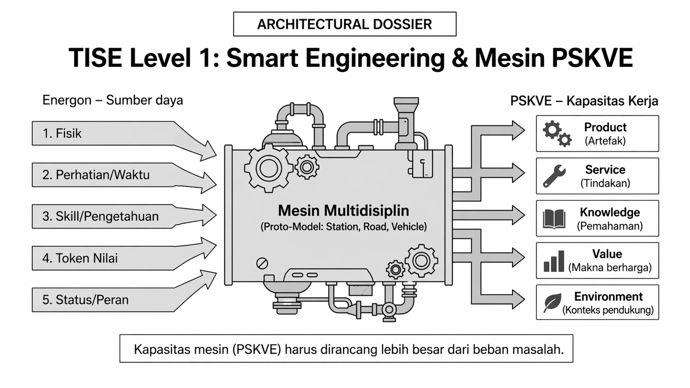{#fig-p0-08}

## Posisi terhadap Literatur

Secara literatur, monograf ini berdiri di atas tradisi Product-Service Systems (PSS), stakeholder motivation matrix, multi-stakeholder requirements, dan stakeholder engagement [@morelli2002; @vezzoli2014; @berkovich2014; @sholihah2019; @giordano2018; @lievens2021]. Namun, monograf ini melangkah lebih jauh dengan memindahkan fokus dari motivasi ke **misi**, dari peta aktor ke **konfigurasi stakeholder**, dan dari alat representasi ke **Buku DNA** yang membimbing pembentukan solusi secara bertingkat.

Untuk membantu pembaca memahami posisi kebaruan tersebut, pendahuluan ini juga menampilkan ringkasan visual setiap level utama yang nanti dijabarkan rinci pada bab-bab berikutnya. Pada TISE level 5, fokusnya adalah pusat keunggulan, konfigurasi misi, Matrix of Mission, dan readiness stakeholder sebagaimana ditunjukkan pada @fig-p0-04.

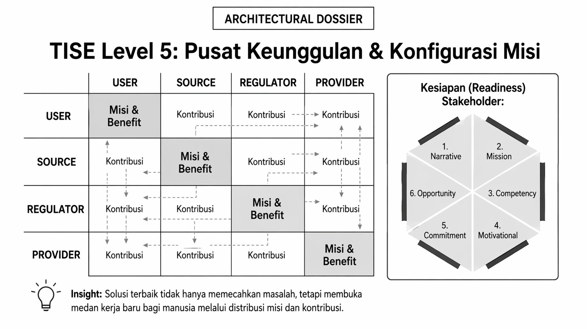{#fig-p0-04}

Pada TISE level 4, fokusnya bergeser ke **Meta-TISE**, yaitu reproduksi DNA desain dan kelahiran artefak anak dari platform yang sudah terbukti, seperti diringkas pada @fig-p0-05.

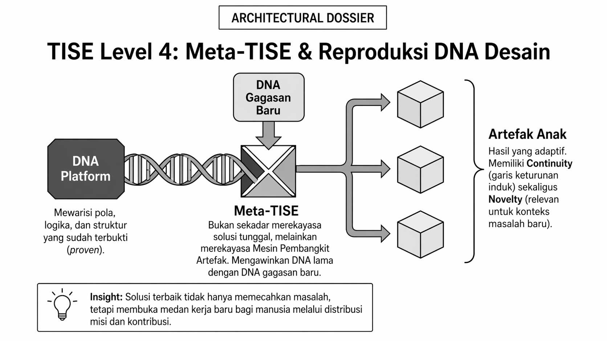{#fig-p0-05}

Pada TISE level 3, pusat perhatian berada pada **identitas naratif**, **misi naratif**, dan **teater solusi** yang memungkinkan manusia memaknai perannya, sebagaimana divisualisasikan pada @fig-p0-06.

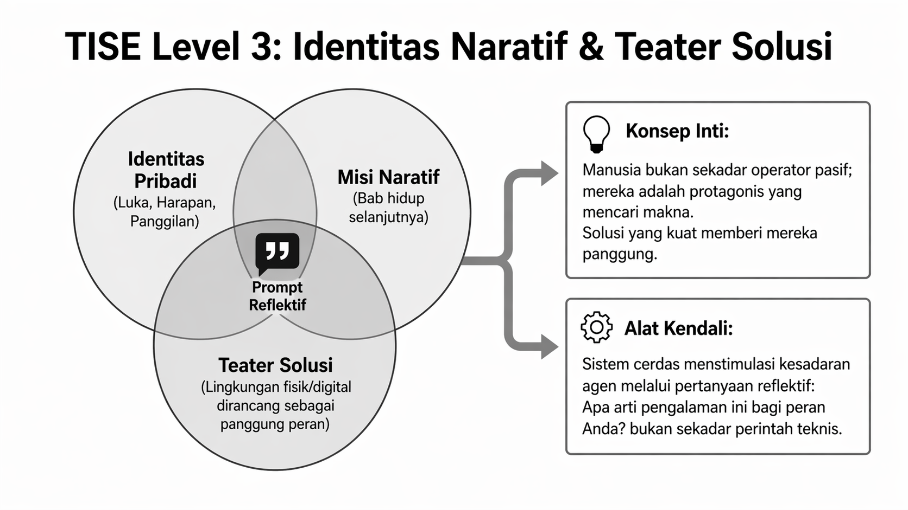{#fig-p0-06}

Pada TISE level 2, sistem memasuki ranah **mesin PUDAL** dan orkestrasi kecerdasan, di mana Natural Intelligence, Collective Intelligence, dan Artificial Intelligence berinteraksi melalui natural language prompting seperti terlihat pada @fig-p0-07.

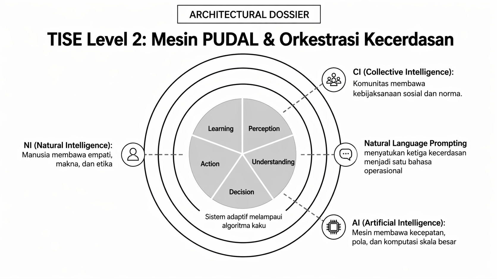{#fig-p0-07}

Pada TISE level 1, rekayasa dipahami sebagai pembangunan **kapasitas kerja** melalui mesin PSKVE yang mengonversi berbagai energon menjadi product, service, knowledge, value, dan environment. Hal ini dirangkum pada @fig-p0-09.

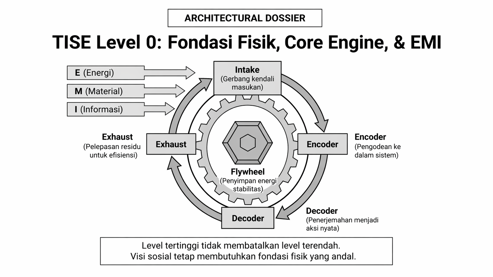{#fig-p0-09}

Pada TISE level 0, fondasi tetap berada pada **core engine**, EMI, dan teknologi dasar yang andal. Model generik inti pada level ini ditampilkan pada @fig-p0-10.

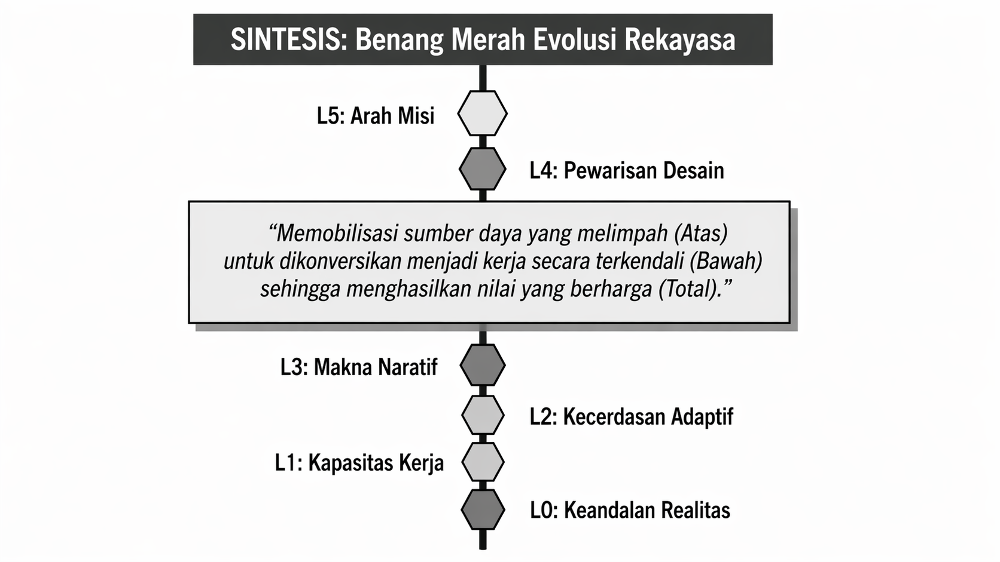{#fig-p0-10}

Untuk menunjukkan bagaimana seluruh struktur ini dapat diterapkan pada persoalan nyata, pendahuluan ini juga memperkenalkan studi kasus **healthy campus food**. Lapisan desain atasnya diperlihatkan pada @fig-p0-11, sedangkan lapisan eksekusi bawahnya diperlihatkan pada @fig-p0-12. Kedua gambar ini memberi gambaran awal bahwa satu persoalan kemanusiaan konkret dapat diturunkan dari konfigurasi misi tingkat tinggi sampai ke implementasi teknis tingkat bawah.

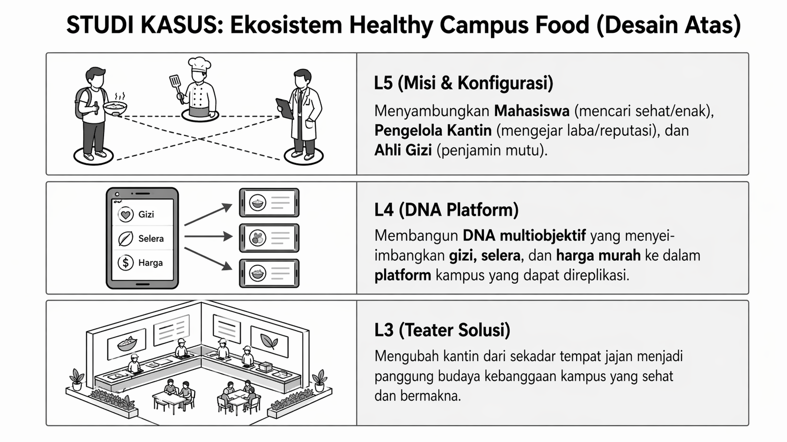{#fig-p0-11}

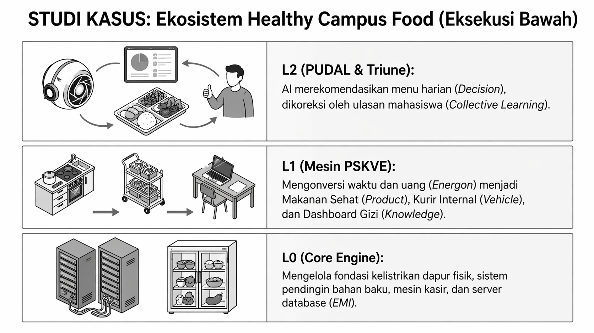{#fig-p0-12}

Akhirnya, arah praktis setelah membaca monograf ini diringkas pada @fig-p0-13. Gambar tersebut menunjukkan bahwa Buku DNA perlu ditransformasikan menjadi **Dokumen DNA Operasional** melalui implementasi MOS-7, sehingga visi tidak berhenti sebagai konsep, tetapi menjadi kerangka kerja nyata antar stakeholder.

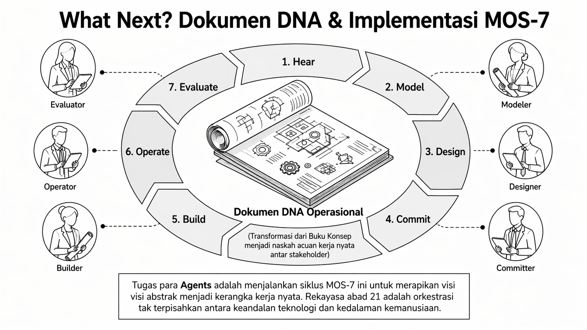{#fig-p0-13}
