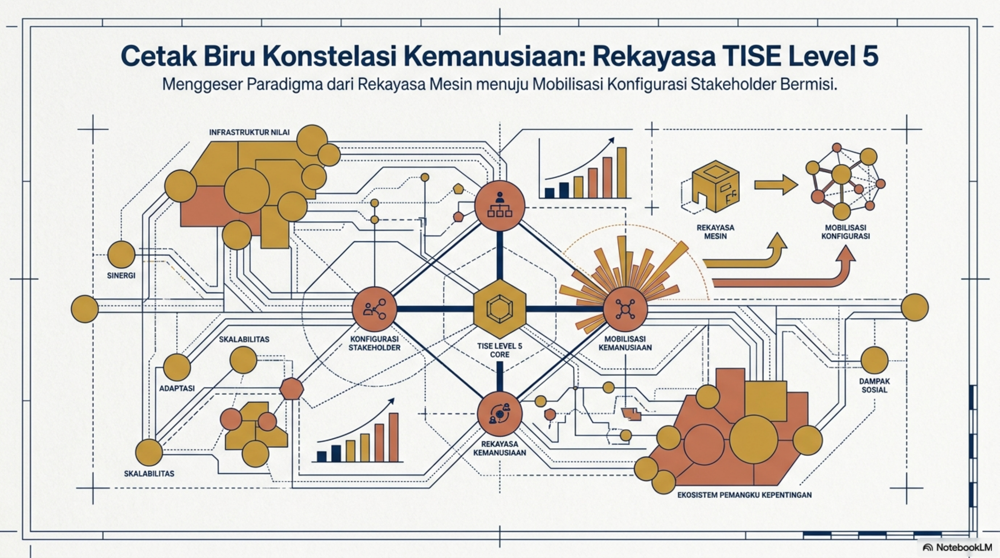
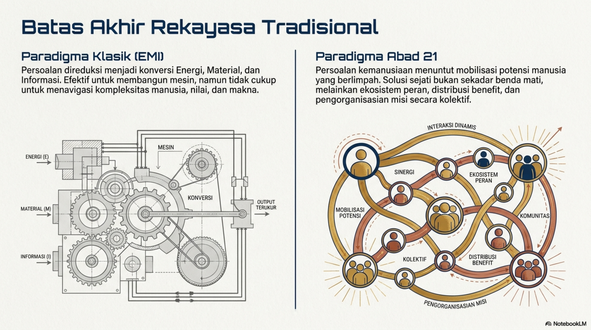
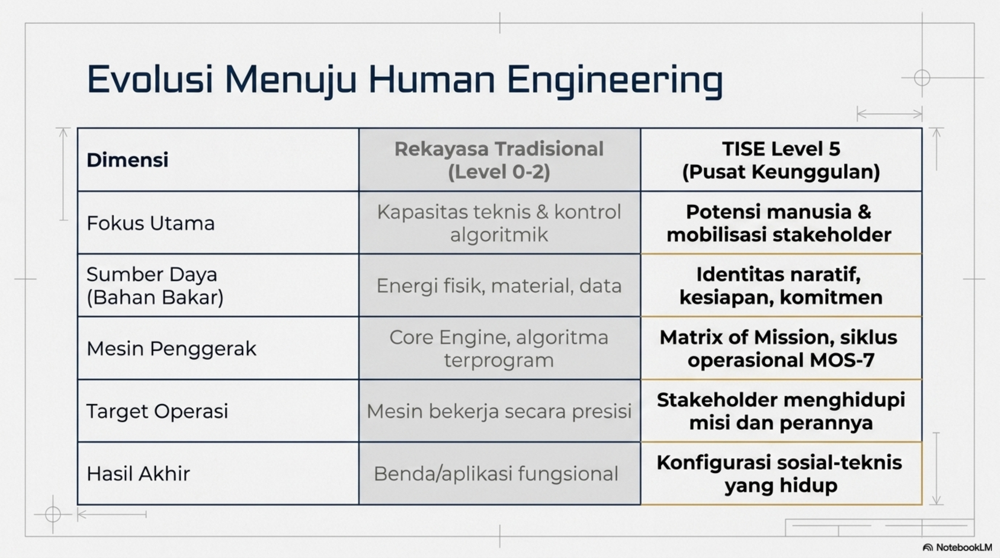
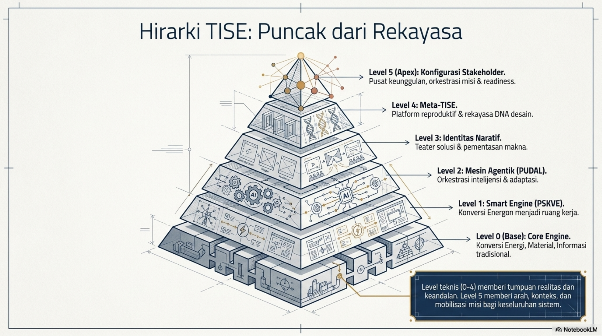
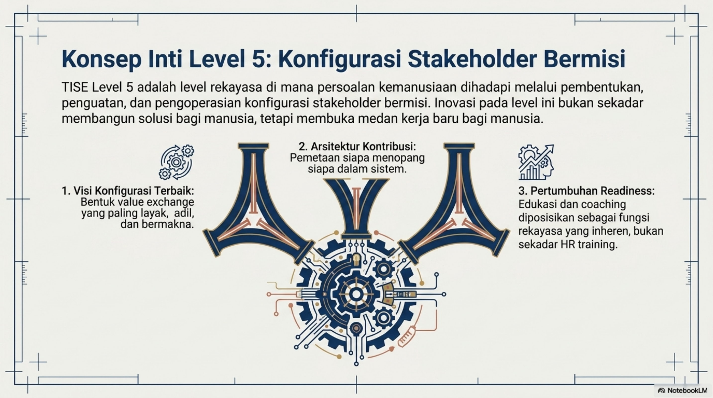

# Bab 2. TISE level 5 sebagai Pusat Keunggulan Rekayasa

Bab ini memperkenalkan TISE level 5 sebagai pergeseran paradigma dari rekayasa yang berpusat pada mesin menuju rekayasa yang berpusat pada mobilisasi konfigurasi stakeholder bermisi. Gambaran umum cetak biru ini disajikan pada @fig-p1-01, sementara batas paradigma rekayasa tradisional dan transisinya ke paradigma abad ke-21 diringkas pada @fig-p1-02. Posisi TISE level 5 dalam keseluruhan evolusi rekayasa juga dapat dilihat pada @fig-p1-03.

{#fig-p1-01 fig-align="center"}

{#fig-p1-02 fig-align="center"}

{#fig-p1-03 fig-align="center"}

## Definisi TISE level 5

**TISE level 5** adalah level rekayasa di mana TISE hadir sebagai pusat keunggulan yang memobilisasi stakeholder bermisi, agents, dan artefak cerdas untuk memecahkan persoalan kemanusiaan melalui konfigurasi stakeholder, Matrix of Mission, dan MOS-7. Esensi definisi ini diringkas kembali pada @fig-p1-04, yang menekankan tiga komponen inti: visi konfigurasi terbaik, arsitektur kontribusi, dan pertumbuhan readiness.

{#fig-p1-04 fig-align="center"}

## Misi Utama

Misi utama TISE level 5 adalah **memobilisasi potensi manusia yang berlimpah untuk memecahkan persoalan kemanusiaan**. Dengan demikian, TISE level 5 tidak hanya membangun solusi bagi manusia, tetapi juga membuka medan kerja baru bagi manusia. Di tingkat operasional, misi ini dijalankan melalui tiga mesin penggerak yang bekerja serempak sebagaimana divisualisasikan pada @fig-p1-05.

{#fig-p1-05 fig-align="center"}

## Visi Konfigurasi Terbaik

Karena konfigurasi stakeholder dan *arrangement* solusi tidak unik, TISE level 5 harus berangkat dari sebuah **visi konfigurasi terbaik**. Visi ini menyatakan bentuk konfigurasi stakeholder yang ingin diwujudkan, jenis hubungan yang perlu dibangun, bentuk value exchange yang diinginkan, serta keadaan akhir yang dipandang layak dan bermakna. Oleh sebab itu, rekayasawan perlu membaca persoalan bukan hanya sebagai gap teknis, tetapi sebagai kebutuhan akan konfigurasi sosial-teknis yang hidup.

## Stakeholder Readiness

Dalam kenyataan, inovasi TISE level 5 memerlukan peningkatan level readiness dari stakeholder. Karena itu, rekayasa pada level ini harus mencakup proses peningkatan:

- kesadaran atas identitas naratif;
- kemampuan memformulasikan misi;
- kompetensi;
- motivasi;
- tingkat komitmen;
- kemampuan membaca opportunity.

Dengan demikian, edukasi, training, coaching, dan pembelajaran terus-menerus merupakan bagian inheren dari TISE level 5. TISE level 5 tidak boleh dipahami hanya sebagai rekayasa konfigurasi sosial, tetapi juga sebagai rekayasa **pertumbuhan manusia di dalam konfigurasi tersebut**.
