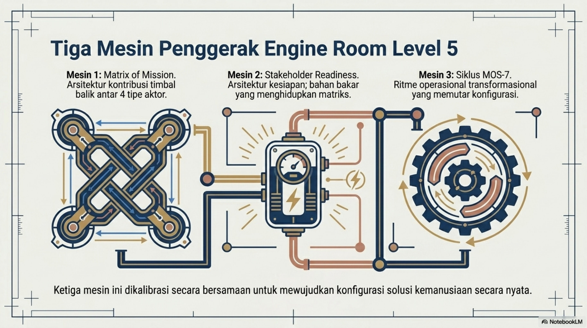
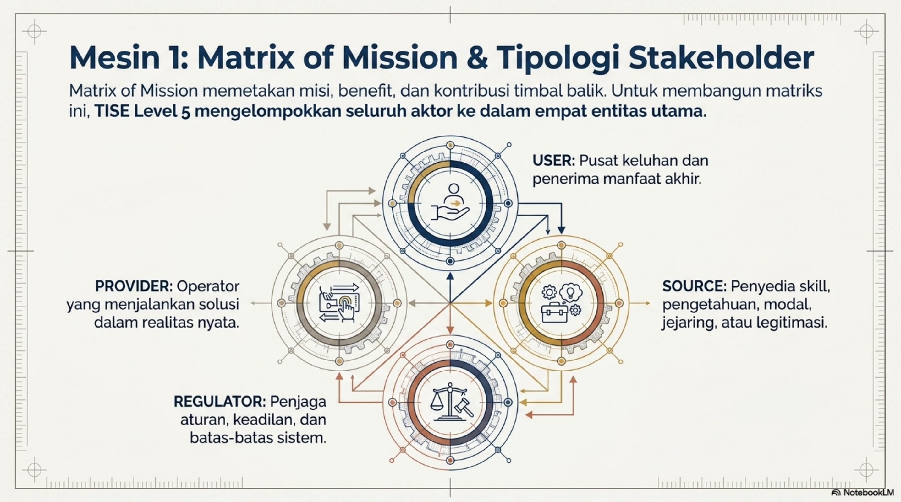
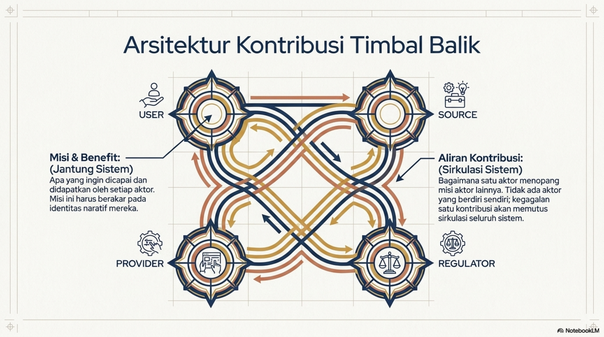
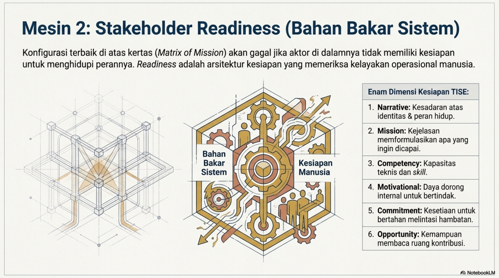
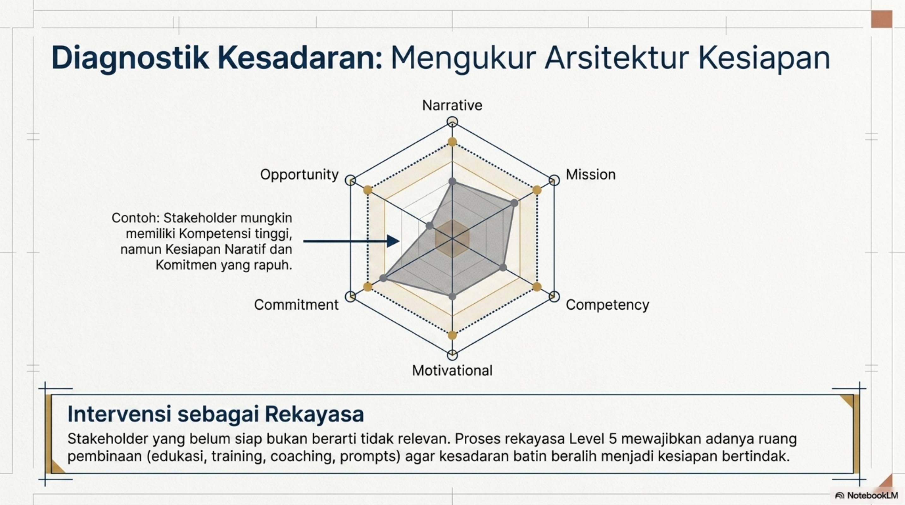

# Bab 3. Matrix of Mission, MOS-7, dan Stakeholder Readiness

Bab ini menguraikan tiga mesin utama yang menghidupkan TISE level 5, yaitu Matrix of Mission, Stakeholder Readiness, dan siklus MOS-7. Tipologi stakeholder yang menjadi fondasi Matrix of Mission ditunjukkan pada @fig-p1-06, sedangkan arsitektur kontribusi timbal balik antaraktor divisualisasikan pada @fig-p1-07.

## Matrix of Mission

**Matrix of Mission** adalah mesin utama TISE level 5. Pada diagonal utama, tiap stakeholder memuat misi yang perlu dijalankan dan benefit yang diharapkan. Pada sel non-diagonal, dimuat kontribusi yang diberikan satu stakeholder kepada stakeholder lain demi menopang terpenuhinya misi masing-masing. Struktur relasional ini diringkas secara diagramatik pada @fig-p1-07 dan secara tabel pada Tabel berikut.

{#fig-p1-06 fig-align="center"}

{#fig-p1-07 fig-align="center"}

|   | A / USER | B / SOURCE | C / REGULATOR | D / PROVIDER |
|---|---|---|---|---|
| 1 / USER | Misi USER; Benefit USER | Kontribusi USER ke SOURCE | Kontribusi USER ke REGULATOR | Kontribusi USER ke PROVIDER |
| 2 / SOURCE | Kontribusi SOURCE ke USER | Misi SOURCE; Benefit SOURCE | Kontribusi SOURCE ke REGULATOR | Kontribusi SOURCE ke PROVIDER |
| 3 / REGULATOR | Kontribusi REGULATOR ke USER | Kontribusi REGULATOR ke SOURCE | Misi REGULATOR; Benefit REGULATOR | Kontribusi REGULATOR ke PROVIDER |
| 4 / PROVIDER | Kontribusi PROVIDER ke USER | Kontribusi PROVIDER ke SOURCE | Kontribusi PROVIDER ke REGULATOR | Misi PROVIDER; Benefit PROVIDER |

: Bentuk generik Matrix of Mission

## Tipologi Stakeholder

TISE level 5 mengelompokkan stakeholder ke dalam empat tipe utama: **USER**, **SOURCE**, **REGULATOR**, dan **PROVIDER**. Pengelompokan ini membantu rekayasawan membedakan pusat keluhan, penyedia kapabilitas, penjaga batas sistem, dan operator yang menjalankan solusi di realitas lapangan.

## Stakeholder Readiness Framework

Sebagai pelengkap Matrix of Mission, monograf ini mengusulkan **Stakeholder Readiness Framework**. Framework ini memeriksa kesiapan stakeholder pada enam dimensi:

1. **Narrative readiness**;
2. **Mission readiness**;
3. **Competency readiness**;
4. **Motivational readiness**;
5. **Commitment readiness**;
6. **Opportunity readiness**.

Kerangka ini divisualisasikan pada @fig-p1-08 dan @fig-p1-09. @fig-p1-08 menekankan readiness sebagai “bahan bakar sistem”, sedangkan @fig-p1-09 menunjukkan bagaimana diagnosis kesiapan dapat dilakukan secara komparatif antardimensi.

{#fig-p1-08 fig-align="center"}

{#fig-p1-09 fig-align="center"}

## MOS-7 sebagai Siklus Operasional

MOS-7 adalah siklus rekayasa stakeholder bermisi yang terdiri dari tujuh langkah:

1. Hear / Identify;
2. Model / Discern;
3. Design / Formulate;
4. Commit / Seek;
5. Build / Co-Create;
6. Operate / Delivery;
7. Evaluate-Audit / Protect.

Ritme operasional ini digambarkan pada @fig-p1-10, yang menegaskan bahwa pekerjaan rekayasa bukan proses linear satu kali, melainkan siklus adaptif yang menjaga solusi tetap setia pada martabat manusia dan integritas misi.

{#fig-p1-10 fig-align="center"}
