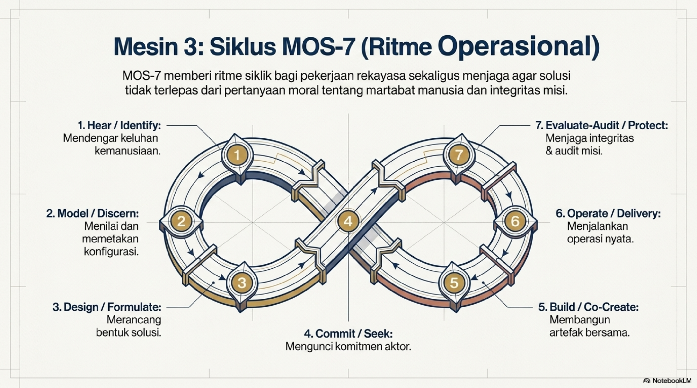
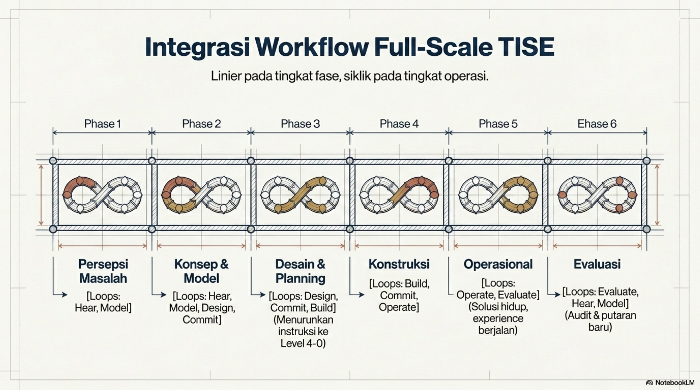
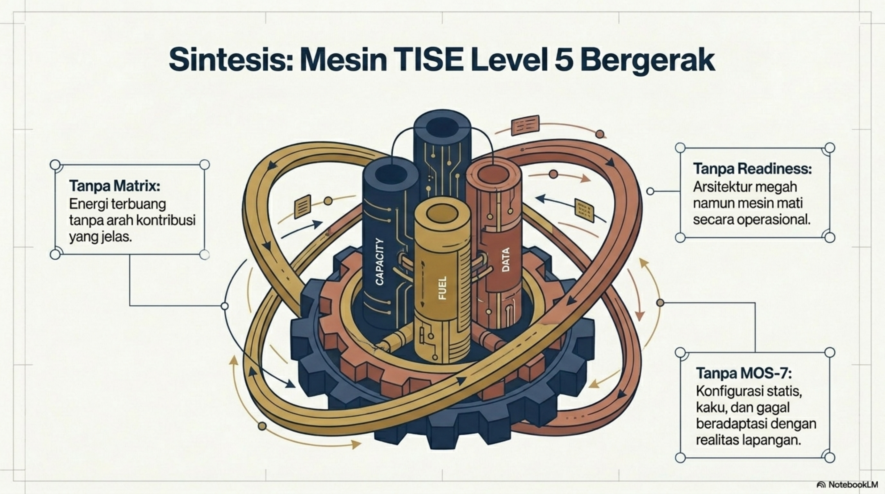
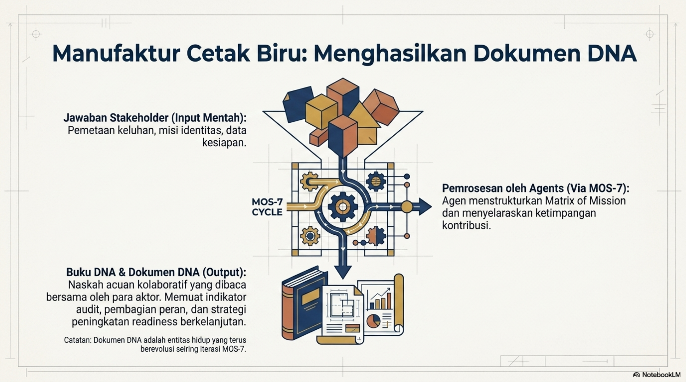
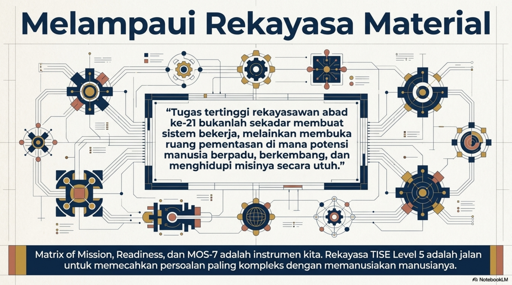

# Bab 4. Metodologi dan Workflow Rekayasa TISE level 5

## Fokus Metodologis

Metodologi pada TISE level 5 berfokus pada pembentukan konfigurasi stakeholder terbaik, penilaian readiness, pembangunan komitmen, dan orkestrasi solusi melalui MOS-7. Integrasi ketiga mesin utama itu menghasilkan arsitektur kerja yang bergerak secara utuh, sebagaimana diringkas pada @fig-p1-11.

{#fig-p1-11 fig-align="center"}

## Tabel Workflow Full-Scale

| Fase Linear | Fokus Utama | Putaran MOS-7 yang Dominan | Level TISE yang Paling Dominan | Keluaran Utama |
|---|---|---|---|---|
| Persepsi Masalah | Mendengar keluhan dan mengidentifikasi stakeholder | Hear, Model | TISE level 5 | Rumusan persoalan, alternatif konfigurasi |
| Konsep dan Model | Memilih konfigurasi terbaik | Hear, Model, Design, Commit | TISE level 5 dan 4 | Matrix of Mission terpilih, arah platform |
| Desain dan Planning | Menurunkan kebutuhan ke level 4–0 | Design, Commit, Build | TISE level 4, 3, 2, 1 | DNA platform, desain naratif, PUDAL, PSKVE |
| Konstruksi | Membangun atau memodifikasi elemen | Build, Commit, Operate | TISE level 4 sampai 0 | Artefak anak, layanan, elemen teknis |
| Operasional | Menjalankan solusi nyata | Operate, Evaluate | Seluruh level | Solusi hidup, operasi provider, experience user |
| Evaluasi | Audit, pembelajaran, redesign | Evaluate, Hear, Model | TISE level 5 | Hasil evaluasi, redesign, siklus baru |

: Workflow rekayasa TISE level 5 full-scale

Workflow ini divisualisasikan lebih lanjut pada @fig-p1-12, yang menunjukkan bahwa metodologi full-scale bersifat **linier pada tingkat fase** tetapi **siklik pada tingkat operasi**.

{#fig-p1-12 fig-align="center"}

## Contoh Kasus: Healthy Food untuk Warga Kampus

Pada level ini, pertanyaan kuncinya adalah: siapa USER utama, siapa SOURCE, siapa REGULATOR, siapa PROVIDER, dan seperti apa **visi konfigurasi terbaik** untuk memenuhi kebutuhan makanan sehat, berselera, dan terjangkau melalui sistem rekomendasi cerdas multiobjektif. Dari sudut pandang desain atas, kasus ini dapat dipetakan sebagaimana ditunjukkan pada @fig-p1-13.

{#fig-p1-13 fig-align="center"}

Pada tahap eksekusi bawah, konfigurasi ini kemudian diterjemahkan menjadi orkestrasi PUDAL, lingkungan kerja PSKVE, dan fondasi teknologi level 0 seperti pada @fig-p1-14.

{#fig-p1-14 fig-align="center"}

## Sintesis dan Hasil Dokumen DNA

Akhir dari workflow TISE level 5 bukan hanya desain abstrak, tetapi lahirnya **Dokumen DNA operasional** yang dapat dibaca dan dijalankan bersama oleh para stakeholder. Proses manufaktur cetak biru ini dirangkum pada @fig-p1-15.

{#fig-p1-15 fig-align="center"}
