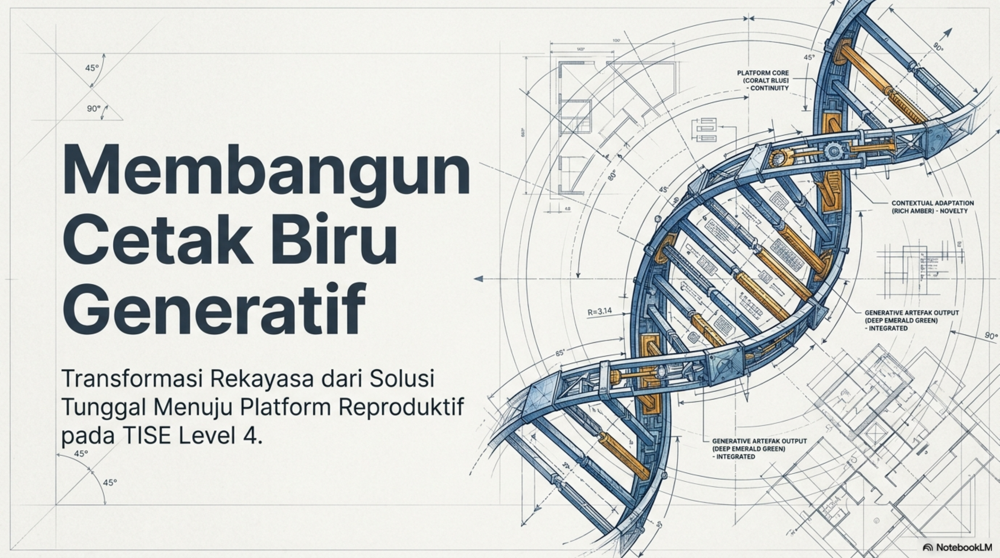
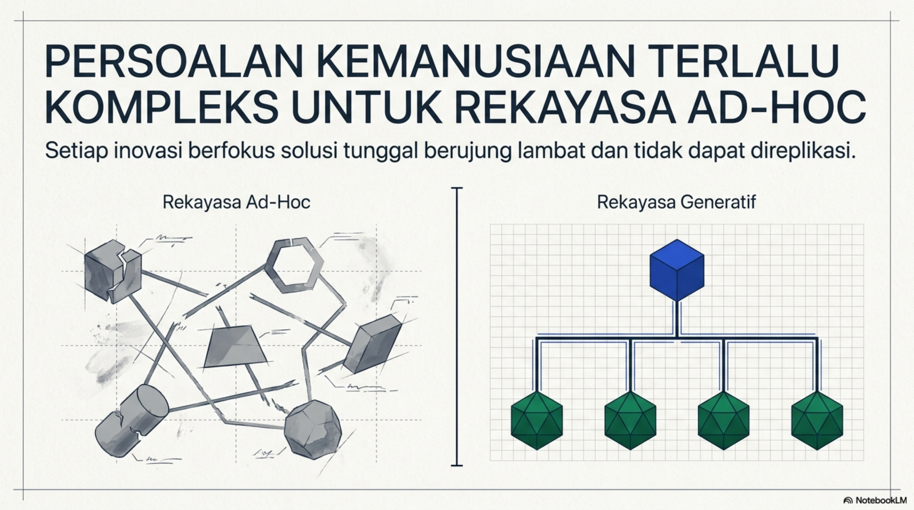
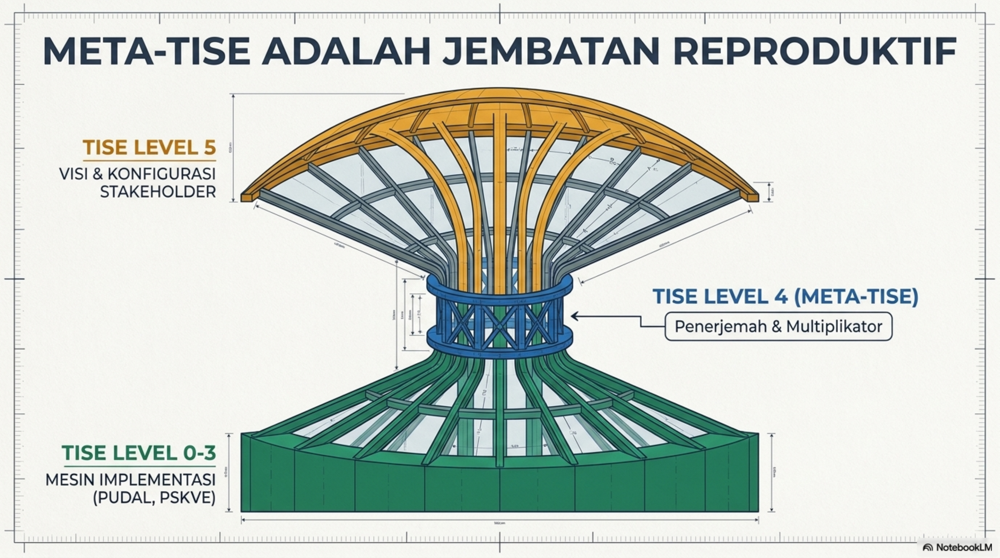
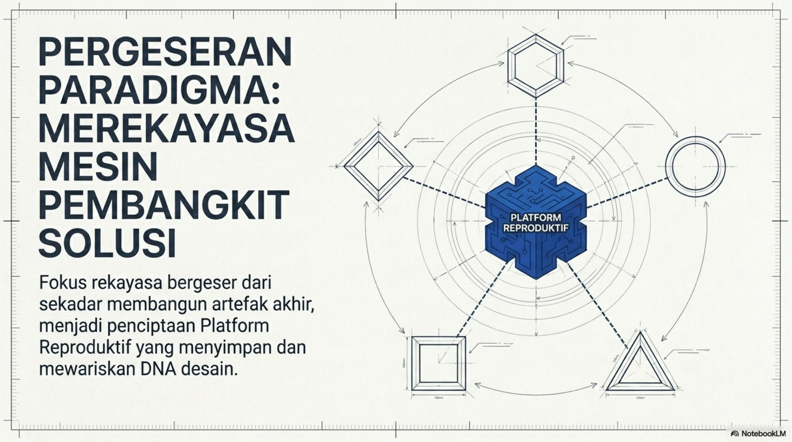
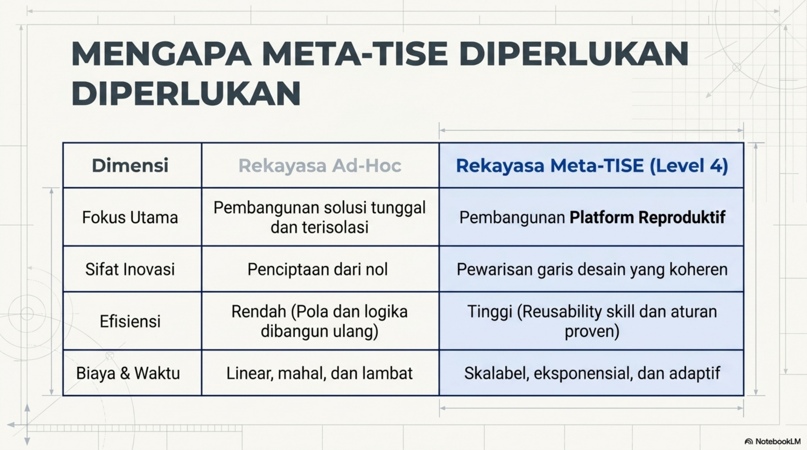
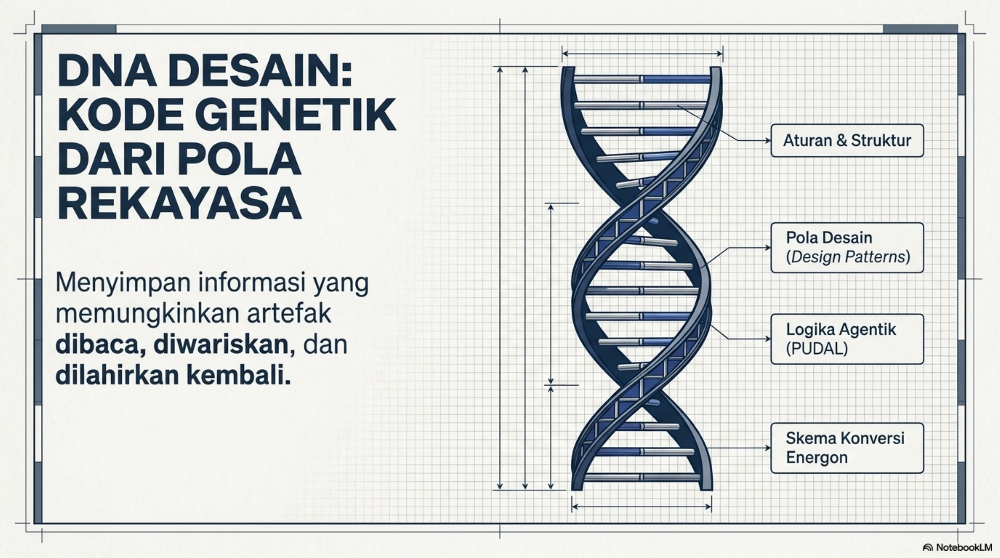
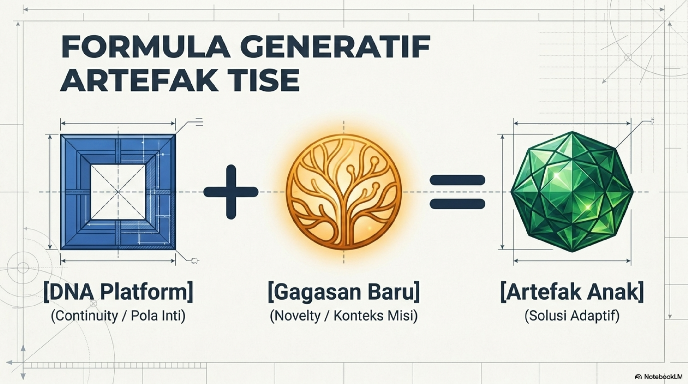
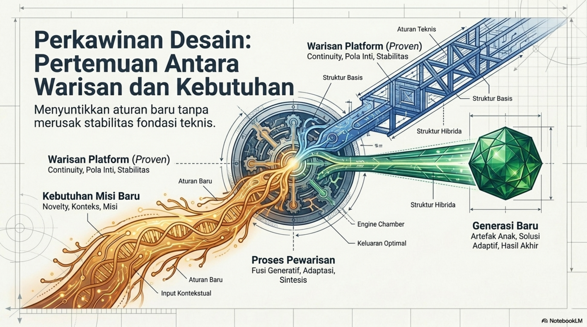
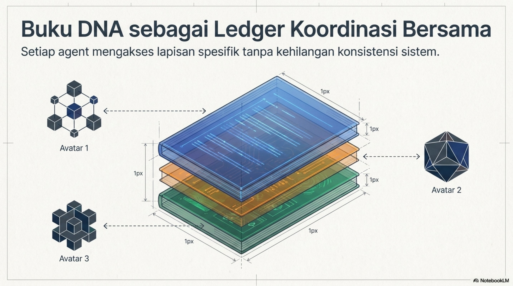
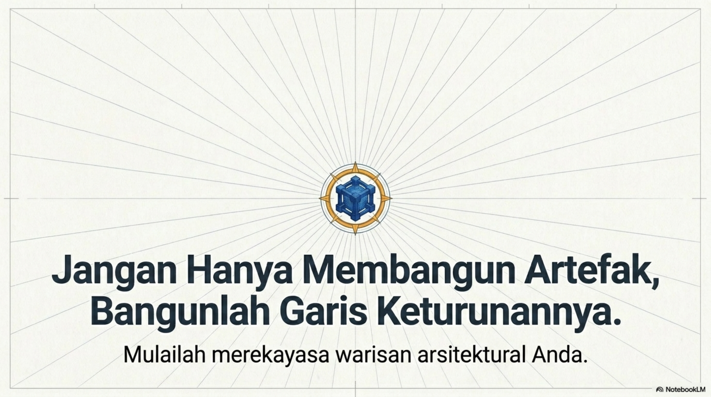

# Bab 5. DNA Desain, Meta-TISE, dan Artefak Anak

Bab ini menjelaskan pergeseran dari rekayasa solusi tunggal menuju rekayasa **platform reproduktif**. Pada level ini, fokus tidak lagi hanya pada pembangunan artefak akhir, tetapi pada pembangunan **cetak biru generatif** yang dapat melahirkan banyak artefak turunan secara konsisten. Gambaran umum transformasi tersebut ditunjukkan pada @fig-b5-blueprint-generatif.

{#fig-b5-blueprint-generatif fig-alt="Ilustrasi cetak biru generatif TISE level 4"}

## Apa itu Meta-TISE

**Meta-TISE** adalah rekayasa atas artefak TISE itu sendiri. Jika pada level-level sebelumnya rekayasa berfokus pada pembangunan solusi untuk domain tertentu, maka pada TISE level 4 fokusnya bergeser: yang direkayasa bukan hanya solusi akhir, tetapi **platform rekayasa** yang memungkinkan lahirnya banyak solusi turunan secara lebih cepat, lebih konsisten, dan lebih dapat digunakan ulang. Perbedaan antara rekayasa ad-hoc dan rekayasa generatif diperlihatkan pada @fig-b5-adhoc-vs-generatif.

{#fig-b5-adhoc-vs-generatif fig-alt="Perbandingan rekayasa ad-hoc dan generatif"}

Meta-TISE dapat dipahami sebagai **jembatan reproduktif** yang menghubungkan visi dan konfigurasi stakeholder pada level tertinggi dengan mesin implementasi pada level 0--3. Peran jembatan ini divisualisasikan pada @fig-b5-jembatan-meta-tise.

{#fig-b5-jembatan-meta-tise fig-alt="Meta-TISE sebagai jembatan reproduktif"}

Pentingnya Meta-TISE juga tampak ketika kita membandingkan biaya, waktu, dan efisiensi rekayasa ad-hoc dengan rekayasa platform reproduktif. Ringkasan perbandingan itu ditunjukkan pada @fig-b5-mengapa-meta-tise.

{#fig-b5-mengapa-meta-tise fig-alt="Tabel alasan kebutuhan Meta-TISE"}

## DNA Desain

DNA desain adalah representasi sistematis dari pola-pola desain, skills, aturan, struktur konseptual, dan logika operasi yang memungkinkan suatu artefak TISE direplikasi, dikembangkan, atau “dikawinkan” dengan artefak lain untuk melahirkan generasi artefak baru. Struktur DNA desain tersebut digambarkan pada @fig-b5-dna-desain.

{#fig-b5-dna-desain fig-alt="DNA desain TISE"}

Dengan kata lain, DNA platform menyimpan **continuity** dari artefak induk: struktur yang proven, aturan teknis, pola desain, serta logika operasi yang telah teruji. Namun DNA saja tidak cukup. Agar lahir artefak baru yang relevan, DNA tersebut harus dipertemukan dengan konteks, misi, dan kebutuhan baru. Relasi ini dirumuskan secara sederhana pada @fig-b5-formula-generatif.

{#fig-b5-formula-generatif fig-alt="Formula generatif artefak TISE"}

## Perkawinan Desain

Meta-TISE bekerja melalui **perkawinan desain**, yaitu pertemuan antara warisan platform yang proven dengan kebutuhan misi baru. Proses ini tidak boleh merusak fondasi teknis yang sudah stabil, tetapi juga tidak boleh menolak novelty yang dibutuhkan konteks. Mekanisme sintesis itu dijelaskan pada @fig-b5-perkawinan-desain.

{#fig-b5-perkawinan-desain fig-alt="Perkawinan desain dalam Meta-TISE"}

Di sinilah peran Meta-TISE menjadi sangat strategis. Ia bertindak sebagai ruang sintesis yang menyaring bagian mana dari platform induk yang tetap dipertahankan, bagian mana yang dimodifikasi, dan bagian mana yang harus ditambahkan agar artefak anak tetap andal sekaligus relevan.

## Artefak Anak

Artefak anak adalah artefak baru yang lahir dari suatu platform TISE melalui pewarisan DNA desain dan penambahan elemen-elemen baru yang relevan dengan konteks masalah tertentu. Karena itu, artefak anak harus membawa dua sifat sekaligus, yaitu **continuity** dan **novelty**, sebagaimana ditunjukkan pada @fig-b5-continuity-novelty.

{#fig-b5-continuity-novelty fig-alt="Continuity dan novelty pada artefak anak"}

Continuity menjamin bahwa artefak anak tidak kehilangan kestabilan, pola inti, dan keandalan sistem operasi dari platform induknya. Sebaliknya, novelty menjamin bahwa artefak anak tidak menjadi salinan pasif, melainkan solusi yang sungguh menjawab konteks baru.

## Logika Perkalian, Bukan Penjumlahan

Dengan Meta-TISE, rekayasa tidak lagi berkembang secara linear melalui penjumlahan proyek-proyek terpisah. Sebaliknya, satu platform yang baik dapat melahirkan banyak artefak anak dengan biaya marginal yang lebih kecil. Itulah sebabnya Meta-TISE mengubah logika penjumlahan menjadi logika perkalian, seperti diperlihatkan pada @fig-b5-logika-perkalian.

{#fig-b5-logika-perkalian fig-alt="Meta-TISE mengubah penjumlahan menjadi perkalian"}

Bab ini membawa kita pada satu tesis utama: rekayasawan tidak cukup hanya membangun artefak. Rekayasawan perlu membangun **garis keturunan arsitektural** yang memungkinkan solusi terus diwariskan, dikembangkan, dan diperbanyak. Pesan itu dirangkum kembali pada @fig-b5-penutup.

{#fig-b5-penutup fig-alt="Ajakan membangun garis keturunan artefak"}
