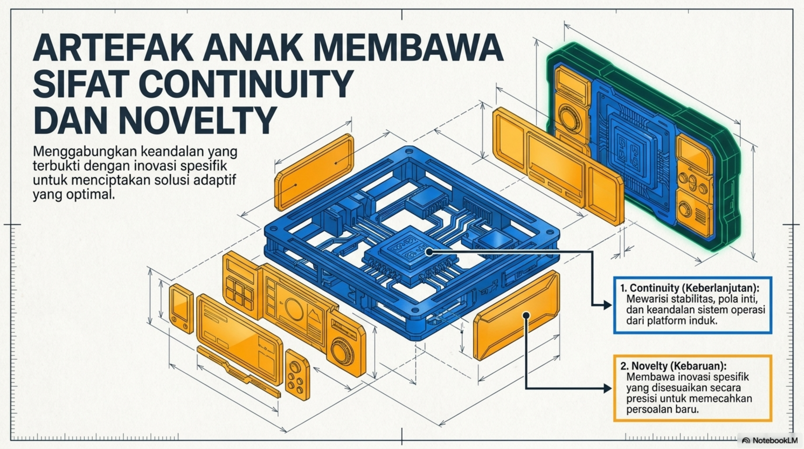
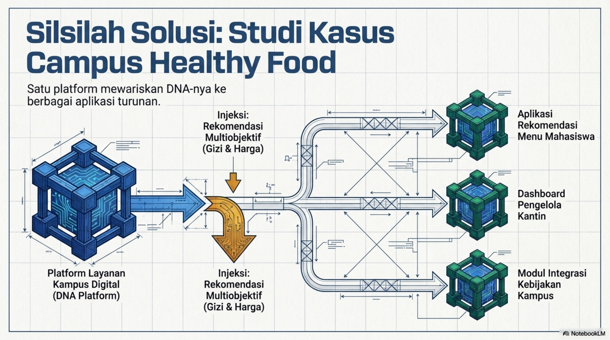
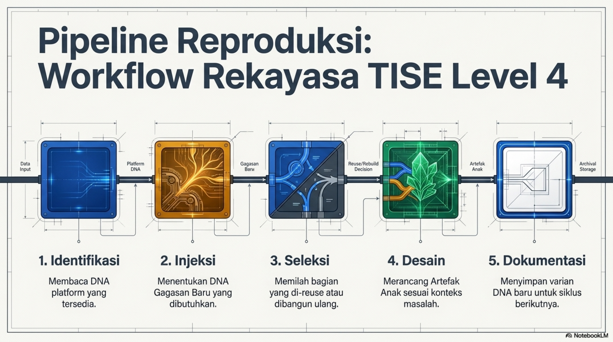
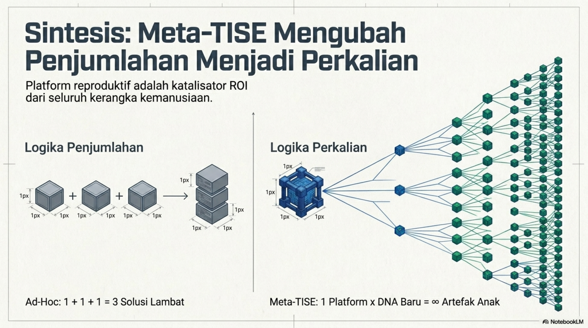

# Bab 6. Metodologi dan Workflow Rekayasa TISE level 4

Bab ini menerjemahkan konsep Meta-TISE ke dalam metodologi operasional. Jika Bab 5 menjelaskan **apa** itu platform reproduktif, maka bab ini menjelaskan **bagaimana** platform tersebut dibaca, disuntik dengan gagasan baru, lalu diproduksi menjadi artefak anak. Gambaran umum workflow reproduksi level 4 dapat dilihat pada @fig-b6-pipeline.

{#fig-b6-pipeline fig-alt="Pipeline reproduksi TISE level 4"}

## Fokus Metodologis

Metodologi pada TISE level 4 berfokus pada **pembacaan, pewarisan, modifikasi, dan reproduksi DNA desain**. Namun proses ini tidak boleh berjalan secara individual dan terfragmentasi. Karena DNA platform harus dapat dibaca bersama oleh banyak agen, dibutuhkan sebuah ledger koordinasi bersama seperti pada @fig-b6-ledger-dna.

{#fig-b6-ledger-dna fig-alt="Buku DNA sebagai ledger koordinasi bersama"}

Dengan adanya Buku DNA, setiap aktor atau agen dapat mengakses lapisan spesifik dari platform tanpa kehilangan konsistensi sistem. Buku DNA menjadi media audit, dokumentasi, pewarisan pola, dan sinkronisasi keputusan desain.

## Langkah Workflow

Berdasarkan @fig-b6-pipeline, workflow rekayasa level 4 dapat dirumuskan menjadi lima langkah utama.

1. **Mengidentifikasi DNA platform yang sudah tersedia.** Pada tahap ini, rekayasawan membaca pola inti, komponen reusable, aturan teknis, dan logika agentik yang diwariskan.
2. **Menentukan DNA gagasan baru yang perlu ditambahkan.** Tahap ini mendefinisikan novelty yang benar-benar relevan dengan konteks misi.
3. **Menentukan bagian yang dapat direuse, dimodifikasi, atau dibangun ulang.** Di sini dilakukan seleksi desain agar efisien namun tetap adaptif.
4. **Mendesain artefak anak.** Artefak baru dibangun sebagai hasil sintesis antara continuity dan novelty.
5. **Mendokumentasikan varian DNA baru.** Hasil akhir tidak berhenti pada artefak anak, tetapi harus dikembalikan ke dalam Buku DNA agar dapat dipakai dalam siklus berikutnya.

## Contoh Kasus: Healthy Food untuk Warga Kampus

Dalam kasus healthy food kampus, TISE level 4 bertugas merancang **platform DNA** yang mampu melahirkan varian artefak anak seperti aplikasi rekomendasi menu, dashboard pengelola kantin, modul data gizi dan harga, serta modul personalisasi preferensi rasa. Silsilah solusi untuk studi kasus ini diperlihatkan pada @fig-b6-healthy-food.

{#fig-b6-healthy-food fig-alt="Silsilah solusi Campus Healthy Food"}

Pada kasus ini, satu platform layanan kampus digital bertindak sebagai induk. Ke dalam platform tersebut diinjeksikan DNA gagasan baru berupa rekomendasi multiobjektif yang menyeimbangkan gizi, harga, dan preferensi pengguna. Hasilnya bukan hanya satu aplikasi, tetapi keluarga artefak anak yang saling berkerabat dan dapat berkembang lebih lanjut.

## Dokumentasi sebagai Aset Reproduktif

Tahap dokumentasi dalam level 4 bukan sekadar pencatatan administratif. Dokumentasi adalah tindakan rekayasa strategis karena ia mengubah hasil desain menjadi aset reproduktif. Dengan dokumentasi yang baik, proses yang awalnya hanya menghasilkan satu solusi berubah menjadi infrastruktur yang dapat melahirkan banyak solusi baru.

Implikasi ekonominya adalah perubahan dari logika **penjumlahan proyek** menjadi **perkalian leverage desain**, sebagaimana dirangkum pada @fig-b6-sintesis-perkalian.

{#fig-b6-sintesis-perkalian fig-alt="Meta-TISE mengubah penjumlahan menjadi perkalian"}

Dengan demikian, workflow level 4 tidak berhenti pada desain artefak anak. Ia harus menghasilkan arsip DNA baru yang siap digunakan ulang, diaudit, dan diwariskan. Inilah yang membedakan rekayasa Meta-TISE dari inovasi ad-hoc biasa.
