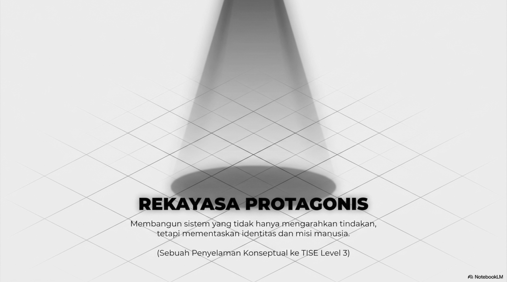
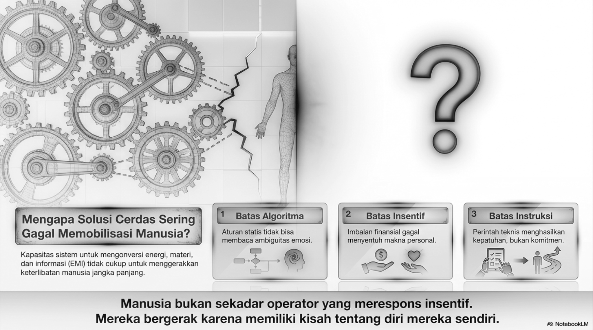
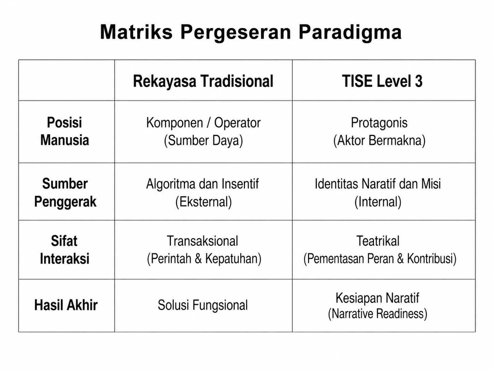
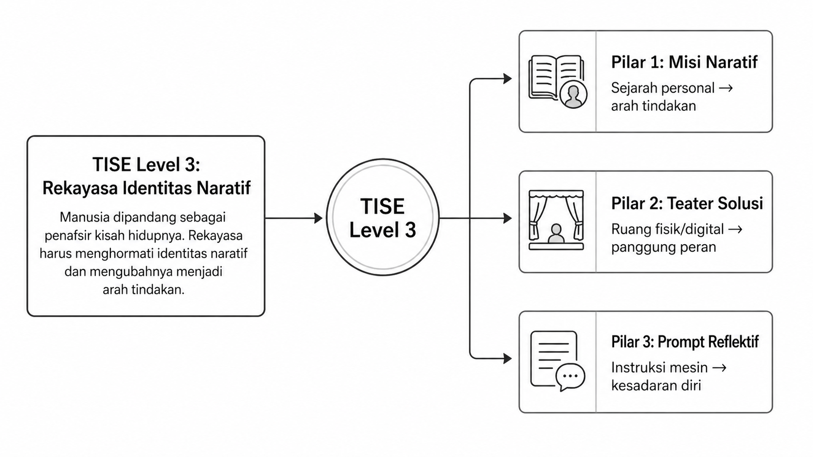
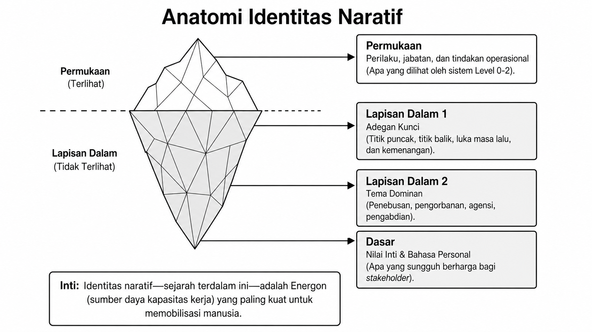
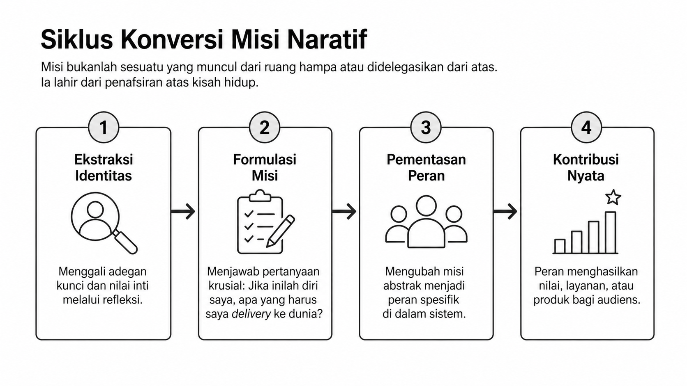
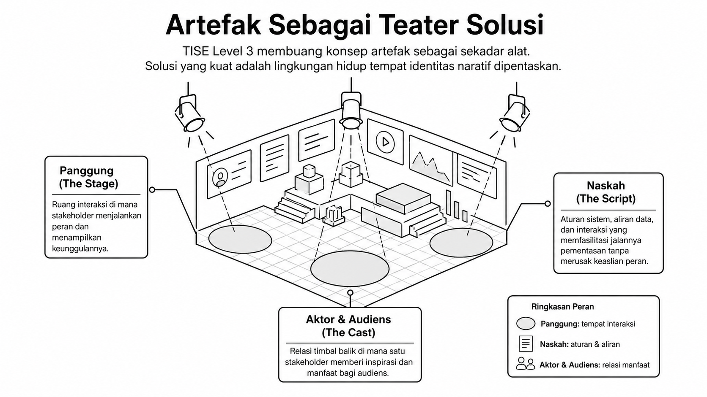
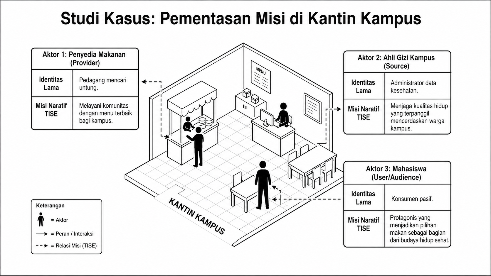

# Bab 7. Identitas Naratif, Teater Solusi, dan Pementasan Misi

Bab ini menjelaskan pergeseran TISE level 3 dari rekayasa yang hanya mengarahkan tindakan menuju **rekayasa protagonis**, yaitu rekayasa yang menghormati manusia sebagai pembawa identitas, misi, dan kisah hidupnya sendiri. Gambaran umum orientasi ini ditunjukkan pada @fig-b7-rekayasa-protagonis.

{#fig-b7-rekayasa-protagonis fig-alt="Rekayasa protagonis pada TISE level 3"}

## Mengapa Solusi Cerdas Sering Gagal Memobilisasi Manusia

Banyak solusi cerdas gagal bukan karena lemah secara teknis, tetapi karena gagal menyentuh pusat penggerak manusia. Seperti diperlihatkan pada @fig-b7-batas-solusi-cerdas, algoritma, insentif, dan instruksi teknis sering hanya menghasilkan kepatuhan jangka pendek, bukan komitmen yang hidup.

{#fig-b7-batas-solusi-cerdas fig-alt="Mengapa solusi cerdas sering gagal memobilisasi manusia"}

Karena itu, TISE level 3 menuntut pergeseran paradigma. Manusia tidak lagi dipandang sebagai komponen atau operator, tetapi sebagai **protagonis bermakna**. Pergeseran tersebut diringkas pada @fig-b7-matriks-pergeseran.

{#fig-b7-matriks-pergeseran fig-alt="Matriks pergeseran paradigma menuju TISE level 3"}

## Apa itu Identitas Naratif

Pada **TISE level 3**, identitas naratif adalah kisah hidup yang diinternalisasi seseorang tentang siapa dirinya, dari mana ia datang, pengalaman apa yang membentuk dirinya, nilai apa yang paling penting baginya, dan ke mana ia sedang menuju. Masuk ke level ini berarti rekayasa mulai memperlakukan manusia sebagai penafsir aktif atas hidupnya sendiri, sebagaimana divisualisasikan pada @fig-b7-masuk-level-3.

{#fig-b7-masuk-level-3 fig-alt="Masuk ke TISE level 3 sebagai rekayasa identitas naratif"}

Identitas naratif tidak berhenti pada permukaan perilaku. Ia memiliki lapisan-lapisan kedalaman yang perlu dibaca secara sistematis. Struktur tersebut ditunjukkan pada @fig-b7-anatomi-identitas.

{#fig-b7-anatomi-identitas fig-alt="Anatomi identitas naratif"}

Melalui anatomi ini, kita dapat melihat bahwa sumber energi terdalam manusia bukan hanya sumber daya operasional, melainkan **energon naratif**: nilai, pengalaman kunci, dan tema hidup yang sungguh berarti bagi stakeholder.

## Dari Identitas ke Misi Naratif

Jika identitas naratif berhasil dibaca, langkah berikutnya adalah mengonversinya menjadi arah tindakan. Proses ini dirangkum dalam siklus konversi misi naratif pada @fig-b7-siklus-konversi.

{#fig-b7-siklus-konversi fig-alt="Siklus konversi misi naratif"}

Dengan demikian, misi bukanlah sesuatu yang sepenuhnya diimpor dari luar. Misi lahir dari penafsiran atas kisah hidup dan nilai inti seseorang, lalu diterjemahkan menjadi kontribusi nyata yang dapat di-delivery ke dunia.

## Artefak sebagai Teater Solusi

Artefak pada level ini dipahami sebagai **teater solusi**, yaitu ruang tempat stakeholder menjalankan peran, menampilkan keunggulannya, dan memberi inspirasi atau manfaat bagi audiens. Struktur teater solusi ini diperlihatkan pada @fig-b7-teater-solusi.

{#fig-b7-teater-solusi fig-alt="Artefak sebagai teater solusi"}

Di dalam teater solusi, artefak bukan sekadar alat. Artefak menjadi ruang sosial-teknis tempat satu peran dipertemukan dengan kebutuhan nyata audiens. Karena itu, kualitas desain tidak hanya diukur dari fungsinya, tetapi juga dari kemampuannya membuka panggung bagi manusia untuk hidup dan berkarya secara lebih utuh.

## Studi Kasus Pementasan Misi

Gagasan ini menjadi lebih jelas melalui studi kasus kantin kampus pada @fig-b7-kasus-kantin. Dalam kasus tersebut, penyedia makanan, ahli gizi, dan mahasiswa tidak lagi hanya dilihat sebagai aktor transaksional, tetapi sebagai pembawa misi naratif yang berbeda.

{#fig-b7-kasus-kantin fig-alt="Studi kasus pementasan misi di kantin kampus"}

Penyedia makanan tidak lagi sekadar pedagang, melainkan pelayan komunitas. Ahli gizi tidak lagi sekadar administrator data, melainkan penjaga kualitas hidup. Mahasiswa pun tidak lagi hanya konsumen pasif, melainkan protagonis yang menjadikan pilihan makanan sebagai bagian dari budaya hidup sehat.

## Bagaimana TISE Mementaskan Identitas Naratif

TISE mementaskan identitas naratif dengan menemukan identitas naratif, merumuskan misi naratif, meningkatkan readiness, merancang teater solusi, menghubungkan stakeholder melalui Matrix of Mission, dan menjalankan intervensi yang memelihara pementasan itu. Semua ini menyiapkan dasar penting untuk langkah metodologis yang akan dibahas lebih rinci pada bab berikutnya.
