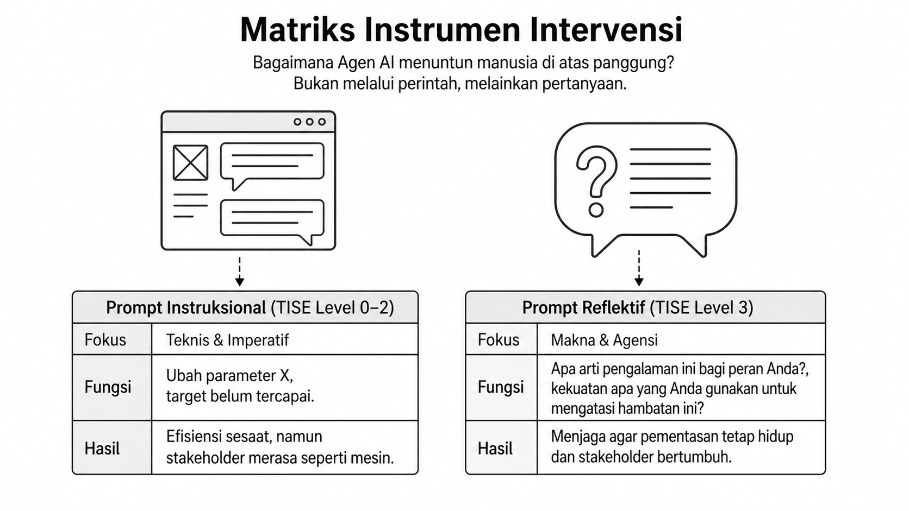
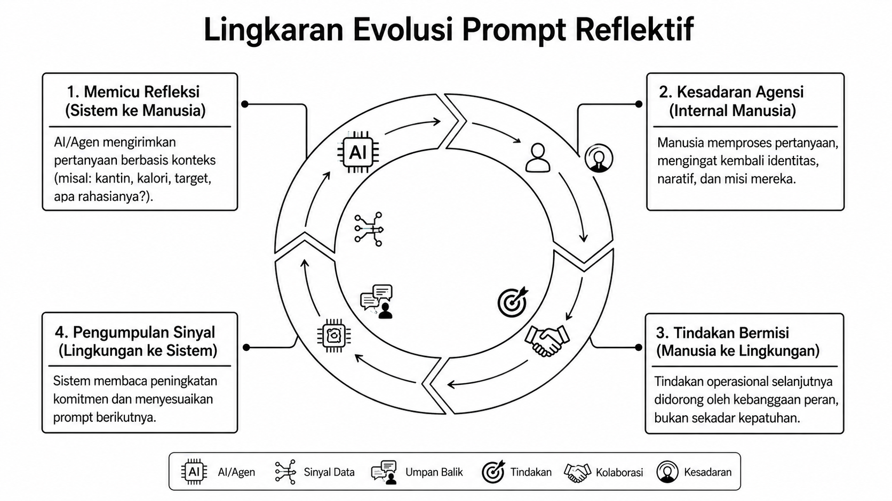
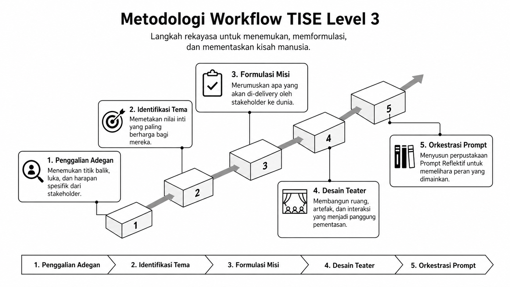
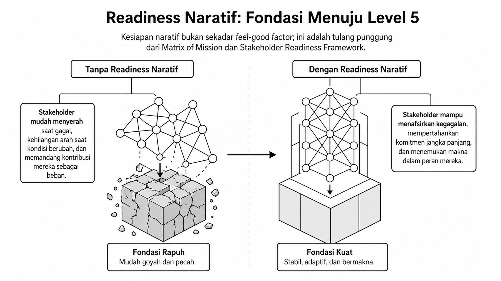
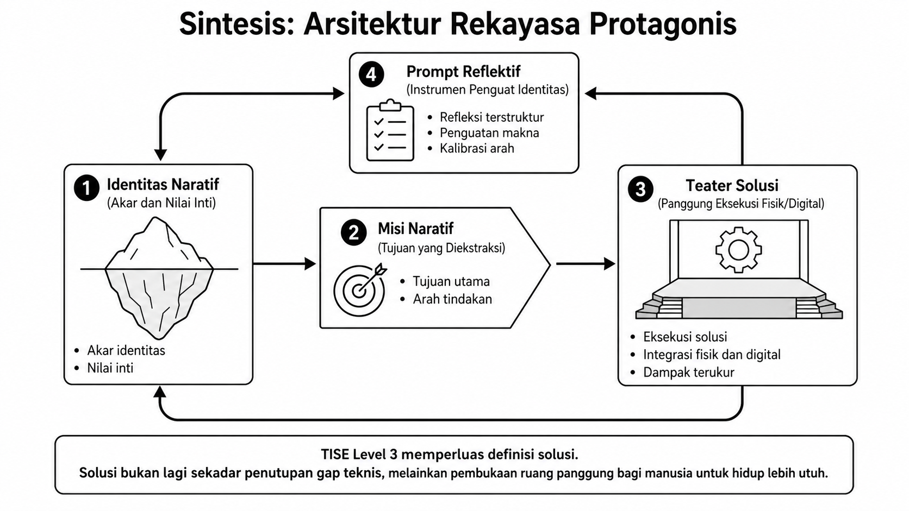

# Bab 8. Metodologi dan Workflow Rekayasa TISE level 3

Bab ini menerjemahkan rekayasa protagonis ke dalam workflow yang operasional. Jika Bab 7 menjelaskan **mengapa** identitas naratif dan teater solusi penting, maka bab ini menjelaskan **bagaimana** TISE level 3 menemukan, merumuskan, memfasilitasi, dan memelihara pementasan peran manusia.

## Fokus Metodologis

Salah satu pembeda utama TISE level 3 adalah perubahan instrumen intervensi. Sistem tidak lagi terutama bekerja melalui prompt instruksional, tetapi melalui **prompt reflektif** yang membangkitkan makna dan agensi. Perbedaan keduanya diperlihatkan pada @fig-b8-matriks-instrumen.

{#fig-b8-matriks-instrumen fig-alt="Matriks instrumen intervensi TISE level 3"}

Dengan prompt reflektif, intervensi TISE level 3 bukan sekadar menyuruh orang melakukan sesuatu, melainkan membantu mereka memahami arti tindakan itu bagi peran yang sedang mereka mainkan.

## Lingkaran Evolusi Prompt Reflektif

Prompt reflektif bekerja dalam sebuah siklus yang terus memutar relasi antara sistem, manusia, dan lingkungan. Siklus ini ditunjukkan pada @fig-b8-lingkaran-prompt.

{#fig-b8-lingkaran-prompt fig-alt="Lingkaran evolusi prompt reflektif"}

Melalui siklus ini, AI atau agen tidak bertindak sebagai pemberi komando mutlak. Ia berfungsi sebagai mitra reflektif yang memicu kesadaran, membaca perkembangan komitmen, lalu menyesuaikan prompt berikutnya secara adaptif.

## Langkah Workflow

Berdasarkan prinsip di atas, metodologi workflow TISE level 3 dapat dirumuskan ke dalam lima langkah utama sebagaimana dirangkum pada @fig-b8-workflow.

{#fig-b8-workflow fig-alt="Metodologi workflow TISE level 3"}

Kelima langkah tersebut dapat dijelaskan sebagai berikut.

1. **Penggalian adegan.** Rekayasawan membantu stakeholder menemukan titik balik, luka, kemenangan, dan harapan spesifik yang membentuk kisah hidup mereka.
2. **Identifikasi tema.** Dari adegan-adegan itu dipetakan nilai inti dan tema dominan yang paling berarti.
3. **Formulasi misi.** Nilai inti diterjemahkan menjadi misi naratif: apa yang hendak di-delivery oleh stakeholder ke dunia.
4. **Desain teater solusi.** Ruang, artefak, alur interaksi, dan audiens disusun agar misi itu dapat dipentaskan secara hidup.
5. **Orkestrasi prompt.** Sistem membangun pustaka prompt reflektif untuk menjaga agar peran tetap hidup, adaptif, dan bertumbuh.

## Readiness Naratif sebagai Fondasi

Agar pementasan peran tidak mudah runtuh, TISE level 3 memerlukan **readiness naratif**. Kesiapan ini bukan sekadar motivasi emosional sementara, melainkan kapasitas seseorang untuk menafsirkan kegagalan, menjaga komitmen, dan menemukan makna saat konteks berubah. Pentingnya readiness naratif ditunjukkan pada @fig-b8-readiness.

{#fig-b8-readiness fig-alt="Readiness naratif sebagai fondasi"}

Dalam kerangka yang lebih luas, readiness naratif menjadi prasyarat penting bagi pembentukan konfigurasi stakeholder yang matang di level berikutnya.

## Sintesis Arsitektur Rekayasa Protagonis

Jika seluruh komponen Bab 7 dan Bab 8 disatukan, kita memperoleh sintesis arsitektur rekayasa protagonis seperti pada @fig-b8-sintesis-arsitektur.

{#fig-b8-sintesis-arsitektur fig-alt="Sintesis arsitektur rekayasa protagonis"}

Sintesis ini memperlihatkan bahwa TISE level 3 memperluas definisi solusi. Solusi bukan lagi sekadar penutupan gap teknis, melainkan pembukaan ruang pementasan yang memungkinkan manusia hidup lebih utuh, lebih sadar akan peran, dan lebih berdaya dalam memberi kontribusi.

## Contoh Kasus: Healthy Food untuk Warga Kampus

Dalam kasus healthy food kampus, mahasiswa, pengelola kantin, ahli gizi, dan pimpinan kampus dapat dipetakan sebagai pembawa narasi berbeda yang semuanya perlu dipentaskan dalam teater solusi pangan kampus yang sehat, enak, dan terjangkau. Workflow level 3 membantu setiap aktor mengenali identitasnya, merumuskan misinya, lalu menghidupi kontribusinya melalui interaksi yang terus dipelihara secara reflektif.
