# Bab 9. Rekayasa Mesin Agentik pada TISE Level 2

Bab ini menjelaskan bagaimana TISE level 2 menggeser rekayasa dari kendali algoritmik yang kaku menuju **mesin agentik** yang hidup, adaptif, dan mampu beroperasi di tengah kompleksitas manusia. Orientasi umum bab ini dirangkum pada @fig-b9-sampul.

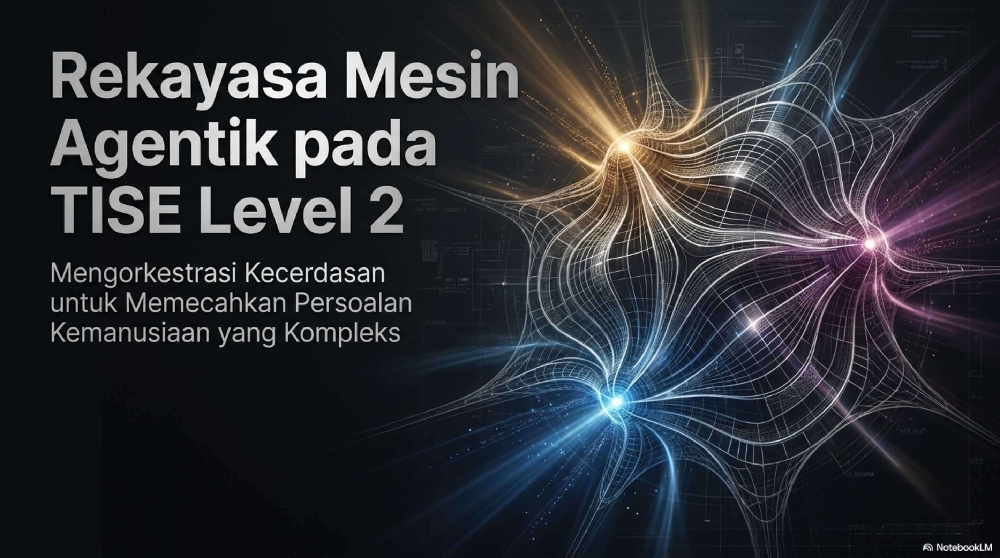{#fig-b9-sampul fig-alt="Rekayasa mesin agentik pada TISE level 2"}

## Mengapa Kendali Algoritmik Saja Tidak Pernah Cukup

Algoritma sangat kuat ketika dunia stabil, data rapi, dan objektif tunggal dapat didefinisikan secara presisi. Namun, ketika artefak berhadapan dengan manusia, situasi ambigu, konflik makna sosial, dan pergeseran misi membuat kendali matematis murni kehilangan arah. Titik batas tersebut divisualisasikan pada @fig-b9-batas-algoritmik.

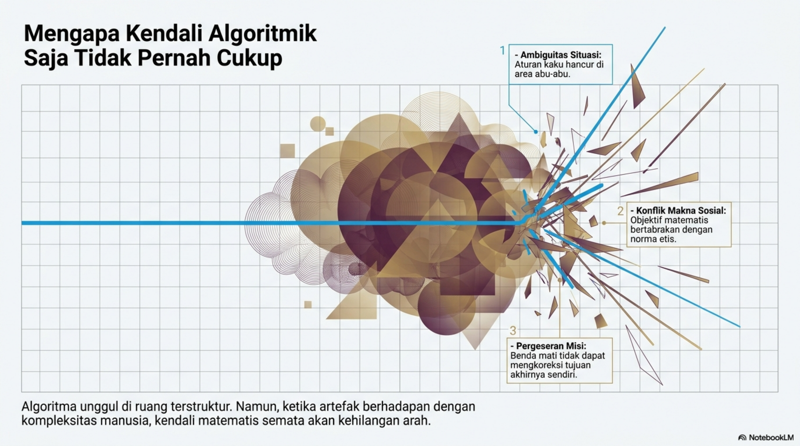{#fig-b9-batas-algoritmik fig-alt="Mengapa kendali algoritmik saja tidak pernah cukup"}

Karena itu, TISE level 2 memperkenalkan lompatan dari artefak yang pasif menuju artefak yang mampu merespons, memahami, menimbang, bertindak, dan belajar terus-menerus. Evolusi ini diringkas pada @fig-b9-evolusi-level-2.

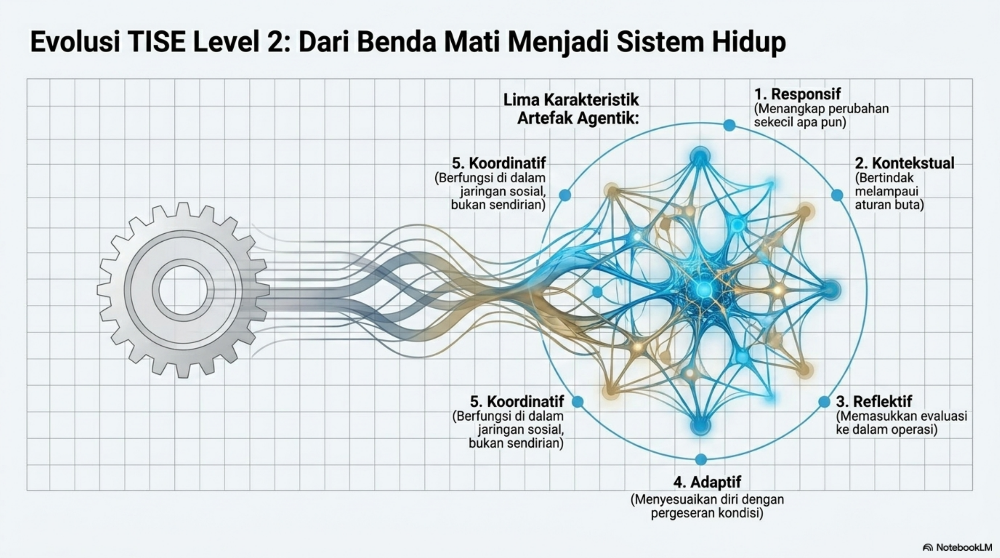{#fig-b9-evolusi-level-2 fig-alt="Evolusi TISE level 2 menuju sistem hidup"}

## Batas Demarkasi antara Algoritma Kaku dan Mesin Agentik

Perbedaan antara kendali algoritmik tradisional dan mesin agentik PUDAL bukan sekadar soal kompleksitas perangkat lunak, melainkan soal sifat ontologis artefak itu sendiri. Perbandingan ini ditunjukkan secara eksplisit pada @fig-b9-demarkasi.

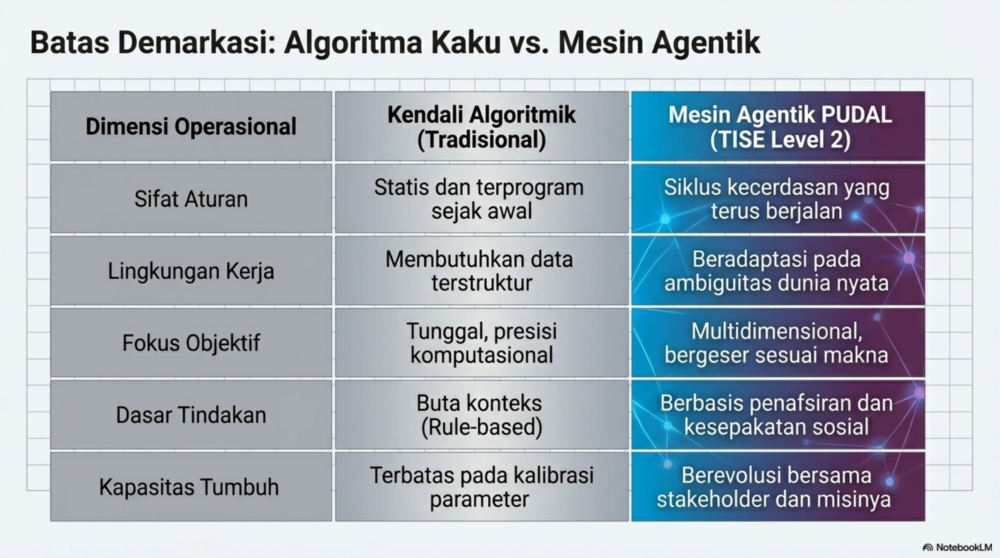{#fig-b9-demarkasi fig-alt="Batas demarkasi algoritma kaku dan mesin agentik"}

Pada sisi tradisional, aturan bersifat statis, lingkungan kerja diasumsikan terstruktur, dan pertumbuhan sistem hanya berupa kalibrasi parameter. Pada sisi agentik, artefak hidup di dalam ambiguitas dunia nyata, menafsirkan konteks, beradaptasi dengan perubahan, dan tumbuh bersama stakeholder beserta misinya.

## Triune Intelligence sebagai Jantung Mesin Agentik

Agar artefak tidak kehilangan arah moral maupun sosial, TISE level 2 tidak menyerahkan seluruh keputusan pada AI. Ia bekerja melalui **Triune Intelligence**, yaitu orkestrasi antara **Natural Intelligence (NI)**, **Collective Intelligence (CI)**, dan **Artificial Intelligence (AI)**. Gambaran dasar relasi ini diperlihatkan pada @fig-b9-triune.

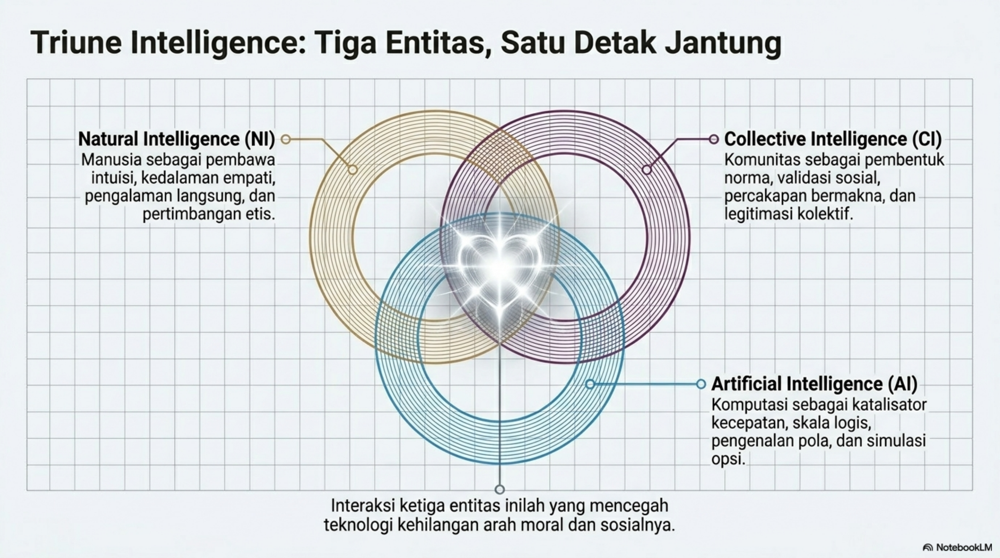{#fig-b9-triune fig-alt="Triune Intelligence pada TISE level 2"}

Kedalaman makna personal terutama datang dari NI, sedangkan legitimasi sosial dibangun oleh CI. Peran keduanya dalam memberi arti pada data dirangkum pada @fig-b9-ni-ci-makna.

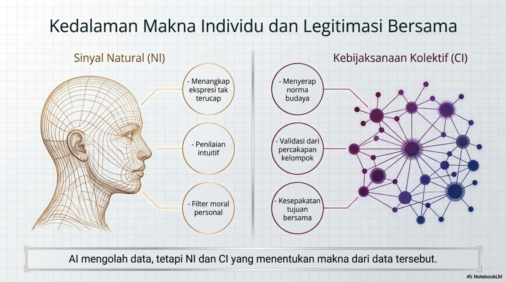{#fig-b9-ni-ci-makna fig-alt="Sinyal natural intelligence dan kebijaksanaan kolektif"}

Sementara itu, AI berfungsi sebagai katalisator kecepatan, ruang, dan waktu. Seperti terlihat pada @fig-b9-ai-katalis, AI memperluas kapasitas sistem untuk memproses sinyal, mengenali pola, mensimulasikan konsekuensi, dan mengorkestrasi tindakan.

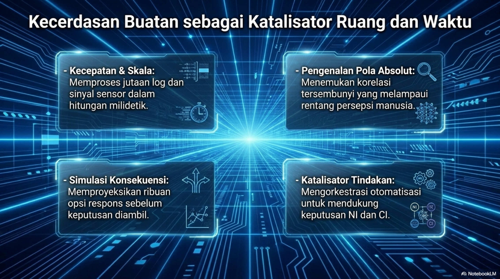{#fig-b9-ai-katalis fig-alt="AI sebagai katalisator ruang dan waktu"}

## Mesin PUDAL sebagai Denyut Nadi Adaptabilitas Artefak

Struktur operasional utama TISE level 2 dirumuskan dalam mesin **PUDAL**. Siklus ini terdiri dari perception, understanding, decision, action, dan learning sebagaimana divisualisasikan pada @fig-b9-pudal.

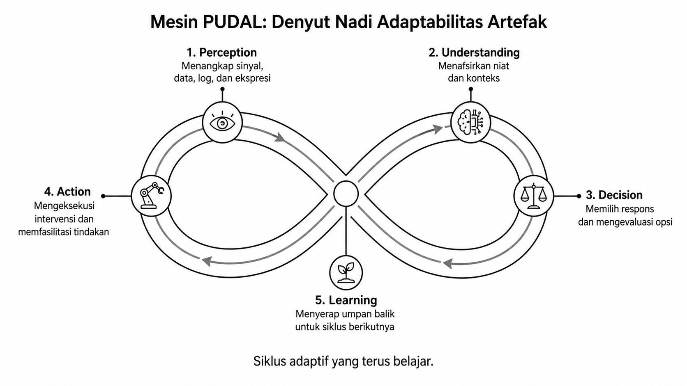{#fig-b9-pudal fig-alt="Mesin PUDAL pada TISE level 2"}

Setiap fase tidak berdiri sendiri. Perception menangkap sinyal dunia nyata, understanding memberi makna dan membaca niat, decision memilih respons yang selaras dengan konteks, action mengeksekusi intervensi, dan learning menyerap umpan balik untuk merekonstruksi siklus berikutnya.

## Orkestrasi Spektrum Penuh di Dalam PUDAL

PUDAL tidak dijalankan oleh satu sumber kecerdasan saja. Setiap fasenya merupakan hasil perpaduan spesifik antara NI, CI, dan AI. Arsitektur orkestrasi ini dirangkum pada @fig-b9-spektrum-penuh.

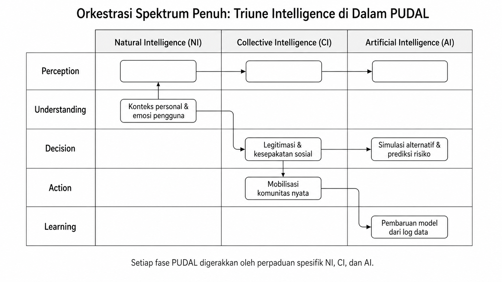{#fig-b9-spektrum-penuh fig-alt="Triune Intelligence di dalam PUDAL"}

Dengan demikian, mesin agentik tidak pernah boleh dipahami sebagai AI yang bekerja sendirian. Ia adalah sistem sosial-teknis yang menjaga keseimbangan antara makna personal, legitimasi kolektif, dan kekuatan komputasional.

## Natural Language Prompting sebagai Bahasa Universal

Komunikasi antar kecerdasan di dalam TISE level 2 membutuhkan medium yang cukup lentur untuk menghubungkan empati manusia, norma komunitas, dan instruksi komputasi. Medium itu adalah **natural language prompting**, sebagaimana ditunjukkan pada @fig-b9-natural-language.

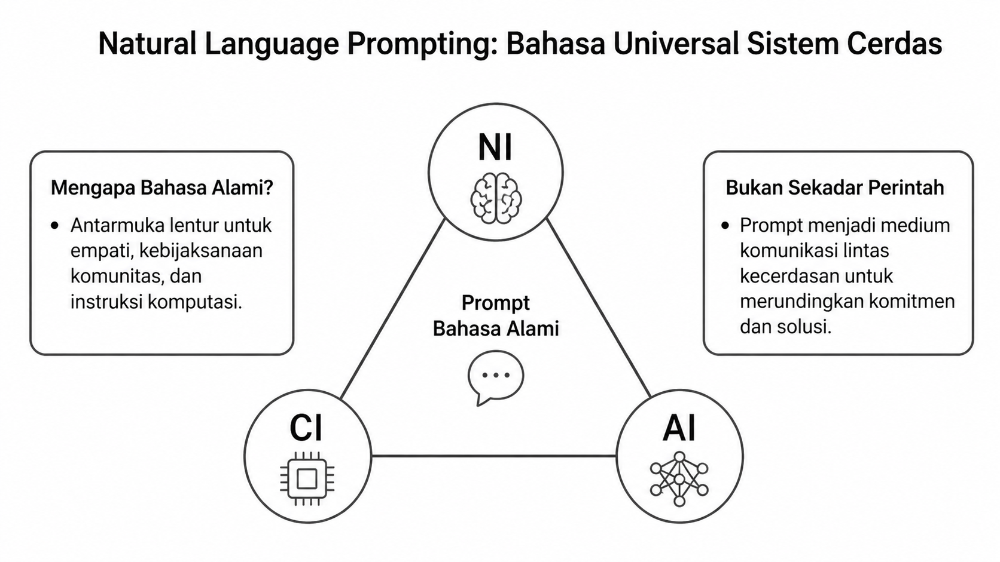{#fig-b9-natural-language fig-alt="Natural language prompting pada TISE level 2"}

Prompt pada level ini bukan sekadar perintah teknis. Ia adalah antarmuka negosiasi makna, kompromi tujuan, dan orkestrasi lintas agen agar keputusan yang diambil tidak tercerabut dari realitas kemanusiaan.

## Anatomi Prompt: Dari Instruksi Teknis Menuju Refleksi Makna

Perbedaan antara prompt instruksional dan prompt reflektif mulai tampak sejak level 2, walaupun pengembangan penuhnya baru mencapai puncak di level 3. Perbandingan ini diperlihatkan pada @fig-b9-anatomi-prompt.

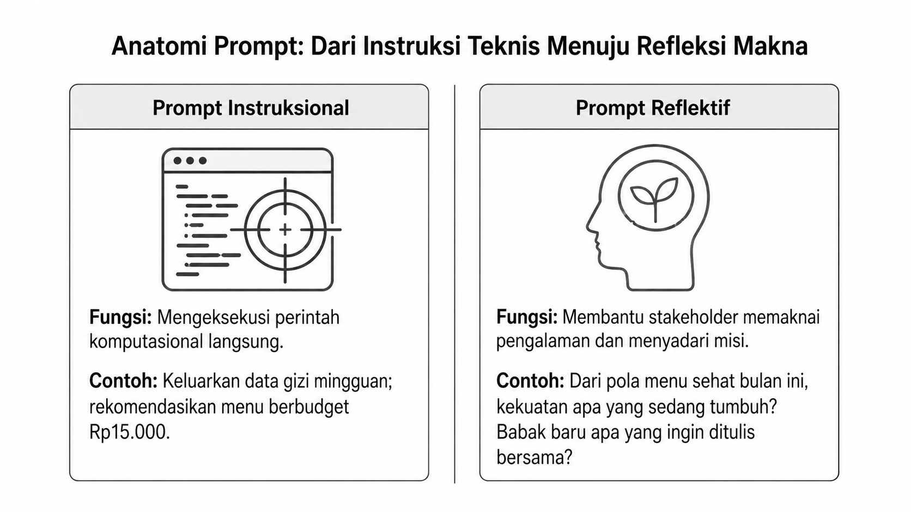{#fig-b9-anatomi-prompt fig-alt="Anatomi prompt instruksional dan reflektif"}

Di TISE level 2, prompt instruksional tetap penting untuk menjalankan operasi, tetapi prompt juga mulai menjadi wahana komunikasi yang lebih kaya agar sistem dapat memahami komitmen, preferensi, dan kesadaran situasional stakeholder.
