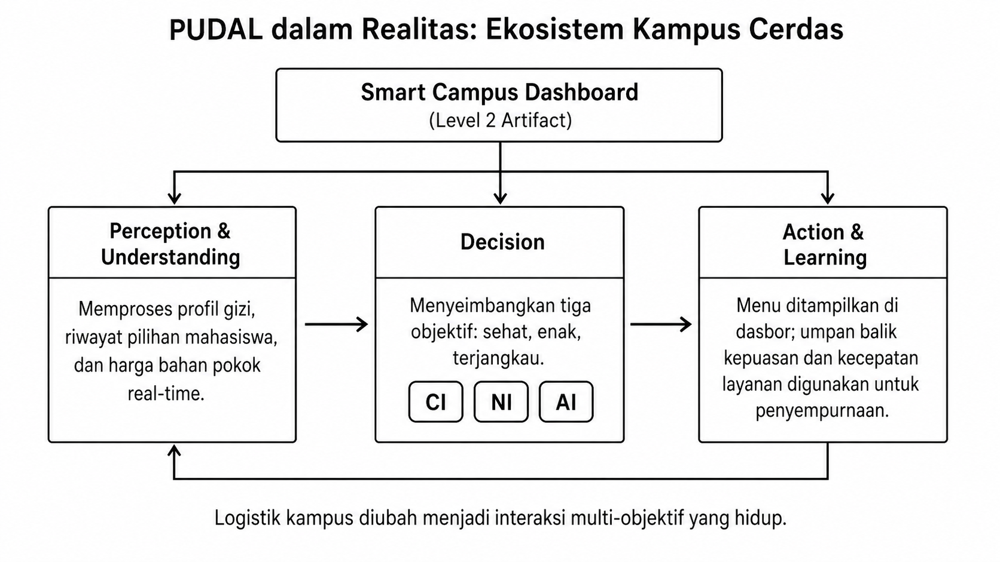
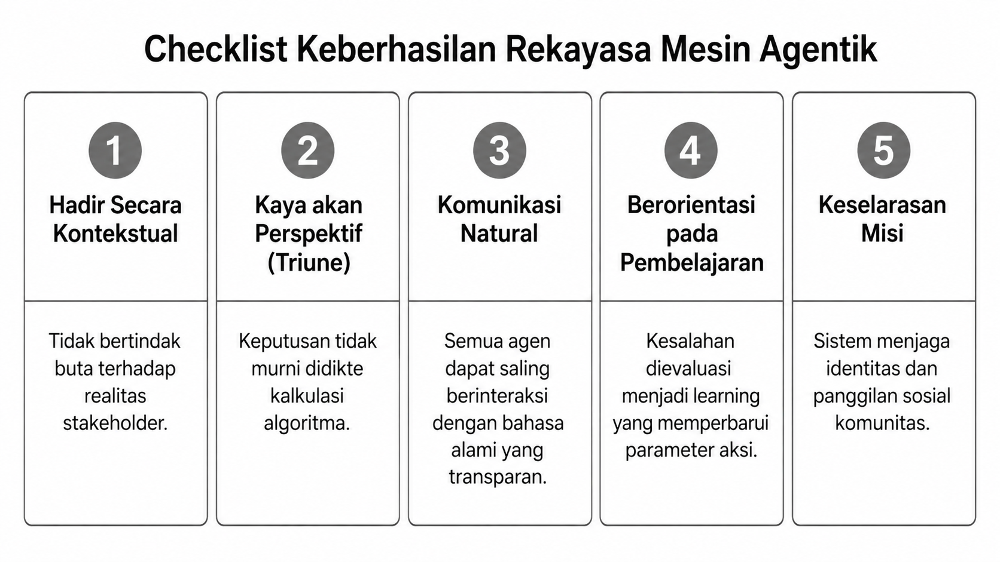
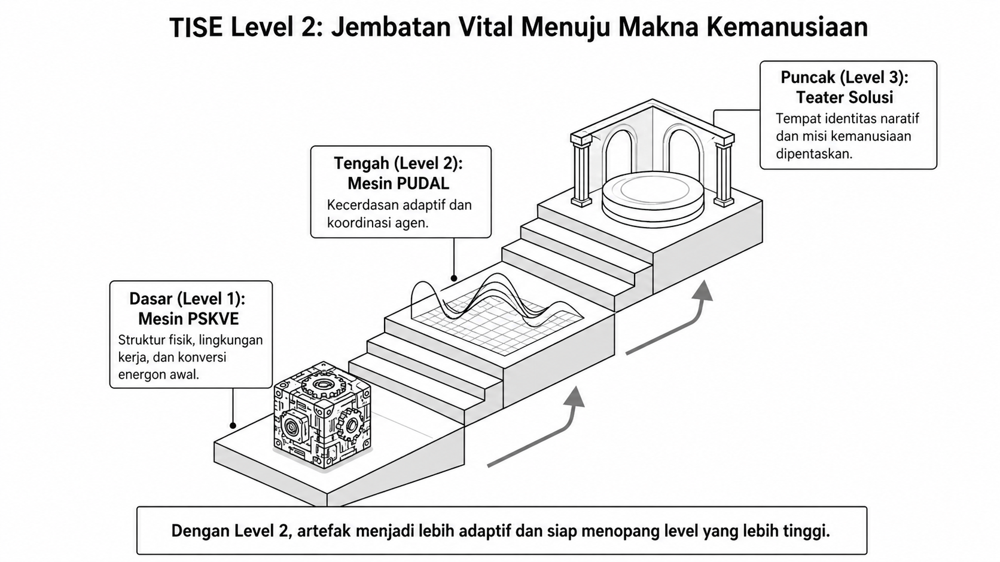
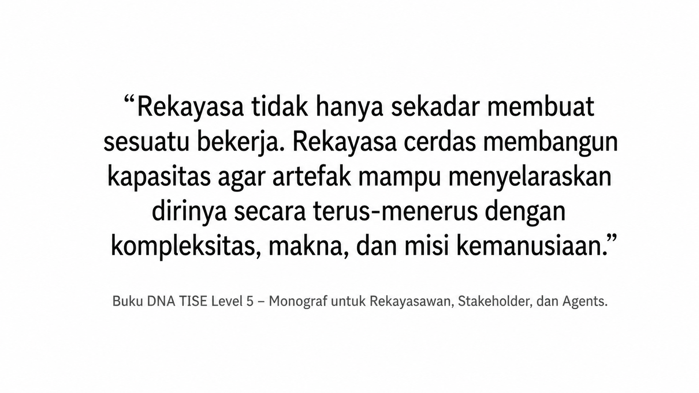

# Bab 10. Metodologi dan Workflow Rekayasa TISE Level 2

Jika Bab 9 menjelaskan landasan konseptual mesin agentik, maka bab ini menjelaskan bagaimana rekayasawan membangun, menguji, dan mengoperasikan artefak level 2 dalam praktik. Contoh utamanya tetap menggunakan kasus **smart campus** dan **healthy food ecosystem**.

## PUDAL dalam Realitas Operasional

Mesin PUDAL baru bernilai ketika diwujudkan ke dalam artefak nyata. Dalam konteks kampus cerdas, integrasi perception, decision, action, dan learning dapat diimplementasikan melalui dasbor kampus seperti pada @fig-b10-smart-campus.

{#fig-b10-smart-campus fig-alt="PUDAL dalam ekosistem kampus cerdas"}

Pada contoh ini, artefak membaca profil gizi, preferensi mahasiswa, harga bahan pokok, dan umpan balik operasional kantin. Lalu sistem menyeimbangkan berbagai objektif yang saling bersaing dan memperbarui model berdasarkan realitas pelayanan harian.

## Checklist Keberhasilan Rekayasa Mesin Agentik

Agar sebuah artefak sungguh layak disebut sebagai hasil rekayasa level 2, rekayasawan memerlukan kriteria evaluasi yang jelas. Checklist utama tersebut dirangkum pada @fig-b10-checklist.

{#fig-b10-checklist fig-alt="Checklist keberhasilan rekayasa mesin agentik"}

Kelima kriteria ini dapat diterjemahkan ke dalam pertanyaan evaluatif berikut.

1. **Hadir secara kontekstual.** Apakah artefak mampu membaca situasi spesifik stakeholder, atau masih bertindak buta terhadap konteks?
2. **Kaya akan perspektif.** Apakah keputusan dibentuk oleh perpaduan NI, CI, dan AI, atau masih didikte oleh kalkulasi tunggal?
3. **Komunikasi natural.** Apakah agen-agen di dalam sistem dapat saling mengintervensi melalui bahasa yang transparan dan dipahami semua pihak?
4. **Berorientasi pada pembelajaran.** Apakah kesalahan dan penyimpangan dipakai untuk memperbarui parameter tindakan berikutnya?
5. **Keselarasan misi.** Apakah sistem bukan hanya bekerja secara efektif, tetapi juga menjaga panggilan sosial dan arah kemanusiaan komunitas yang dilayaninya?

## TISE Level 2 sebagai Jembatan Vital Menuju Makna Kemanusiaan

Secara arsitektural, level 2 harus dipahami sebagai jembatan antara mesin fondasional level 1 dan teater solusi level 3. Posisi transisional ini digambarkan pada @fig-b10-jembatan.

{#fig-b10-jembatan fig-alt="TISE level 2 sebagai jembatan menuju level 3"}

Tanpa level 2, artefak akan tetap kaku dan mekanis. Dengan level 2, artefak memperoleh kapasitas untuk bernapas, menafsirkan, dan menyesuaikan diri sehingga siap menjadi panggung bagi identitas naratif dan misi manusia pada level berikutnya.

## Implikasi Metodologis bagi Rekayasawan

Dari seluruh pembahasan bab ini, ada satu prinsip metodologis yang harus dipegang: rekayasa level 2 bukan sekadar membangun fungsi, tetapi membangun **kapasitas adaptif**. Sintesis prinsip ini diringkas pada @fig-b10-kutipan.

{#fig-b10-kutipan fig-alt="Sintesis rekayasa cerdas pada TISE level 2"}

Karena itu, workflow rekayasa TISE level 2 dapat diringkas sebagai berikut.

1. **Memetakan arena konteks.** Tentukan situasi nyata, stakeholder kunci, dan bentuk ambiguitas yang harus dihadapi artefak.
2. **Merancang spektrum kecerdasan.** Definisikan kontribusi NI, CI, dan AI pada setiap fase PUDAL.
3. **Menyusun bahasa interaksi.** Bangun natural language prompts, protokol dialog, dan mekanisme translasi antar agen.
4. **Mewujudkan siklus PUDAL.** Implementasikan perception, understanding, decision, action, dan learning dalam artefak.
5. **Menjalankan uji misi dan pembelajaran.** Nilai apakah artefak tetap selaras dengan tujuan kemanusiaan sambil terus belajar dari perubahan realitas.

## Penutup

Dengan demikian, TISE level 2 menandai lahirnya artefak yang bukan lagi mesin pasif, melainkan organisme sosial-teknis yang hidup. Ia menjadi fondasi penting sebelum sistem naik ke level 3, ketika artefak tidak hanya adaptif, tetapi juga mulai membuka ruang bagi manusia untuk memerankan identitas dan misinya secara utuh.
