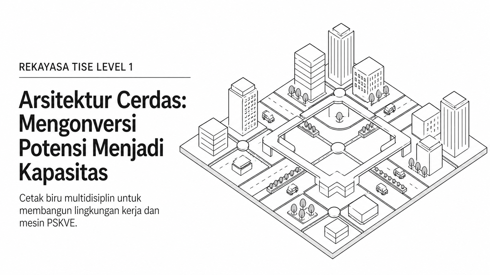
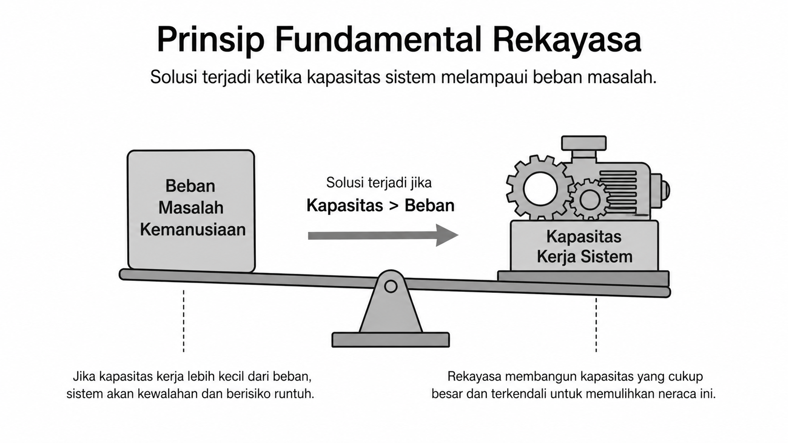
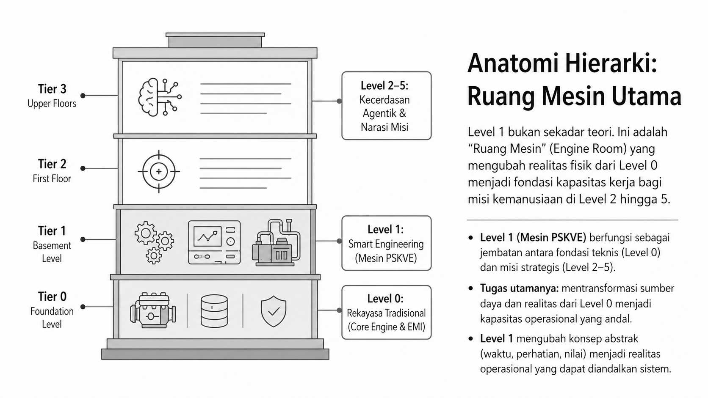
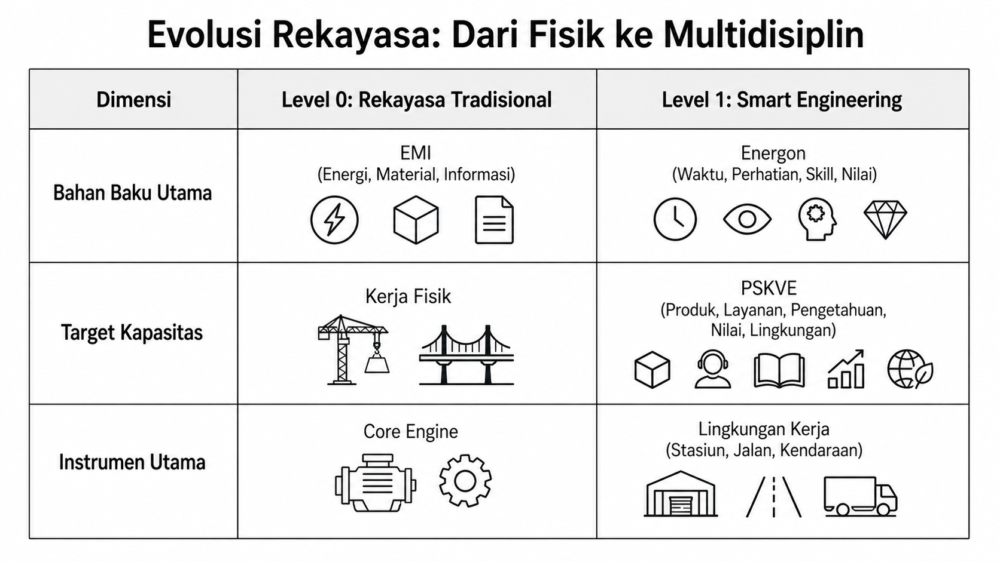
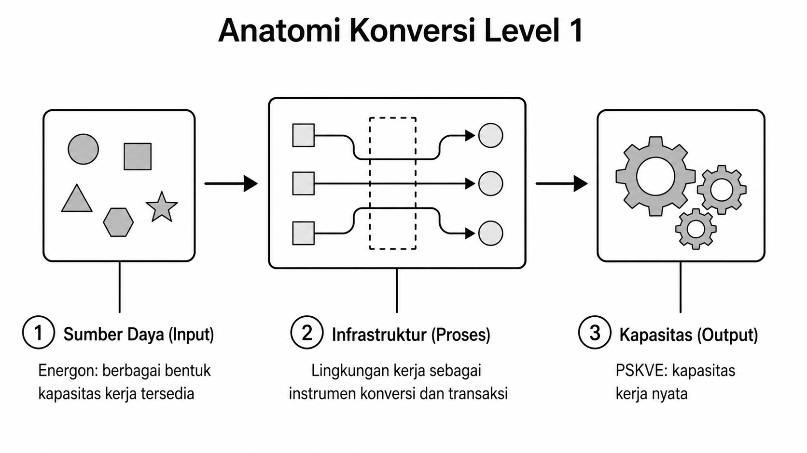
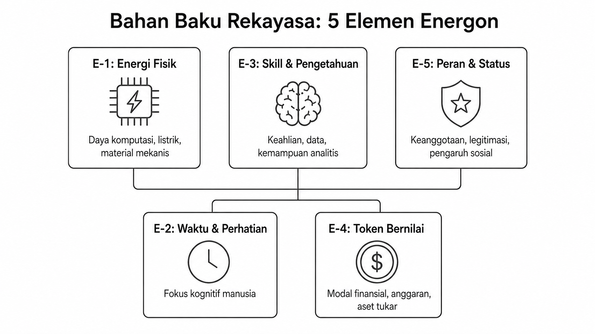
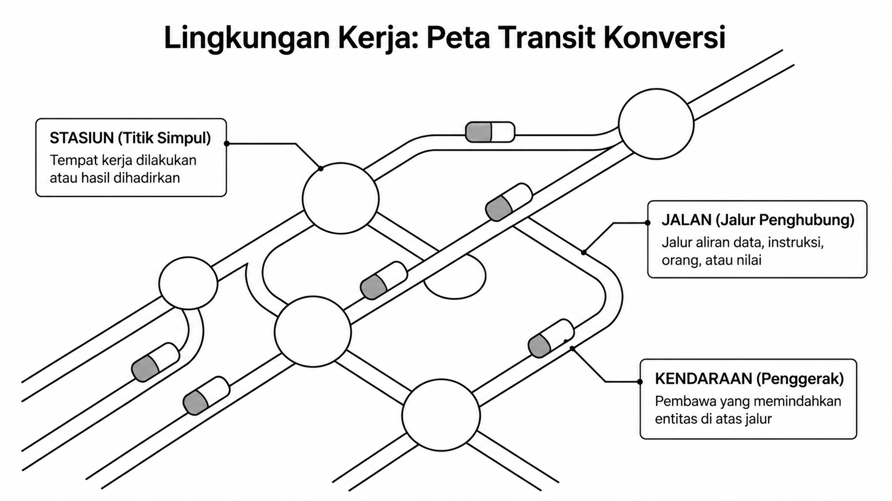
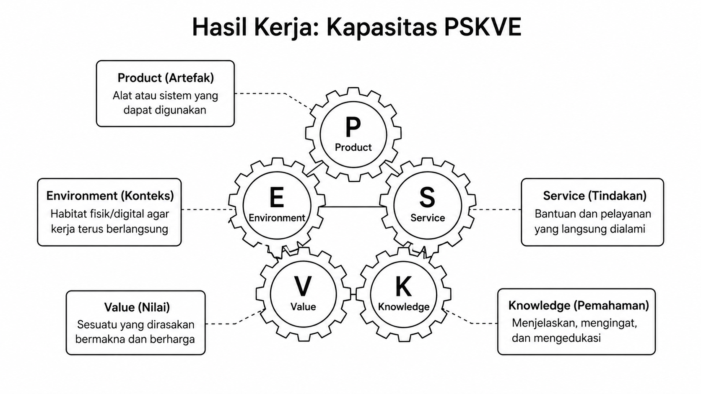

# Bab 11. Smart Engineering, Energon, dan Mesin PSKVE

## Prinsip Umum Rekayasa

Keberhasilan suatu solusi terjadi bila solusi tersebut memiliki **kapasitas kekuatan yang melebihi berat beban masalah**. Pada TISE level 1, logika ini diperluas: beban masalah tidak lagi hanya berbentuk energi fisik, material, atau informasi, tetapi juga dapat hadir sebagai kekurangan layanan, pengetahuan, nilai, atau lingkungan. Gagasan dasar ini divisualisasikan pada Gambar @fig-p5-02.

{#fig-p5-01 fig-align="center"}

Gambar @fig-p5-01 memperlihatkan bahwa TISE level 1 menempatkan rekayasa sebagai aktivitas desain infrastruktur konversi, bukan sekadar pembuatan artefak tunggal.

{#fig-p5-02 fig-align="center"}

Gambar @fig-p5-02 menegaskan bahwa rekayasa pada level ini adalah upaya sistematis untuk membalik neraca antara **beban masalah** dan **kapasitas kerja sistem**.

{#fig-p5-03 fig-align="center"}

Sebagaimana ditunjukkan pada Gambar @fig-p5-03, level 1 merupakan **engine room** yang mengubah konsep abstrak menjadi realitas operasional yang dapat menopang level 2 sampai level 5.

{#fig-p5-04 fig-align="center"}

Perluasan dari rekayasa tradisional menuju smart engineering dapat dilihat pada Gambar @fig-p5-04, di mana bahan baku rekayasa berubah dari EMI menjadi **energon**, sedangkan target hasil berubah menjadi **PSKVE**.

## Energon

Energon adalah segala sesuatu yang memiliki kapasitas untuk melakukan kerja atau memungkinkan kerja terjadi. Dengan demikian, energon tidak terbatas pada energi fisik, tetapi juga mencakup waktu, perhatian, pengetahuan, token bernilai, dan legitimasi sosial. Lima elemen ini diringkas dalam Gambar @fig-p5-06.

{#fig-p5-05 fig-align="center"}

Gambar @fig-p5-05 memperjelas struktur dasar konversi level 1: **input energon**, **proses infrastruktur**, dan **output kapasitas**.

{#fig-p5-06 fig-align="center"}

## PSKVE sebagai Kapasitas Kerja

PSKVE dapat dipahami sebagai lima bentuk kapasitas kerja yang dibutuhkan untuk menghadapi berbagai domain masalah: **Product, Service, Knowledge, Value, Environment**. Relasi kelima hasil ini divisualisasikan pada Gambar @fig-p5-08.

## Lingkungan Kerja: Stasiun, Jalan, Kendaraan

Konsep **stasiun, jalan, dan kendaraan** dipakai sebagai proto-model dari PSKVE engineering untuk menjelaskan bagaimana berbagai energon dikonversi, dipindahkan, ditransaksikan, dan diwujudkan menjadi PSKVE. Peta transit ini diperlihatkan pada Gambar @fig-p5-07.

{#fig-p5-07 fig-align="center"}

Gambar @fig-p5-07 menunjukkan bahwa lingkungan kerja cerdas bukan sekadar tempat, melainkan jaringan terstruktur untuk menjaga aliran sumber daya dan hasil agar tidak terpecah menjadi titik-titik terisolasi.

{#fig-p5-08 fig-align="center"}

Sebagaimana tampak pada Gambar @fig-p5-08, solusi akan rapuh bila hanya menghasilkan satu dimensi hasil; kapasitas yang kuat menuntut keterhubungan antar-unsur PSKVE.
