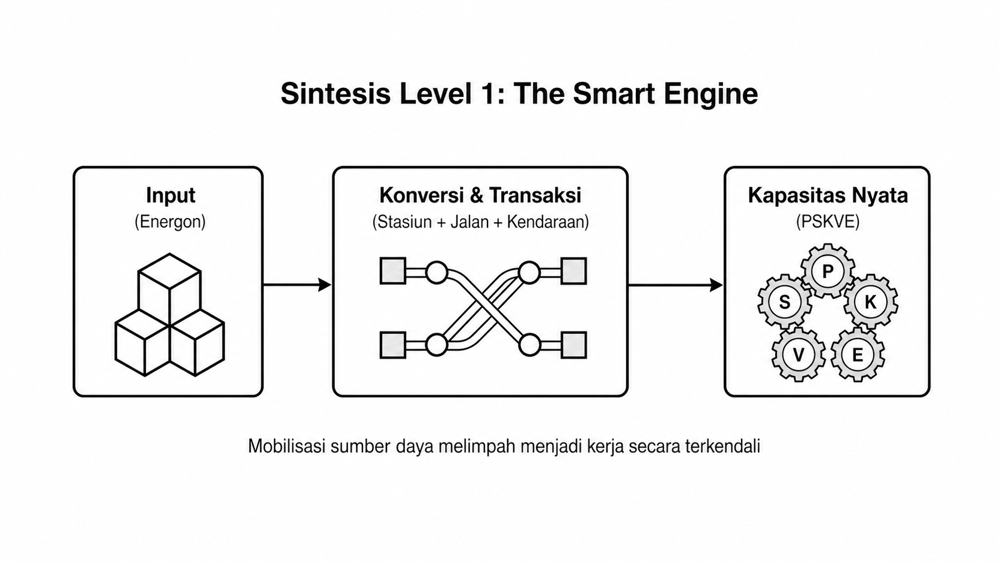
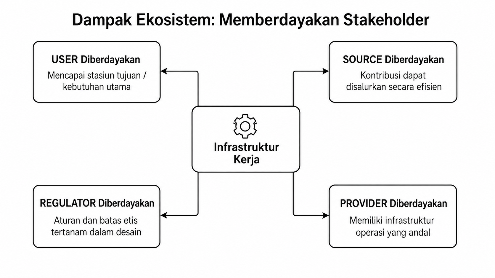
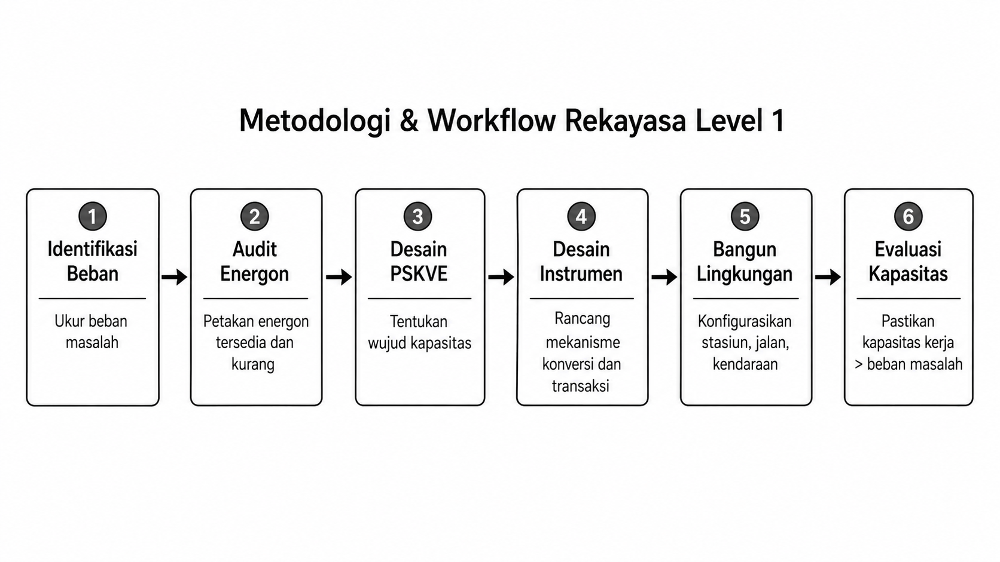
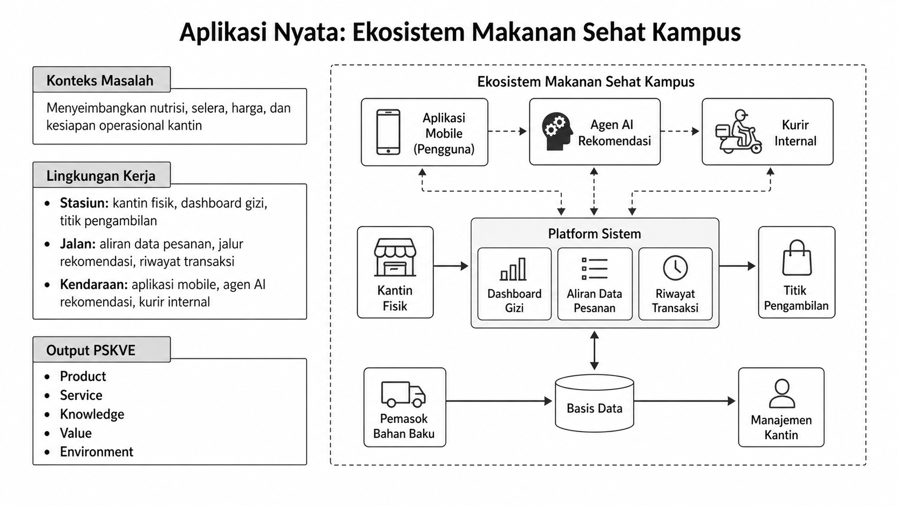
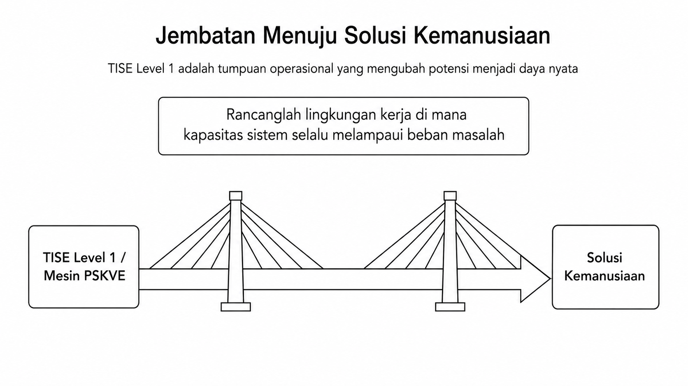

# Bab 12. Metodologi dan Workflow Rekayasa TISE level 1

## Fokus Metodologis

Metodologi pada TISE level 1 berfokus pada **konversi energon** menjadi PSKVE melalui mesin multidisiplin. Sintesis umum dari mekanisme tersebut ditunjukkan pada Gambar @fig-p5-09.

{#fig-p5-09 fig-align="center"}

Gambar @fig-p5-09 memperlihatkan bahwa inti rekayasa bukan terletak pada benda tunggal, melainkan pada **orkestrasi jalur konversi** dari input menuju kapasitas kerja nyata.

## Dampak Ekosistem terhadap Stakeholder

Infrastruktur level 1 juga harus dipahami sebagai mekanisme pemberdayaan multi-pihak. Karena itu, stakeholder yang terlibat—user, source, provider, dan regulator—harus memperoleh kapasitas baru dari desain sistem. Hubungan ini dirangkum dalam Gambar @fig-p5-10.

{#fig-p5-10 fig-align="center"}

## Langkah Workflow

1. Mengidentifikasi **beban masalah**.
2. Mengidentifikasi **energon**.
3. Mendesain hasil yang dibutuhkan dalam bentuk **PSKVE**.
4. Mendesain **instrumen konversi** dan **transaksi**.
5. Mengonfigurasi **stasiun, jalan, dan kendaraan**.
6. Mengevaluasi apakah kapasitas kerja yang dihasilkan sudah lebih besar daripada beban masalah.

Enam langkah kerja ini divisualisasikan secara ringkas pada Gambar @fig-p5-12.

{#fig-p5-12 fig-align="center"}

## Contoh Kasus: Healthy Food untuk Warga Kampus

Pada level ini, sistem healthy food kampus dapat dipahami sebagai lingkungan kerja cerdas dengan stasiun (kantin, aplikasi, dashboard), jalan (aliran data, transaksi, pengguna), dan kendaraan (aplikasi, agen rekomendasi, petugas kantin, sistem pembayaran). Contoh konkret konfigurasi tersebut dapat dilihat pada Gambar @fig-p5-11.

{#fig-p5-11 fig-align="center"}

Gambar @fig-p5-11 memperlihatkan bagaimana masalah gizi kampus tidak diselesaikan oleh satu alat, melainkan oleh sebuah **lingkungan kerja cerdas** yang mengintegrasikan data, rekomendasi, layanan, dan operasi.

## Menuju Solusi Kemanusiaan yang Lebih Tinggi

Pada akhirnya, level 1 berfungsi sebagai jembatan dari potensi menuju solusi kemanusiaan yang lebih luas. Jembatan ini menegaskan bahwa rancangan produk saja tidak cukup; yang diperlukan adalah rancangan lingkungan kerja yang menjaga kapasitas sistem tetap lebih besar daripada beban masalah. Penekanan ini diperlihatkan pada Gambar @fig-p5-13.

{#fig-p5-13 fig-align="center"}

Gambar @fig-p5-13 sekaligus menutup pembahasan bab ini dengan menegaskan peran level 1 sebagai fondasi operasional bagi visi naratif dan kecerdasan buatan di level-level yang lebih tinggi.
