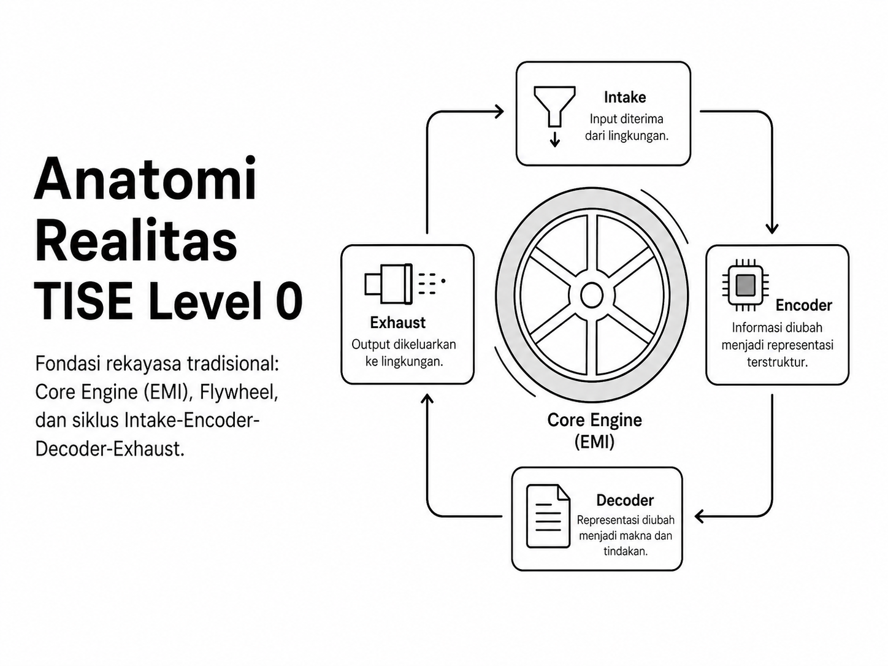
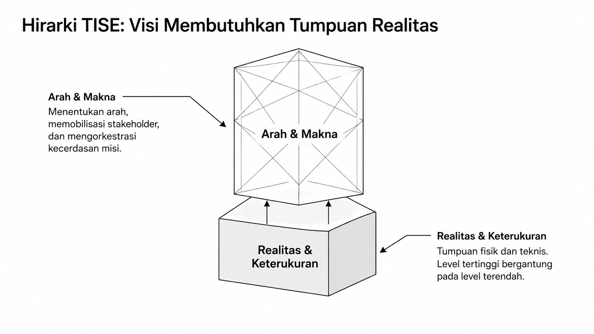
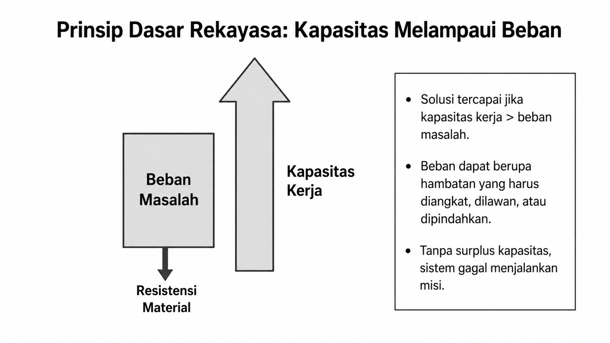
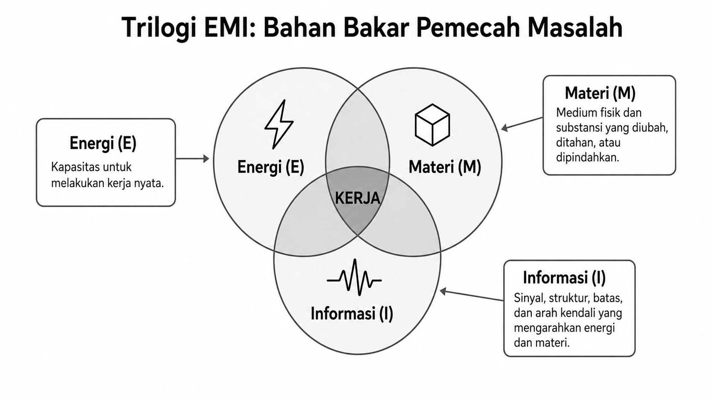
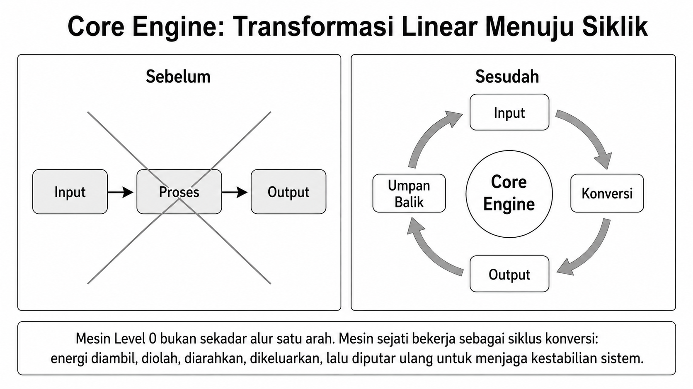
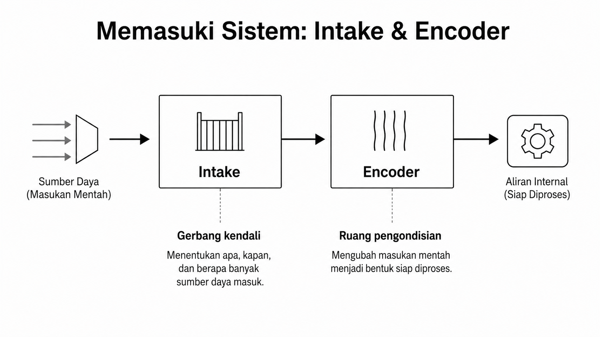
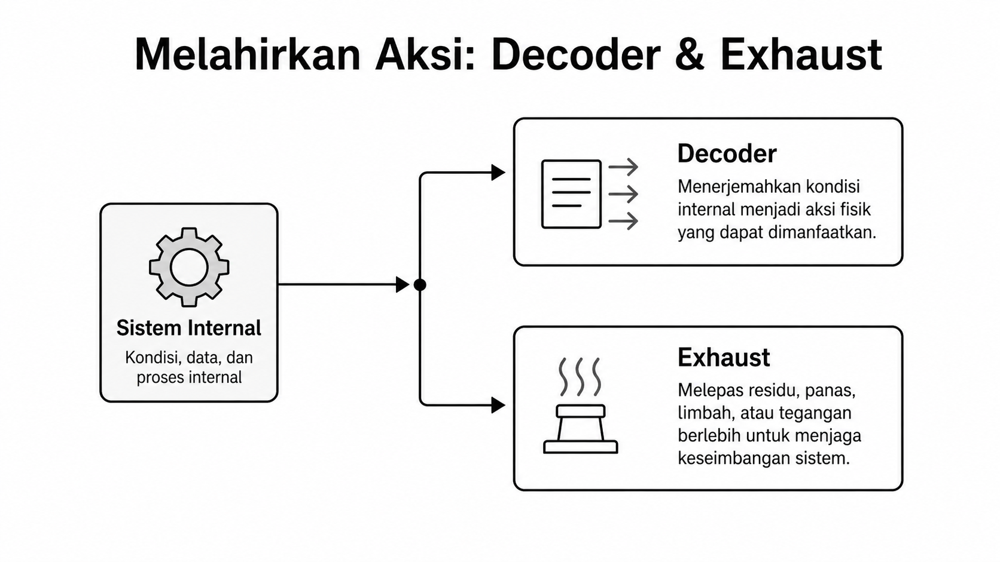
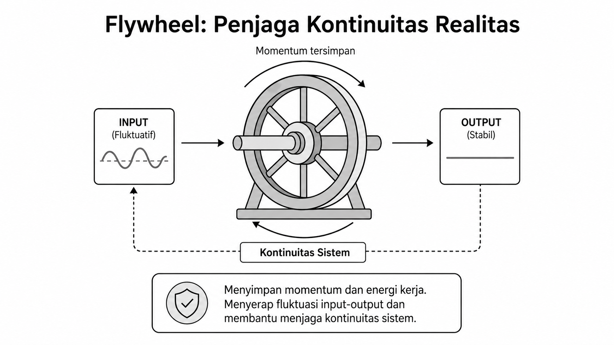
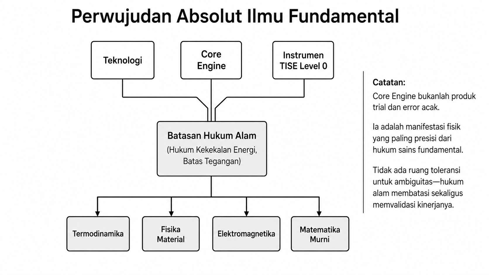
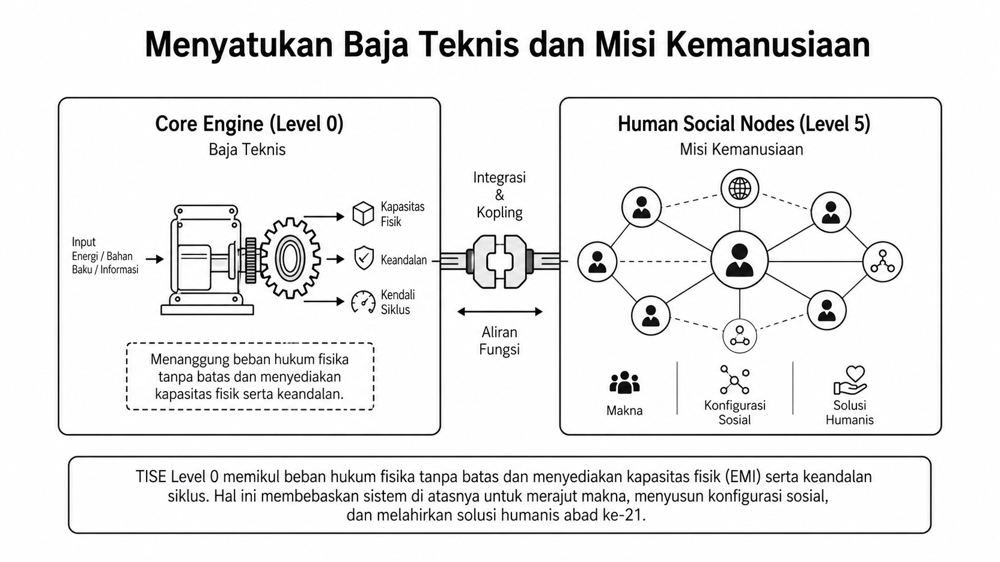

# Bab 13. Rekayasa Tradisional, Core Engine, dan EMI

## Anatomi Dasar TISE Level 0

TISE level 0 adalah wilayah **rekayasa tradisional** yang berurusan dengan realitas fisik, keterukuran, dan keandalan mesin sebagai fondasi mutlak bagi level-level di atasnya. Gambaran umum ini diperlihatkan pada Gambar @fig-p6-01.

{#fig-p6-01 fig-align="center"}

Gambar @fig-p6-01 menegaskan bahwa level 0 bukan lapisan tambahan, melainkan **pondasi realitas** tempat seluruh struktur TISE bertumpu.

{#fig-p6-02 fig-align="center"}

Sebagaimana terlihat pada Gambar @fig-p6-02, level-level yang lebih tinggi tidak pernah membatalkan level 0; justru seluruh arsitektur visi dan misi kemanusiaan harus bertumpu pada realitas teknis yang andal.

## Rekayasa Tradisional

Secara tradisional, rekayasa adalah disiplin untuk menghasilkan **mesin bertenaga** yang mampu mengangkat beban masalah dengan mengonversi energi sumber menjadi kerja. Prinsip paling mendasar dari cara pandang ini divisualisasikan pada Gambar @fig-p6-03.

{#fig-p6-03 fig-align="center"}

Gambar @fig-p6-03 memperjelas bahwa solusi teknis hanya mungkin muncul bila **kapasitas kerja** lebih besar daripada **beban masalah** dan batas-batas fisik yang harus dihadapi.

## EMI

Pada TISE level 0, sumber daya tradisional utama hadir dalam bentuk **energi, materi, dan informasi (EMI)**. Ketiga unsur ini bukan entitas terpisah, melainkan trilogi yang bersama-sama memungkinkan terjadinya kerja, sebagaimana dirangkum pada Gambar @fig-p6-04.

{#fig-p6-04 fig-align="center"}

Gambar @fig-p6-04 menunjukkan bahwa **kerja** lahir dari keterpaduan energi, materi, dan informasi, bukan dari salah satu unsur saja.

## Mesin, Instrumen, dan Teknologi

Mesin adalah instrumen konversi energi yang disusun secara siklik melalui **intake, encoder, decoder, exhaust**, dan dijaga kontinuitasnya oleh **flywheel**. Mesin dan instrumen penyusunnya adalah **teknologi** karena merupakan perwujudan praktis dari sains dan riset fundamental.

{#fig-p6-05 fig-align="center"}

Gambar @fig-p6-05 menegaskan bahwa mesin sejati bukan sekadar rantai linear satu kali jalan, tetapi **konfigurasi siklik** yang terus menjaga aliran energi dan kerja.

{#fig-p6-06 fig-align="center"}

Pada sisi masuk sistem, Gambar @fig-p6-06 memperlihatkan peran **intake** sebagai gerbang kendali dan **encoder** sebagai ruang pengondisian sumber daya mentah.

{#fig-p6-07 fig-align="center"}

Selanjutnya, Gambar @fig-p6-07 menunjukkan bahwa **decoder** menerjemahkan potensi internal menjadi aksi nyata, sedangkan **exhaust** menjaga sistem dari akumulasi residu dan ketegangan berlebih.

{#fig-p6-08 fig-align="center"}

Peran kestabilan siklus dijaga oleh **flywheel**, yang pada Gambar @fig-p6-08 dipahami sebagai penyimpan momentum agar jantung mesin tidak berhenti di tengah misi kerjanya.

## Teknologi sebagai Perwujudan Ilmu Fundamental

Karena itu, teknologi pada level 0 harus dibangun di atas sains yang presisi, bukan trial and error acak. Hubungan ini diperlihatkan pada Gambar @fig-p6-12.

{#fig-p6-12 fig-align="center"}

Gambar @fig-p6-12 menegaskan bahwa batasan hukum alam sekaligus menjadi **kendala** dan **validator** bagi kinerja teknologi level 0.

## Menopang Misi Kemanusiaan

Pada akhirnya, kekokohan teknis level 0 bukanlah tujuan akhir, melainkan sarana untuk menopang level-level yang lebih tinggi. Relasi ini diringkas pada Gambar @fig-p6-14.

{#fig-p6-14 fig-align="center"}

Gambar @fig-p6-14 menutup pembahasan bab ini dengan menegaskan bahwa keandalan mesin tradisional membebaskan sistem di atasnya untuk berfokus pada makna, konfigurasi sosial, dan solusi kemanusiaan.
