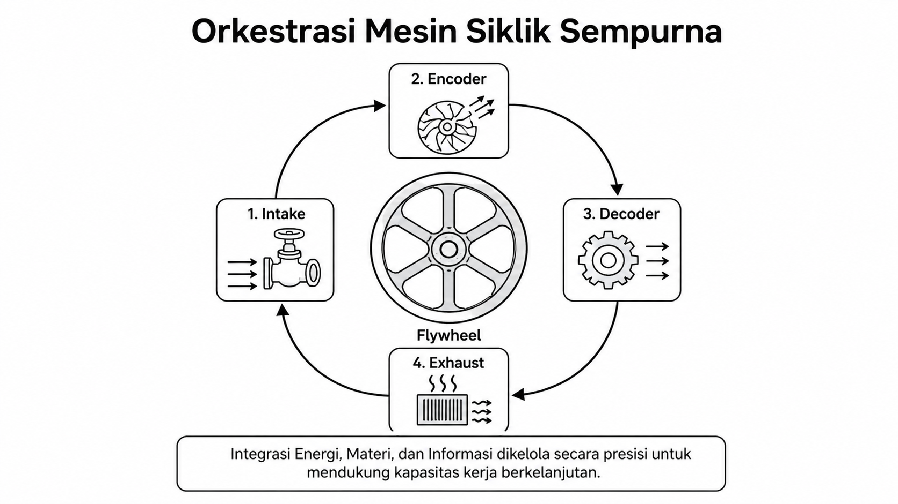
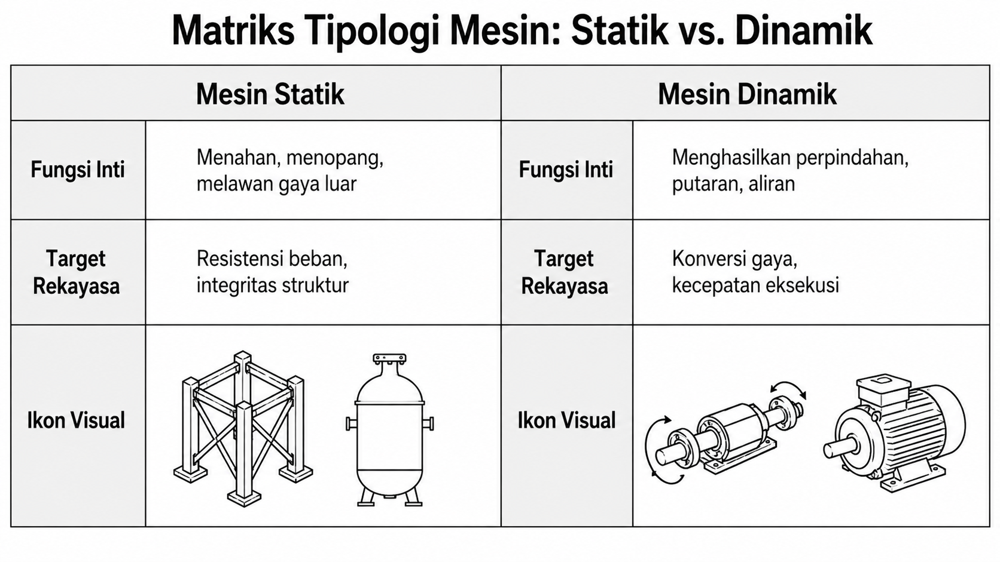
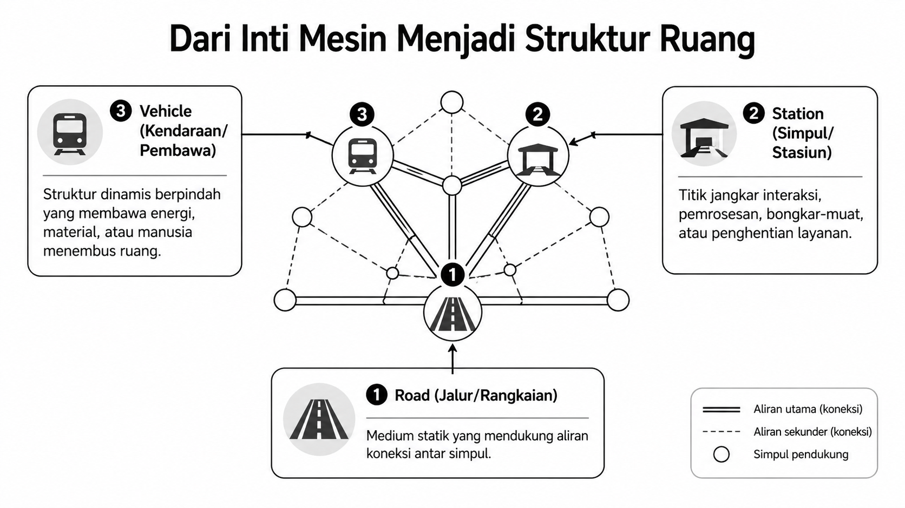
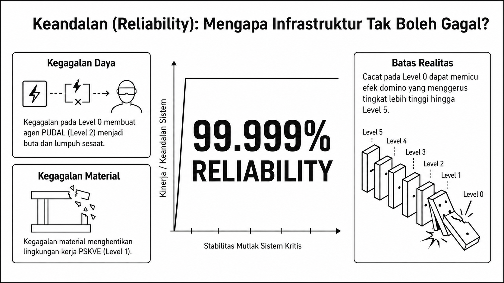

# Bab 14. Metodologi dan Workflow Rekayasa TISE level 0

## Fokus Metodologis

Metodologi pada TISE level 0 berfokus pada pembangunan **teknologi dasar** yang andal, terukur, dan dapat diintegrasikan ke level-level di atasnya. Bentuk utuh orkestrasi mesin ini diperlihatkan pada Gambar @fig-p6-09.

{#fig-p6-09 fig-align="center"}

Gambar @fig-p6-09 menunjukkan bahwa workflow level 0 harus dibaca sebagai **siklus terintegrasi**, bukan sebagai daftar komponen yang berdiri sendiri.

## Langkah Workflow

1. Mendefinisikan **beban energi, materi, dan informasi**.
2. Menentukan **core engine**.
3. Mendesain siklus **intake, encoder, decoder, exhaust**, dan **flywheel**.
4. Menentukan parameter kendali statik dan dinamik.
5. Memastikan dasar sains, teknologi, material, dan keandalan sistem.
6. Memasang mesin ke dalam struktur yang dapat menjadi **vehicle**, **station**, atau **road**.

## Kendali Statik dan Dinamik

Dalam praktik rekayasa, instrumen level 0 dapat mengambil bentuk **mesin statik** maupun **mesin dinamik**. Pembedaan ini penting karena memengaruhi target kapasitas, konfigurasi kendali, dan desain struktur, sebagaimana dirangkum pada Gambar @fig-p6-10.

{#fig-p6-10 fig-align="center"}

Gambar @fig-p6-10 memperlihatkan bahwa sebagian sistem berfungsi terutama untuk **menahan dan menopang**, sedangkan yang lain dirancang untuk **menghasilkan gerak, aliran, dan percepatan**.

## Dari Core Engine ke Struktur Operasional

Setelah core engine dirancang, langkah berikutnya adalah memasangnya ke dalam ruang operasional sehingga ia dapat hadir sebagai **road**, **station**, atau **vehicle**. Transformasi ini diperlihatkan pada Gambar @fig-p6-11.

{#fig-p6-11 fig-align="center"}

Sebagaimana tampak pada Gambar @fig-p6-11, metodologi level 0 tidak berhenti pada mesin internal, tetapi bergerak menuju **arsitektur ruang** yang memungkinkan kerja nyata berlangsung.

## Keandalan Sistem

Karena level 0 menjadi fondasi seluruh level di atasnya, maka **reliability** adalah syarat absolut. Kegagalan kecil pada daya, material, atau struktur dapat memicu keruntuhan berantai pada sistem yang lebih tinggi. Penekanan ini divisualisasikan pada Gambar @fig-p6-13.

{#fig-p6-13 fig-align="center"}

Gambar @fig-p6-13 menegaskan bahwa desain level 0 harus mengejar **keandalan hampir mutlak** karena cacat teknis di fondasi dapat meruntuhkan misi sistem secara keseluruhan.

## Contoh Kasus: Healthy Food untuk Warga Kampus

Pada level ini, healthy food kampus bertumpu pada teknologi dasar seperti perangkat dapur, pendinginan, infrastruktur listrik, perangkat input-output data, jaringan komunikasi, terminal pembayaran, dan sistem integrasi harga. Semua komponen ini tetap membutuhkan prinsip dasar bahwa kapasitas teknis harus lebih besar daripada beban kerja, aliran material harus terkendali, dan struktur operasional harus stabil.
