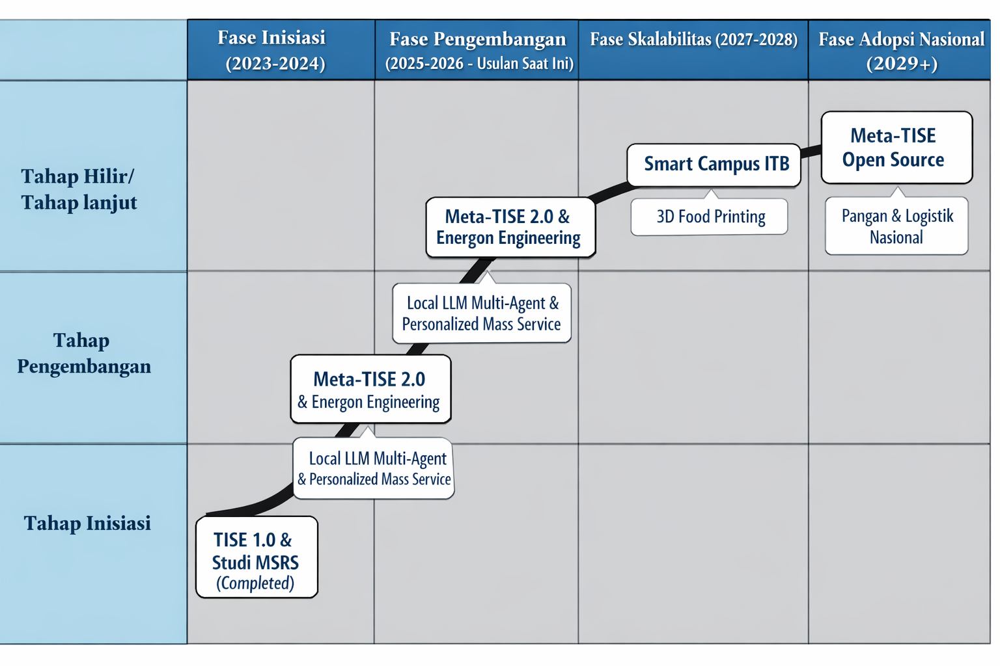

------------------------------------------------------------------------

format: docx

------------------------------------------------------------------------

**EXTENDED ABSTRACT**

**Judul Riset:** **Meta-TISE Sebagai Platform Rekayasa Sistem Multidisiplin: Kasus Ekosistem Pangan Kampus Cerdas**

**1. Latar Belakang dan Urgensi** Rekayasa sistem modern menghadapi "krisis termodinamika" akibat peningkatan kompleksitas yang tidak sebanding dengan utilitas yang dihasilkan. Dalam konteks institusi pendidikan, hal ini terlihat nyata pada sistem pangan kampus yang beroperasi dengan model "Mass Service" konvensional. Model ini memiliki entropi tinggi, ditandai dengan inefisiensi rantai pasok ("Push-based production"), tingginya limbah makanan (*waste*), dan kegagalan memenuhi kebutuhan nutrisi spesifik individu. Hal ini menciptakan "Defisit Nilai" ($V = U/C$), di mana biaya dan kompleksitas sistem ($C$) tinggi, namun utilitas personal ($U$) rendah.

Riset ini mengusulkan pergeseran paradigma menuju **Meta-TISE** (*Triune-Intelligence Smart Engineering*), sebuah sistem rekayasa autopoietik (mampu memperbaiki diri sendiri) yang bertujuan melakukan **Epemerisasi**—memindahkan fungsionalitas dari materi berbiaya tinggi ke informasi berbiaya rendah. Tujuannya adalah menciptakan ekosistem *Personalized Mass Service* yang menyeimbangkan kebutuhan nutrisi (Sehat), preferensi rasa (Enak), dan keterjangkauan (Terjangkau), sekaligus memberdayakan *Identitas Naratif* mahasiswa.

**2. Landasan Teori: Meta-TISE 2.0 dan Energon Engineering** Kerangka kerja riset ini didasarkan pada integrasi tiga konsep fundamental:

-   **Triune Intelligence (TI) 2.0:** Menggabungkan tiga pilar kecerdasan untuk mengatasi keterbatasan AI konvensional:
    1.  **Axiological Intelligence (AQ/Kernel):** Kecerdasan berbasis nilai dan makna yang menetapkan "Niat" (*Prompt*) dan batasan keselamatan non-negosiasi. Dalam TISE 2.0, ini berfungsi sebagai "Naskah Hidup" yang memperkuat agensi naratif pengguna.
    2.  **Synergistic Practical Intelligence (PI-A/Neocortex):** Simbiosis manusia-AI yang berfungsi sebagai mesin optimasi rasional menggunakan *Multi-Agent Systems* (MAS) untuk eksplorasi ruang desain.
    3.  **Social Intelligence (SI/Limbic):** Kecerdasan kolektif yang memvalidasi solusi melalui umpan balik sosial (*Crowd Intelligence*) untuk memastikan keselarasan nilai.
-   **Energon Engineering:** Memandang sistem sebagai mesin konversi energi tertutup yang mengubah *Potential Energon* (niat/sumber daya) menjadi *Kinetic Work* (layanan terkirim) melalui siklus transduksi dan penyimpanan momentum (*Flywheel*).
-   **Identitas Naratif:** Pendekatan psikologis yang memandang pengguna bukan sekadar konsumen pasif, melainkan "Protagonis-Penulis" yang menggunakan sistem untuk menulis ulang kisah hidup mereka (misal: dari pola hidup tidak sehat menjadi atletis) melalui mekanisme *redemption* (penebusan) dan *agency*.

**3. Metodologi dan Arsitektur Sistem** Sistem akan dibangun menggunakan arsitektur **Local LLM Multi-Agent System** (seperti Ollama) untuk menjamin privasi data dan kedaulatan operasional. Metodologi rekayasa mengikuti dua kerangka utama:

-   **Ontologi PSKVE (Product-Service-Knowledge-Value-Environment):** Memodelkan ekosistem pangan sebagai *System of Systems*. *Product* bukan hanya makanan, melainkan *Cyber-Physical System* yang terhubung IoT. *Service* bergeser dari kepemilikan ke akses *Assembly-to-Order*. *Knowledge* mencakup *Digital Twin* metabolisme pengguna dan rantai pasok.
-   **Topologi Kontrol PUDAL:** Siklus kendali adaptif yang terdiri dari *Perception* (ingesti multimodal), *Understanding* (analisis kausal/konteks), *Decision* (perencanaan agenik), *Acting* (eksekusi kebijakan), dan *Learning* (perbaikan diri rekursif).

Secara teknis, sistem akan mengorkestrasi agen-agen cerdas:

1.  **Meta-Architect Agent:** Menerjemahkan bahasa alami (niat pengguna) menjadi spesifikasi teknis (SysML v2).
2.  **Generative Engineer Agent:** Merancang menu dan logistik secara dinamis.
3.  **Critic Agent:** Melakukan validasi keamanan melalui simulasi *Digital Twin* sebelum eksekusi.
4.  **Student Support Agent:** Bertindak sebagai "Juru Tulis Cerdas" yang memberikan *scaffolding* naratif dan *nudge* reflektif kepada pengguna.

**4. Studi Kasus Aplikasi: MSRS-THA** Platform Meta-TISE akan divalidasi melalui pengembangan **Multi-Stakeholder Recommendation System (MSRS)** untuk pangan kampus. Sistem ini memfasilitasi **Ko-Kreasi Nilai** antara penyedia (kantin) dan konsumen (mahasiswa).

-   **Skenario Operasional:** Ketika mahasiswa memesan makan siang, sistem tidak hanya mencocokkan preferensi rasa, tetapi juga memeriksa *Digital Twin* kesehatan mereka (misal: pantangan gula) dan *Digital Twin* inventaris kantin (misal: stok sayur berlebih).
-   **Optimasi Pareto:** Algoritma MOEA (*Multi-Objective Evolutionary Algorithms*) mencari solusi yang menyeimbangkan fungsi objektif: *Tasty* (Enak), *Healthy* (Sehat), dan *Affordable* (Terjangkau) bagi mahasiswa, serta meminimalkan limbah bagi penyedia.
-   **Intervensi Naratif:** Sistem memberikan intervensi psikologis ("Nudges to Reason") yang menghubungkan pilihan makanan dengan tujuan jangka panjang mahasiswa, mengubah transaksi rutin menjadi momen pembentukan karakter.

**5. Kesimpulan dan Dampak** Riset ini menawarkan lompatan teknologi dari sistem rekomendasi pasif menjadi platform rekayasa otonom yang memanusiakan teknologi. Dampak yang diharapkan meliputi:

1.  **Efisiensi Termodinamika:** Pengurangan drastis limbah makanan melalui produksi berbasis *Pull* dan prediksi permintaan yang akurat.
2.  **Pemberdayaan Manusia:** Transformasi mahasiswa dari konsumen pasif menjadi agen aktif yang memiliki otoritas atas kesehatan dan narasi hidup mereka.
3.  **Kedaulatan Teknologi:** Penguasaan teknologi rekayasa sistem berbasis *Local LLM* yang aman, privat, dan *scalable* untuk diadopsi oleh institusi lain.

Dengan demikian, Meta-TISE 2.0 tidak hanya merekayasa menu makanan, tetapi merekayasa ulang cara manusia berinteraksi dengan sistem pendukung kehidupannya untuk mencapai kehidupan yang lebih bermakna dan berkelanjutan.

**Kata Kunci:** *Meta-TISE, Triune Intelligence, Energon Engineering, Multi-Agent Systems, Personalized Mass Service, Identitas Naratif, Sistem Pangan Berkelanjutan.*

# Substansi

Berikut adalah penjelasan mendalam mengenai rekayasa multidisiplin, urgensinya, masalah yang dihadapi, dan bagaimana **Meta-TISE** berperan sebagai solusi komprehensif.

### 1. Apa Itu Rekayasa Multidisiplin dan Seberapa Penting?

**Definisi:** Dalam konteks sumber yang ada, rekayasa multidisiplin bukan sekadar menggabungkan berbagai bidang teknik. Ini adalah paradigma rekayasa sistem cerdas (*Smart Engineering*) yang bertujuan memberdayakan manusia untuk memecahkan masalah multidomain yang kompleks. Rekayasa ini memandang solusi bukan sebagai artefak statis, melainkan sebagai **sistem dari sistem** (*Systems of Systems*) yang dinamis dan adaptif,.

**Pentingnya Rekayasa Multidisiplin:** Urgensi pendekatan ini muncul karena tantangan zaman sekarang (seperti krisis iklim, kesehatan masyarakat, dan kesetaraan sosial di era *Anthropocene*) tidak dapat diselesaikan dengan pendekatan linier atau satu bidang ilmu saja. Pentingnya rekayasa ini terletak pada kemampuannya untuk:

-   **Menciptakan Nilai (**$V$): Meningkatkan utilitas ($U$) sambil menekan biaya dan kompleksitas ($C$) melalui kompresi informasi.
-   **Menghubungkan Kesenjangan:** Menjembatani posisi saat ini (*current status*) dan posisi yang diinginkan (*desired status*) para pemangku kepentingan dalam ruang lima dimensi (PSKVE).
-   **Memberdayakan Manusia:** Menjadikan manusia sebagai pusat kendali (*human-centric*), bukan menggantikan mereka dengan mesin.

### 2. Apa Masalah dalam Rekayasa Saat Ini?

Sumber-sumber menyebutkan bahwa paradigma rekayasa tradisional menghadapi **"Krisis Termodinamika"** dan telah mencapai batas asimtotiknya,. Masalah utamanya meliputi:

1.  **Entropi Tinggi & Defisit Nilai:** Sistem saat ini sering kali boros energi dan materi. Contohnya dalam sistem pangan kampus, model produksi massal ("Push") menghasilkan limbah tinggi dan nutrisi yang tidak sesuai kebutuhan individu, menciptakan defisit nilai di mana biaya ($C$) tinggi tetapi utilitas personal ($U$) rendah,.
2.  **Silo Kecerdasan:** Kecerdasan bekerja secara terkotak-kotak (*siloed*). Seorang ahli bekerja sendiri, terpisah dari data *real-time* lingkungan atau umpan balik kolektif, sehingga solusi yang dihasilkan kaku dan sulit beradaptasi,.
3.  **Konflik Kepentingan:** Sulitnya menyeimbangkan kepentingan berbagai pemangku kepentingan (misal: konsumen ingin murah, produsen ingin untung, lingkungan butuh keberlanjutan) tanpa alat bantu komputasi yang canggih,.
4.  **Halusinasi Fisika & Etika:** Mengandalkan AI generatif saja berisiko menghasilkan desain yang melanggar hukum fisika ("Halusinasi Fisika") atau mengabaikan nilai-nilai kemanusiaan jika tidak ada penyelarasan nilai (*Value Alignment*),.

### 3. Bagaimana Meta-TISE Menjadi Solusi dan Platform?

**Meta-TISE** didefinisikan sebagai sistem rekursif dan autopoietik (mampu membangun dirinya sendiri) yang dirancang untuk merekayasa sistem cerdas. Ia bertindak sebagai "mesin yang membangun mesin" (*machine that builds machines*).

Berikut cara Meta-TISE menjawab tantangan rekayasa multidisiplin:

#### A. Sebagai Solusi: Integrasi *Triune Intelligence* (TI)

Meta-TISE tidak hanya mengandalkan satu jenis kecerdasan, melainkan mengorkestrasi tiga pilar kecerdasan (*Triune Intelligence*) untuk memecahkan masalah multidisiplin,,:

1.  **Kecerdasan Individu (Kernel/Reptilian):** Menangani "Niat" (*Intent*) dan "Kelangsungan Hidup". Ini memastikan sistem melayani tujuan spesifik manusia (misal: pantangan alergi) dan bertindak sebagai pemegang kendali utama (*kill switch*),.
2.  **Kecerdasan Buatan (Rasional/Neocortex):** Bertindak sebagai mesin optimasi dan sintesis. Menggunakan *Multi-Agent Systems* (MAS) untuk mengeksplorasi ribuan opsi desain, melakukan simulasi *Digital Twin*, dan menangani logika kompleks yang melampaui kapasitas otak manusia,.
3.  **Kecerdasan Kolektif (Sosial/Limbic):** Bertindak sebagai validator dan sensor entropi. Ini memastikan solusi selaras dengan norma sosial, etika, dan tren pasar melalui umpan balik kerumunan (*Crowd Intelligence*),.

#### B. Sebagai Platform: Arsitektur PSKVE dan PUDAL

Meta-TISE menyediakan kerangka kerja (platform) yang terstruktur untuk mengelola kompleksitas multidisiplin:

1.  **Lingkungan Kerja PSKVE:** Sistem memodelkan masalah dalam lima dimensi untuk memastikan tidak ada aspek yang terlewat,:

    -   **\[P\]roduct:** Artefak fisik/siber (misal: makanan cerdas).
    -   **\[S\]ervice:** Logika layanan (misal: *Assembly-to-Order*).
    -   **\[K\]nowledge:** Basis pengetahuan semantik dan *Digital Twins*.
    -   **\[V\]alue:** Optimasi multi-objektif (misal: Sehat, Enak, Terjangkau).
    -   **\[E\]nvironment:** Konteks fisik dan regulasi.

2.  **Mesin Kontrol PUDAL:** Platform ini digerakkan oleh siklus kontrol adaptif: **P**erception (Persepsi data multimodal), **U**nderstanding (Pemahaman konteks/kausal), **D**ecision (Perencanaan agenik), **A**cting (Eksekusi tersertifikasi), dan **L**earning (Pembelajaran rekursif),,.

3.  **Epemerisasi (Kompresi Nilai):** Sebagai platform, Meta-TISE bertujuan melakukan **Epemerisasi**: kemampuan melakukan "lebih banyak dengan sumber daya lebih sedikit". Ia memindahkan fungsionalitas dari materi (berbiaya tinggi) ke informasi/algoritma (berbiaya rendah), sehingga memecahkan krisis biaya dalam rekayasa konvensional,.

4.  **Ko-Kreasi Naratif (TISE 2.0):** Platform ini juga memfasilitasi aspek psikologis dan naratif. Ia tidak hanya menyelesaikan tugas teknis tetapi membantu pengguna menulis ulang "Kisah Hidup" mereka (misal: dari gaya hidup tidak sehat menjadi sehat) melalui interaksi yang membangun agensi diri (*Self-Authorship*),.

### Kesimpulan

Meta-TISE adalah platform rekayasa multidisiplin yang ideal karena ia mengubah paradigma dari **"Mendesain Artefak Mati"** menjadi **"Mendesain Sistem Kehidupan yang Otonom"**. Dengan menggabungkan niat manusia, kekuatan komputasi AI, dan validasi sosial dalam satu siklus tertutup, Meta-TISE mampu menghasilkan solusi yang efisien secara termodinamika, cerdas secara operasional, dan bermakna secara manusiawi,.

Berikut adalah ringkasan proposal Riset Unggulan ITB 2026 yang mengintegrasikan paradigma Meta-TISE 2.0 dan *Energon Engineering*:

**Ringkasan Proposal: Transformasi Ekosistem Pangan Kampus Melalui Meta-TISE 2.0**

-   **Cakupan Riset:** Riset ini berfokus pada pengembangan platform **Meta-TISE 2.0** (*Triune-Intelligence Smart Engineering*), sebuah sistem rekayasa otonom berbasis *Multi-Agent Systems* (MAS) yang berjalan pada infrastruktur *Local LLM* (Ollama) untuk menjamin privasi dan keamanan data,. Lingkup penelitian mencakup rekayasa sistem sosio-teknikal yang mengorkestrasi interaksi kompleks antara aspek biologis (nutrisi), termodinamika (rantai pasok/energi), dan psikologis (narasi diri) dalam ekosistem pangan kampus,.

-   **Sasaran:** Sasaran utama adalah mentransformasi layanan makanan kampus dari model "Mass Service" konvensional yang berentropi tinggi (banyak limbah, produksi *Push*) menjadi **Layanan Massal Terpersonalisasi** (*Personalized Mass Service*) berbasis *Pull*,. Secara spesifik, sistem bertujuan menyeimbangkan trias **THA** (*Tasty, Healthy, Affordable*) bagi mahasiswa, sekaligus mencapai target **Ephemerisasi** (melakukan lebih banyak dengan sumber daya minimal) untuk keberlanjutan lingkungan,.

-   **Nilai Kecendekiawanan:** Proposal ini menawarkan kebaruan teoretis dengan memadukan **Energon Engineering** (konversi niat menjadi kerja fisik melalui siklus tertutup) dengan **Psikologi Naratif** (Identitas Naratif),. Inovasi kuncinya adalah pergeseran dari sekadar orkestrasi tugas (TISE 1.0) menjadi **Ko-Kreasi Naratif** (TISE 2.0), di mana sistem tidak hanya melayani kebutuhan makan, tetapi memberdayakan mahasiswa sebagai "Protagonis-Penulis" yang aktif membangun agensi (*Agency*) dan menebus kebiasaan buruk (*Redemption*) melalui interaksi cerdas dengan sistem,.

-   **Kemitraan:** Riset ini menerapkan **Multi-Stakeholder Recommendation System (MSRS)** yang memfasilitasi negosiasi otomatis dan **Ko-Kreasi Nilai** antara penyedia layanan (UMKM kantin/petani lokal), konsumen (mahasiswa/staf), dan pembuat kebijakan kampus,. Kemitraan ini dirancang untuk memastikan keadilan ekonomi bagi vendor lokal (*Producer Fairness*) dan inklusivitas harga bagi mahasiswa (*Consumer Inclusivity*).

-   **Luasnya Dampak:** Dampak yang dihasilkan bersifat multidimensi: mengurangi limbah pangan secara drastis melalui prediksi presisi (*Pre-consumer waste reduction*), meningkatkan kesehatan metabolik dan kesejahteraan mental komunitas kampus, serta menyediakan model infrastruktur AI yang berdaulat (lokal) dan *scalable* yang dapat diadopsi oleh institusi pendidikan lain sebagai solusi *Smart Campus* yang memanusiakan teknologi,.

-   Berikut adalah **Substansi Proposal Riset Unggulan ITB 2026** yang disusun berdasarkan sintesis mendalam dari dokumen sumber yang Anda berikan, mengintegrasikan paradigma *Meta-TISE*, *Energon Engineering*, dan *Multi-Stakeholder Recommendation System* (MSRS).

------------------------------------------------------------------------

# SUBSTANSI PROPOSAL RISET

**Judul Riset:** **Meta-TISE Sebagai Platform Rekayasa Sistem Multidisiplin: Kasus Ekosistem Pangan Kampus Cerdas**

------------------------------------------------------------------------

### 1. Latar Belakang Permasalahan

**Isu Global dan Strategis: Krisis Termodinamika dan Defisit Nilai** Dunia rekayasa sistem modern saat ini menghadapi "krisis termodinamika" akibat peningkatan kompleksitas yang tidak sebanding dengan utilitas yang dihasilkan. Paradigma rekayasa tradisional yang bersifat linier dan terkotak-kotak (*siloed*) telah mencapai batas asimtotiknya dalam menangani masalah multidomain yang kompleks. Hal ini menciptakan apa yang disebut sebagai **Defisit Nilai**, di mana sistem menuntut Biaya/Kompleksitas ($C$) yang tinggi, namun menghasilkan Utilitas ($U$) yang rendah bagi individu ($V = U/C$). Di era *Anthropocene*, tantangan ini menuntut pergeseran menuju **Epemerisasi**—kemampuan melakukan "lebih banyak dengan sumber daya lebih sedikit" dengan memindahkan fungsionalitas dari materi ke informasi.

**Permasalahan Spesifik: Kegagalan Sistem Pangan Kampus** Dalam konteks institusi pendidikan seperti ITB, kegagalan sistemik ini terlihat nyata pada ekosistem pangan kampus. Sistem saat ini beroperasi pada model **"Mass Service"** dengan strategi produksi *Push* (memasak massal berdasarkan perkiraan). Model ini memiliki entropi tinggi yang ditandai oleh: 1. **Limbah Pangan (*Waste*):** Ketidakcocokan antara suplai massal dan permintaan spesifik menyebabkan tingginya *pre-consumer waste*. 2. **Malnutrisi Terselubung:** Menu yang "satu ukuran untuk semua" gagal memenuhi kebutuhan metabolik individu (misal: diabetes, alergi), berkontribusi pada masalah kesehatan jangka panjang. 3. **Krisis Agensi Naratif:** Mahasiswa diposisikan sebagai konsumen pasif tanpa kendali (*agency*) atas asupan mereka, yang berdampak negatif pada pembentukan identitas dan kesehatan mental mereka.

**Justifikasi Urgensi Riset** Riset ini mendesak untuk dilakukan karena pendekatan sistem rekomendasi konvensional hanya berfokus pada preferensi pengguna (user-centric) dan mengabaikan batasan produsen serta keberlanjutan lingkungan. Diperlukan sebuah lompatan teknologi menuju **Meta-TISE 2.0** (*Triune-Intelligence Smart Engineering*), sebuah sistem yang tidak hanya mengorkestrasi logistik pangan tetapi juga memberdayakan mahasiswa untuk menjadi "Penulis" (*Self-Authorship*) dari narasi kesehatan mereka sendiri. Tanpa intervensi ini, ekosistem kampus akan terus terjebak dalam inefisiensi termodinamika dan kegagalan membentuk lulusan yang sehat dan berdaya.

------------------------------------------------------------------------

### 2. Tujuan

Berdasarkan latar belakang di atas, riset ini bertujuan untuk memecahkan masalah inefisiensi dan pasivitas dalam ekosistem pangan kampus melalui pengembangan teknologi rekayasa otonom. Tujuan spesifik riset adalah:

1.  **Mengembangkan Arsitektur Meta-TISE 2.0:** Membangun platform rekayasa sistem yang bersifat autopoietik (memperbaiki diri sendiri) berbasis *Multi-Agent Systems* (MAS) yang berjalan pada infrastruktur *Local LLM* (Ollama) untuk menjamin privasi dan kedaulatan data.
2.  **Mewujudkan *Personalized Mass Service* (MSRS-THA):** Mengimplementasikan *Multi-Stakeholder Recommendation System* (MSRS) yang menyeimbangkan trias **THA** (*Tasty, Healthy, Affordable*) bagi mahasiswa dengan profitabilitas dan pengurangan limbah bagi penyedia layanan, menggunakan algoritma optimasi multi-objektif.
3.  **Implementasi *Energon Engineering*:** Menerapkan siklus transduksi energi (Input-Encoder-Flywheel-Decoder) untuk mengonversi niat (*Potential Energon*) menjadi kerja nyata (*Kinetic Work*) secara efisien, guna mencapai target Epemerisasi.
4.  **Pemberdayaan Identitas Naratif:** Mengintegrasikan fitur psikologis TISE 2.0 di mana sistem berfungsi sebagai "Juru Tulis Cerdas" yang memberikan *scaffolding* (dukungan) naratif, mengubah transaksi makan siang menjadi momen pembentukan karakter dan agensi mahasiswa.

------------------------------------------------------------------------

### 3. Metodologi

Riset ini menggunakan pendekatan *Design Science Research* yang diintegrasikan dengan kerangka kerja rekayasa sistem Meta-TISE. Metodologi dilaksanakan dalam empat tahapan utama:

**Tahap 1: Kompresi Semantik & Ontologi (Bulan 1-4)** \* **Aktivitas:** Memetakan domain pangan kampus ke dalam ontologi **PSKVE** (*Product, Service, Knowledge, Value, Environment*). \* **Pengolahan Data:** Menggunakan *Meta-Architect Agent* berbasis LLM untuk menerjemahkan bahasa alami (niat pengguna) menjadi spesifikasi teknis **SysML v2**. \* **Luaran:** *Knowledge Graph* yang menghubungkan bahan baku, nutrisi, dan profil metabolik mahasiswa.

**Tahap 2: Eksplorasi Ruang Desain & Digital Twin (Bulan 5-8)** \* **Aktivitas:** Mengembangkan **Digital Twin** (Kembaran Digital) untuk metabolisme mahasiswa dan rantai pasok kantin. Menerapkan **Set-Based Design** untuk mengeksplorasi ribuan variasi menu yang valid secara fisik dan nutrisi. \* **Software:** Python (untuk logika agen), Neo4j (untuk Knowledge Graph), dan simulasi berbasis fisika untuk validasi *Digital Twin*.

**Tahap 3: Pengembangan *Energon Engine* & Multi-Agent System (Bulan 9-16)** \* **Aktivitas:** Membangun *Multi-Agent System* hibrida menggunakan kerangka kerja **CrewAI** (untuk pipeline penilaian/logistik deterministik) dan **AutoGen** (untuk interaksi percakapan mahasiswa) yang berjalan di atas **Ollama** (Local LLM). \* **Siklus Kontrol:** Mengimplementasikan topologi kontrol **PUDAL** (*Perception, Understanding, Decision, Acting, Learning*) untuk manajemen operasional *real-time*. \* *Perception:* Sensor IoT dan input teks. \* *Decision:* Algoritma MOEA (*Multi-Objective Evolutionary Algorithms*) untuk optimasi Pareto. \* *Acting:* Eksekusi instruksi ke dapur (*Smart Kitchen*).

**Tahap 4: Integrasi Naratif & Validasi Lapangan (Bulan 17-24)** \* **Aktivitas:** Implementasi fitur TISE 2.0 (Prompt Reflektif, Stasiun Penebusan). Uji coba pilot MSRS di satu kantin ITB. \* **Evaluasi:** Mengukur *Compression Ratio* (CR) untuk efisiensi sistem dan survei psikologis untuk mengukur peningkatan Agensi Naratif mahasiswa.

------------------------------------------------------------------------

### 4. Jadwal Pelaksanaan

Berikut adalah jadwal pelaksanaan riset selama 2 tahun (24 bulan):

| Tahapan & Kegiatan | Bulan 1-4 | Bulan 5-8 | Bulan 9-12 | Bulan 13-16 | Bulan 17-20 | Bulan 21-24 |
|:----------|:---------:|:---------:|:---------:|:---------:|:-----------:|:---------:|
| **1. Kompresi Semantik** |  |  |  |  |  |  |
| \- Studi Literatur & Ontologi PSKVE | XX |  |  |  |  |  |
| \- Pengembangan Knowledge Graph | XX |  |  |  |  |  |
| **2. Eksplorasi Desain** |  |  |  |  |  |  |
| \- Pengembangan Digital Twin |  | XX |  |  |  |  |
| \- Simulasi Set-Based Design |  | XX |  |  |  |  |
| **3. Pengembangan Sistem (Energon)** |  |  |  |  |  |  |
| \- Setup Local LLM (Ollama) & MAS |  |  | XX |  |  |  |
| \- Implementasi PUDAL Loop |  |  |  | XX |  |  |
| \- Integrasi IoT & Algoritma MOEA |  |  |  | XX |  |  |
| **4. Integrasi & Validasi** |  |  |  |  |  |  |
| \- Implementasi Fitur Naratif (TISE 2.0) |  |  |  |  | XX |  |
| \- Pilot Project di Kantin |  |  |  |  | XX |  |
| \- Evaluasi & Pelaporan Akhir |  |  |  |  |  | XX |
| **5. Sosialisasi & Publikasi** |  |  |  | X | X | X |

------------------------------------------------------------------------

### 5. Peta Jalan (Road Map) Riset ITB

Proposal ini merupakan bagian integral dari peta jalan jangka panjang KK Teknologi Informasi/Pusat Penelitian AI ITB dalam bidang **Rekayasa Sistem Cerdas (*Intelligent Systems Engineering*)**.

1.  **Fase Inisiasi (2023-2024):** Pengembangan konsep dasar *Triune Intelligence* (TISE 1.0) dan studi awal MSRS untuk pangan sehat (*Completed*).
2.  **Fase Pengembangan (2025-2026 - Usulan Saat Ini):** Pengembangan platform **Meta-TISE 2.0** dan **Energon Engineering**. Fokus pada implementasi teknis *Local LLM Multi-Agent System* dan validasi model *Personalized Mass Service* di lingkungan terbatas (Lab/Kantin Pilot).
3.  **Fase Skalabilitas (2027-2028):** Perluasan sistem ke seluruh kampus ITB (Smart Campus Ecosystem). Integrasi penuh dengan sistem akademik dan kesehatan mahasiswa. Penerapan teknologi *3D Food Printing* untuk personalisasi ekstrem.
4.  **Fase Adopsi Nasional (2029+):** Diseminasi platform Meta-TISE sebagai standar *Open Source* untuk sistem pangan dan logistik di universitas lain dan rumah sakit di Indonesia.

------------------------------------------------------------------------

### 6. Daftar Pustaka

1.  L. Wahyunita, A. Z. R. Langi, and A. P. Koesoema, “Multi-Stakeholder Recommendation System on Healthy Food Domain,” *IEEE Access*,Draft submitted to 2024.

2.  L. Wahyunita, A. Z. R. Langi, and A. P. Koesoema, “Sustainable University Food Service Recommendations: Personalized Mass Service and Multi-Stakeholder Intelligence,” *Internal Report ITB*, 2025.

3.  A. Z. R. Langi, “Meta-TISE: The Recursive Architecture of Value Compression in Triune-Intelligence Smart Engineering Systems,” *Meta TISE: Value Compression Engineering*, 2026.

4.  A. Z. R. Langi, “TISE 2.0: Paradigma Ko-Kreasi Naratif untuk Kehidupan Istimewa,” *Internal Paper*, 2025.

5.  A. Z. R. Langi, “Energon Engineering: Matter, Energy, and Time,” *Lecture Notes on TISE*, 2025.

6.  L. Wahyunita, “The Role of Recommendation Systems in Co-Creation on Products that Meet Both Consumer and Producer Requirements,”

7.  *The 12th International Conference for Smart Society (ICISS)*, 2025. “Architecting an Autonomous Educational Ecosystem: A Multi-Agent Framework for Course Management on Local LLMs,” *Technical Report*, 2025.