# HALAMAN SAMPUL

**LAPORAN KEMAJUAN**  
**PROGRAM RISET KOLABORASI INDONESIA-EQUITY**  
**WORLD CLASS UNIVERSITY (WCU)**  
**TAHUN 2025 - 2026**  

**Pengembangan dan Validasi Model Pembelajaran VALORIZE: Kerangka Pedagogis Berbasis AI untuk Membentuk Identitas Profesional Rekayasawan di Era Digital**

**Peneliti Utama:** Prof. Ir. Armein Z.R. Langi, M.Sc., Ph.D. (ITB)  
**Peneliti Mitra:**  
1. Meliana Christianti Johan (Universitas Kristen Maranatha)  
2. I Gusti Bagus Baskara Nugraha (Institut Teknologi Bandung)  
3. Radiant Victor Imbar (Universitas Kristen Maranatha)  

**INSTITUT TEKNOLOGI BANDUNG (ITB)**  

\newpage
# HALAMAN PENGESAHAN

1. **Judul:** Pengembangan dan Validasi Model Pembelajaran VALORIZE: Kerangka Pedagogis Berbasis AI untuk Membentuk Identitas Profesional Rekayasawan di Era Digital
2. **Identitas Peneliti Utama**
   a. Nama Lengkap: Prof. Ir. Armein Z.R. Langi, M.Sc., Ph.D.
   b. Jabatan Fungsional/Golongan: Guru Besar / IV-e
   c. Perguruan Tinggi: Institut Teknologi Bandung
3. **Identitas Peneliti Mitra**
   - Meliana Christianti Johan (Universitas Kristen Maranatha)
   - I Gusti Bagus Baskara Nugraha (Institut Teknologi Bandung)
   - Radiant Victor Imbar (Universitas Kristen Maranatha)
4. **Skema yang diusulkan:** RKI - A / B
5. **Total Biaya yang didanai:** Rp. ..............................

Bandung, 7 April 2026

Mengetahui,  
Direktur Riset dan Inovasi ITB  
**Prof. Dr. apt. Elfahmi, S.Si., M.Si.**  

Peneliti Utama  
**Prof. Ir. Armein Z.R. Langi, M.Sc., Ph.D.**

\newpage
# RINGKASAN EKSEKUTIF

Profesi rekayasawan (insinyur) saat ini menghadapi krisis eksistensial akibat otomatisasi dari Kecerdasan Buatan (AI), di mana diperkirakan 47% dari tugas teknik rutin akan diotomatisasi dalam lima tahun ke depan. Kondisi ini mengungkap kesenjangan pedagogis inti dalam pendidikan tinggi, yakni fokus yang berlebihan pada penguasaan konten (*knowing*) sambil mengabaikan kompetensi khas manusia, seperti penalaran etis dan pemecahan masalah kompleks (*becoming*). 

Riset ini bertujuan mengembangkan dan memvalidasi kerangka kerja pedagogis yang tangguh terhadap otomasi melalui sistem *Collaborative Knowledge Management System-Smart Engineering* (CKMS-SE) sebagai perwujudan operasional prinsip TISE (*Triune-Intelligence Smart Engineering*) dan *Valorize*. Dalam paruh waktu pelaksanaan, riset telah merumuskan landasan teori berdasarkan *Cognitive Load Theory* (CLT) dan *Dual Coding Theory* (DCT), serta berhasil melakukan uji kuasi-eksperimental pada 142 mahasiswa. Hasil menunjukkan lonjakan signifikan pada motivasi intrinsik (Cohen's $d = 0.97$), identitas profesional ($d = 0.84$), dan pembelajaran transfer ($d = 0.95$). Platform ini juga mendokumentasikan penciptaan 427 artefak berharga dengan 16% tingkat penggunaan ulang oleh kohort berikutnya. Capaian luaran sejauh ini meliputi sebuah draf artikel jurnal internasional yang kini berada pada status *Under Review* di penerbit Frontiers (Jurnal Q2 Scopus).

\newpage
# BAB 1 PENDAHULUAN

## 1.1 LATAR BELAKANG MASALAH

Pendidikan teknik selama ini bertumpu pada pendekatan berbasis konten, di mana mahasiswa menghabiskan sebagian besar waktunya mempelajari rumus matematika, algoritma, dan desain perangkat lunak rutin. Namun, Laporan Forum Ekonomi Dunia 2023 memperkirakan bahwa 47% tugas teknik saat ini akan menghadapi otomatisasi dari mesin dalam waktu lima tahun ke depan.

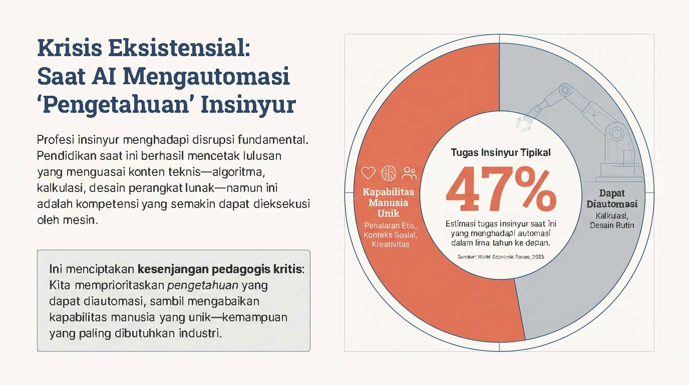

Otomatisasi ini mengungkap kesenjangan kritis: pendidikan kita terlalu memprioritaskan "mengetahui" (*knowing*), sebuah kemampuan yang kian mudah direplikasi oleh AI, namun mengabaikan pembentukan "menjadi" (*becoming*), yakni kemampuan yang berakar pada nilai-nilai manusia yang unik seperti etika, kolaborasi, dan empati (prinsip *Homocordium*).

Lebih jauh, dari perspektif psikologi kognitif, pendekatan tradisional menimbulkan beban kognitif yang masif. Domain sistem dan sinyal yang sarat konsep dan matematika sering kali membebani memori kerja mahasiswa, yang secara alamiah hanya mampu menyimpan 3 hingga 7 potong informasi dalam waktu 15 hingga 30 detik. Jika lingkungan pembelajaran hanya menambah *extraneous load* (beban kognitif eksternal yang tidak relevan), proses pembentukan skema mental atau keahlian sejati akan sangat terhambat.

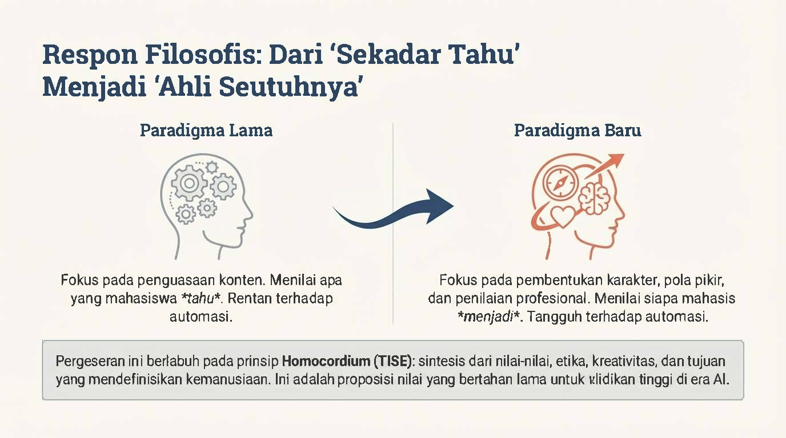

Terdapat perbandingan antara Paradigma Lama dan Paradigma Baru. 
*   **Paradigma Lama (Knowing / Sekadar Tahu):** Fokus pada penguasaan konten. Sistem ini menilai apa yang mahasiswa *tahu*, yang mana keahlian ini sangat rentan terhadap automasi.
*   **Paradigma Baru (Becoming / Ahli Seutuhnya):** Fokus pada pembentukan karakter, pola pikir, dan penilaian profesional. Sistem ini menilai siapa mahasiswa tersebut akan *menjadi*. Karakteristik ini tangguh dan tahan terhadap ancaman automasi.
Pergeseran fundamental ini berlabuh pada prinsip **Homocordium (TISE)**: yaitu sebuah sintesis dari nilai-nilai, etika, kreativitas, dan tujuan yang mendefinisikan kemanusiaan. Ini adalah proposisi nilai yang bertahan lama untuk pendidikan tinggi di era Kecerdasan Buatan (AI).

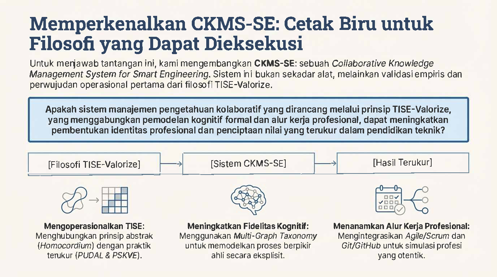

Untuk menjawab tantangan tersebut, riset ini mengembangkan **CKMS-SE** (*Collaborative Knowledge Management System for Smart Engineering*). Sistem ini bukan sekadar alat, melainkan validasi empiris dan perwujudan operasional pertama dari filosofi TISE-Valorize.
Riset ini mengajukan pertanyaan utama: "Apakah sistem manajemen pengetahuan kolaboratif yang dirancang melalui prinsip TISE-Valorize, yang menggabungkan pemodelan kognitif formal dan alur kerja profesional, dapat meningkatkan pembentukan identitas profesional dan penciptaan nilai yang terukur dalam pendidikan teknik?"
Langkah operasionalisasinya dibagi menjadi tiga tahap:
1.  **Mengoperasionalkan TISE:** Menghubungkan prinsip abstrak (Homocordium) dengan praktik terukur melalui mesin PUDAL & PSKVE.
2.  **Meningkatkan Fidelitas Kognitif:** Menggunakan *Multi-Graph Taxonomy* untuk memodelkan proses berpikir ahli secara eksplisit.
3.  **Menanamkan Alur Kerja Profesional:** Mengintegrasikan *Agile/Scrum* dan Git/GitHub untuk menciptakan simulasi profesi yang otentik.

## 1.2 TUJUAN PENELITIAN

Tujuan dari penelitian ini adalah:

1. Merumuskan pergeseran fundamental tujuan pendidikan dari penguasaan konten teknis yang rentan otomatisasi menuju pembentukan karakter, pola pikir, dan penilaian profesional (*becoming*) melalui kerangka *Triune-Intelligence Smart Engineering* (TISE) dan VALORIZE.

2. Mengembangkan dan memvalidasi sebuah purwarupa operasional bernama *Collaborative Knowledge Management System-Smart Engineering* (CKMS-SE) yang mengintegrasikan *Cognitive Load Theory* (CLT) dan *Self-Determination Theory* (SDT) ke dalam praktik kelas harian.

3. Mengukur efektivitas CKMS-SE terhadap tingkat motivasi intrinsik, identitas profesional, kapabilitas pembelajaran transfer, dan penciptaan nilai holistik (melalui pengukuran *PSKVE Value Portfolio*) jika dibandingkan dengan metode pengajaran konvensional.

# BAB 2 METODOLOGI

## 2.1 Umum
Riset ini mengadopsi desain studi kuasi-eksperimental dengan grup kontrol ($n=71$) dan grup intervensi ($n=71$), yang dilakukan selama 12 minggu masa perkuliahan. Populasi terdiri dari 142 mahasiswa sarjana tingkat tiga di Institut Teknologi Bandung yang terdaftar dalam dua mata kuliah inti paralel, yakni Probabilitas & Statistik serta Sistem Teknik. 

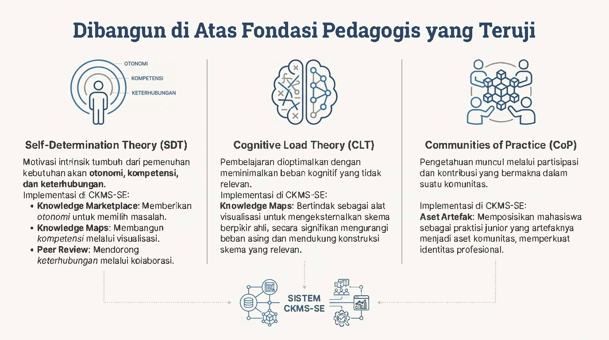

Sistem CKMS-SE diimplementasikan berdasarkan tiga landasan teoritis utama:

1.  **Self-Determination Theory (SDT):** Motivasi intrinsik tumbuh dari pemenuhan kebutuhan dasar akan otonomi, kompetensi, dan keterhubungan. Implementasinya di CKMS-SE adalah melalui *Knowledge Marketplace* (memberikan otonomi memilih masalah), *Knowledge Maps* (membangun kompetensi visualisasi), dan *Peer Review* (mendorong keterhubungan kolaboratif).

2.  **Cognitive Load Theory (CLT):** Pembelajaran dioptimalkan dengan meminimalkan beban kognitif yang tidak relevan (ekstrinsik). Implementasinya menggunakan *Knowledge Maps* yang bertindak sebagai alat visualisasi untuk mengeksternalkan skema berpikir ahli, sehingga secara signifikan mengurangi beban asing dan mendukung konstruksi skema yang relevan di memori kerja.

3.  **Communities of Practice (CoP):** Pengetahuan sejati muncul melalui partisipasi dan kontribusi bermakna di dalam komunitas. Implementasinya adalah melalui penciptaan "Aset Artefak", yang memposisikan mahasiswa sebagai praktisi junior yang artefaknya dikelola menjadi aset komunitas, demi memperkuat identitas profesional mereka.

Instrumen pengukuran yang digunakan meliputi pengujian praktek untuk *Transfer Learning* (kemampuan penalaran pada konteks baru) serta kuesioner tervalidasi: *Intrinsic Motivation Inventory* ($\alpha = 0.89$) dan *Learning & Professional Identity in Practice Scale* (LPIPS, $\alpha = 0.84$).

Grup intervensi mendapatkan perlakuan pengajaran berbasis arsitektur **CKMS-SE**, sebuah *Simulasi Profesi* berfidelitas tinggi yang bertumpu pada pendekatan kolaboratif berbasis Agile/Scrum dan kontrol versi menggunakan Git/GitHub. 

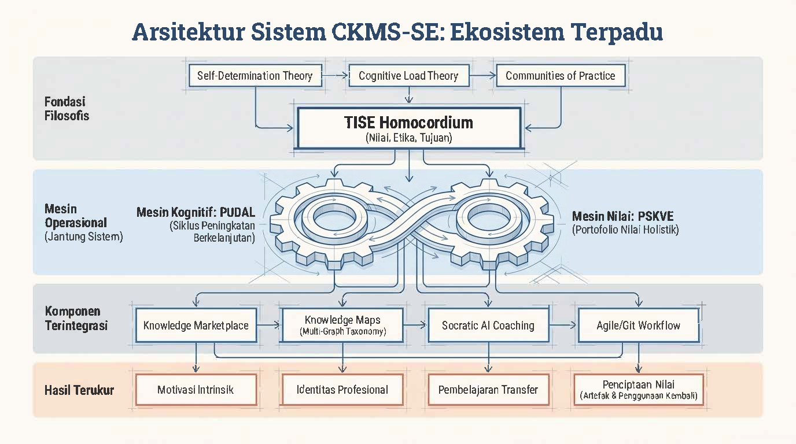

Secara teknis, ekosistem CKMS-SE digerakkan oleh dua mesin utama:

1. **Mesin PUDAL (Perceive, Understand, Decision-making, Act, Learning)**: Sebuah siklus kognitif iteratif berbasis *Multi-Graph Taxonomy* untuk menuntun mahasiswa melatih penalaran kepakaran mereka di bawah pengawasan asisten kecerdasan buatan (*Socratic AI*).

2. **Mesin Portofolio Nilai (PSKVE)**: Sebuah *Knowledge Marketplace* di mana tugas mahasiswa bertransformasi dari sekadar kewajiban ujian menjadi aset pengetahuan (Produk, Layanan, Pengetahuan, Nilai Berkelanjutan, dan Lingkungan) yang diberi *reward* simulasi ekonomi riil.

## 2.2 Mesin Kognitif PUDAL

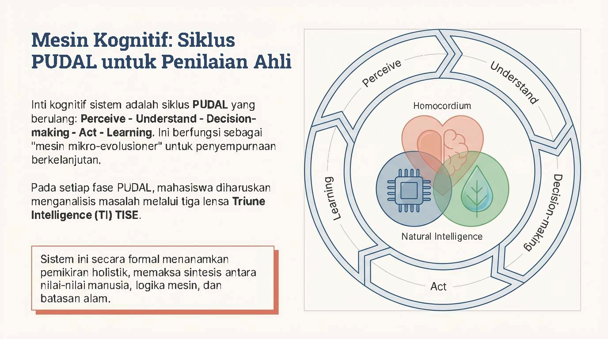

Riset ini menjelaskan bahwa inti kognitif dari sistem ini adalah siklus **PUDAL** yang berulang secara kontinu: **Perceive - Understand - Decision-making - Act - Learning**. Siklus ini berfungsi sebagai "mesin mikro-evolusioner" untuk penyempurnaan pengetahuan secara berkelanjutan.
Pada setiap fasenya, mahasiswa diharuskan menganalisis masalah melalui tiga lensa **Triune Intelligence (TI) TISE**, yang divisualisasikan dengan tiga simbol di tengah lingkaran PUDAL:

*   **Homocordium** (simbol hati/otak): Nilai-nilai kemanusiaan & etika.

*   **Homodeus** (simbol *chip* cerdas): Logika komputasi & Kecerdasan Buatan (AI).

*   **Natural Intelligence** (simbol daun): Hukum fisika dan batasan alam.
Sistem ini secara formal menanamkan pemikiran holistik, yang memaksa sintesis antara nilai-nilai manusia, logika mesin, dan batasan ekologis alam.

## 2.3 Penerapan Artefak Kognitif

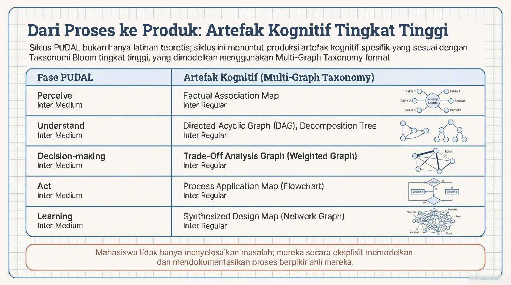

Siklus PUDAL bukan sekadar latihan teoritis; siklus ini menuntut mahasiswa memproduksi artefak kognitif spesifik yang sesuai dengan pemikiran Taksonomi Bloom tingkat tinggi, yang dimodelkan menggunakan kerangka *Multi-Graph Taxonomy* formal.
Pemetaan fase dan artefaknya adalah sebagai berikut:

*   **Perceive:** Menghasilkan *Factual Association Map*.

*   **Understand:** Menghasilkan *Directed Acyclic Graph (DAG)* dan *Decomposition Tree*.

*   **Decision-making:** Menghasilkan *Trade-Off Analysis Graph (Weighted Graph)*.

*   **Act:** Menghasilkan *Process Application Map (Flowchart)*.

*   **Learning:** Menghasilkan *Synthesized Design Map (Network Graph)*.
Tujuannya adalah agar mahasiswa tidak hanya sekadar menyelesaikan masalah, melainkan secara eksplisit memodelkan dan mendokumentasikan proses berpikir ahli mereka.

## 2.4 Portofolio Nilai PSKVE

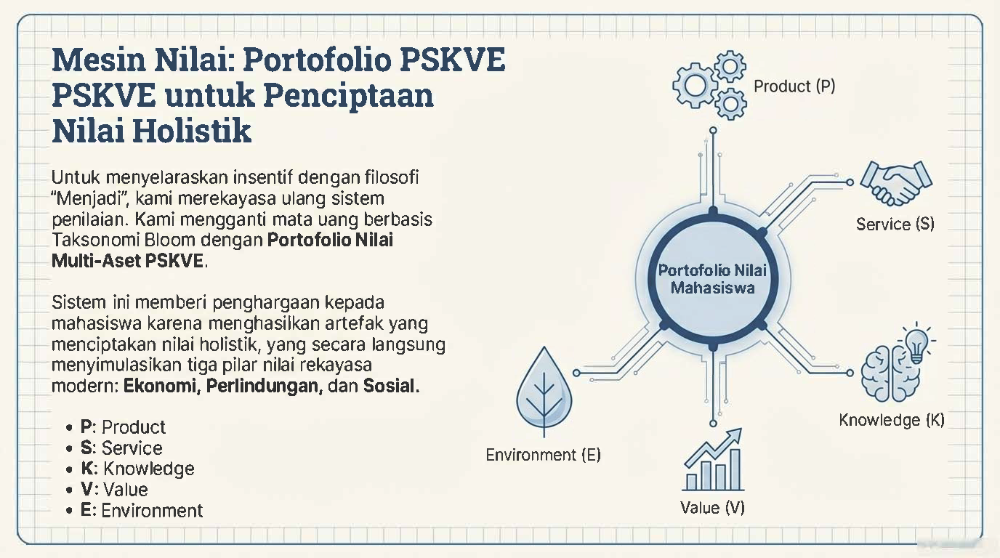

Untuk menyelaraskan insentif dengan filosofi "Menjadi", sistem merekayasa ulang sistem penilaian di dalam *marketplace*. Mata uang yang sebelumnya berbasis pada Taksonomi Bloom digantikan dengan **Portofolio Nilai Multi-Aset PSKVE**. 
Sistem ini memberikan penghargaan kepada mahasiswa karena telah menghasilkan artefak yang menciptakan "nilai holistik", yang secara langsung menyimulasikan tiga pilar nilai rekayasa modern: Ekonomi, Perlindungan, dan Sosial. 
Dimensi portofolio tersebut terdiri dari:

*   **P: Product** (Produk)

*   **S: Service** (Layanan)

*   **K: Knowledge** (Pengetahuan)

*   **V: Value** (Nilai/Pertukaran)

*   **E: Environment** (Lingkungan/Keberlanjutan)

## 2.5 Dimensi Nilai PSKVE

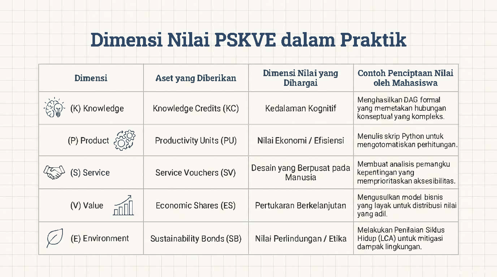

Tabel yang merincikan aset yang diberikan dalam sistem dan contoh konkret penciptaan nilainya oleh mahasiswa:

*   **(K) Knowledge:** Aset berupa *Knowledge Credits (KC)*. Menghargai Kedalaman Kognitif. Contoh: Menghasilkan DAG formal yang memetakan hubungan konseptual yang kompleks.

*   **(P) Product:** Aset berupa *Productivity Units (PU)*. Menghargai Nilai Ekonomi / Efisiensi. Contoh: Menulis skrip Python untuk mengotomatisasi perhitungan.

*   **(S) Service:** Aset berupa *Service Vouchers (SV)*. Menghargai Desain yang Berpusat pada Manusia. Contoh: Membuat analisis pemangku kepentingan yang memprioritaskan aksesibilitas.

*   **(V) Value:** Aset berupa *Economic Shares (ES)*. Menghargai Pertukaran Berkelanjutan. Contoh: Mengusulkan model bisnis yang layak untuk distribusi nilai yang adil.

*   **(E) Environment:** Aset berupa *Sustainability Bonds (SB)*. Menghargai Nilai Perlindungan / Etika. Contoh: Melakukan Penilaian Siklus Hidup (LCA) untuk mitigasi dampak lingkungan.

## 2.6 Implementasi Alur Kerja

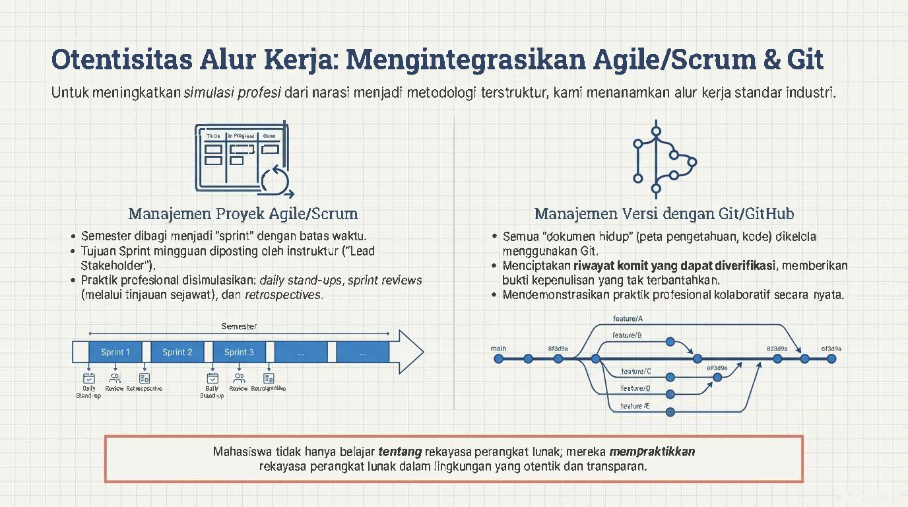

Untuk meningkatkan simulasi profesi dari sekadar cerita menjadi metodologi terstruktur, CKMS-SE menanamkan standar alur kerja industri perangkat lunak.
*   **Manajemen Proyek Agile/Scrum:** Semester perkuliahan dibagi menjadi *"sprint"* dengan batasan waktu tertentu. Tujuan *Sprint* mingguan akan diposting oleh instruktur (yang bertindak sebagai "Lead Stakeholder"). Mahasiswa melakukan praktik profesional yang disimulasikan seperti *daily stand-ups*, *sprint reviews* (berupa tinjauan sejawat), dan *retrospectives*.

*   **Manajemen Versi dengan Git/GitHub:** Semua "dokumen hidup" seperti peta pengetahuan dan baris kode dikelola menggunakan Git. Ini menciptakan riwayat *commit* (perubahan) yang dapat diverifikasi, memberikan bukti kepenulisan yang tak terbantahkan, serta mendemonstrasikan praktik kolaboratif yang nyata melalui percabangan fitur (*feature branch*).
Hasil akhirnya: Mahasiswa tidak hanya belajar *tentang* rekayasa perangkat lunak, mereka *mempraktikkan* rekayasa perangkat lunak secara langsung dalam lingkungan yang transparan.

## 2.7 Metodologi Penelitian

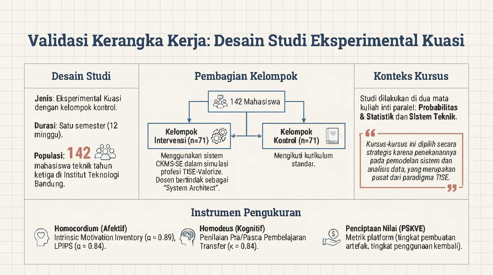

Gambar ini menguraikan desain studi untuk mengevaluasi dampak CKMS-SE selama satu semester (12 minggu).

*   **Pembagian Kelompok / Populasi:** Melibatkan total **142 mahasiswa** teknik tahun ketiga di ITB. Dibagi menjadi Kelompok Intervensi (n=71) yang menggunakan sistem CKMS-SE dalam simulasi profesi (dosen bertindak sebagai *System Architect*), dan Kelompok Kontrol (n=71) yang mengikuti kurikulum standar konvensional.

*   **Konteks Kursus:** Dilakukan di dua mata kuliah inti paralel, yakni Probabilitas & Statistik dan Sistem Teknik (dipilih karena penekanannya pada pemodelan sistem dan data yang merupakan pusat paradigma TISE).

*   **Instrumen Pengukuran:** Meliputi domain Homocordium/Afektif (menggunakan *Intrinsic Motivation Inventory*, $\alpha = 0.89$, dan LPIPS, $\alpha = 0.84$), domain Homodeus/Kognitif (Penilaian pembelajaran transfer, kesepakatan penilai $\kappa = 0.84$), dan Penciptaan Nilai PSKVE (berdasarkan metrik analitik *platform*).

# BAB 3 HASIL DAN LUARAN YANG DICAPAI

## 3.1 HASIL PENELITIAN

Berdasarkan analisis performa terstruktur, studi membuktikan efikasi luar biasa dari kerangka kerja TISE-Valorize. Kelompok intervensi mencatat skor rata-rata sangat baik (M = 94.98, SD = 7.21) dibanding grup kontrol (M = 88.70 dan 86.54) dengan tingkat dispersi/variasi nilai yang jauh lebih kecil (Varians grup eksperimen = 52.01 berbanding >290 pada grup kontrol). Ini membuktikan kerangka pembelajaran berhasil menciptakan kesetaraan pembelajaran dengan menekan *extraneous cognitive load*.

Lebih jauh, analisis instrumen pada kompetensi inti profesional memperlihatkan dampak transformatif. 

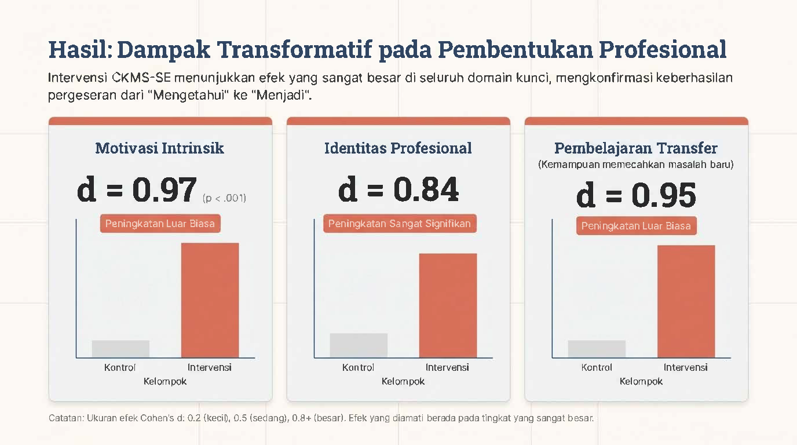

Secara spesifik, diukur menggunakan pengkategorian ukuran efek (Cohen’s $d$):
*   **Motivasi Intrinsik:** Peningkatan sangat luar biasa ($d = 0.97$, $p < .001$).
*   **Identitas Profesional:** Peningkatan yang signifikan ke arah pola pikir rekayasawan berintegritas ($d = 0.84$).
*   **Pembelajaran Transfer:** Lonjakan tajam dalam menyelesaikan kendala yang sama sekali belum pernah diajarkan di kelas ($d = 0.95$).

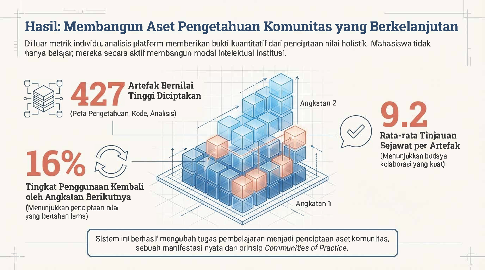

Dalam aspek validasi *Value Co-Creation*, inisiatif *Knowledge Marketplace* telah membuahkan 427 artefak bernilai yang secara aktif diciptakan mahasiswa hanya dalam satu semester. Tingkat kolaborasi ditunjukkan dengan tingginya *Peer Review* (rata-rata 9.2 tinjauan per artefak), di mana 16% dari pengetahuan dan aset komputasional yang diproduksi telah digunakan ulang secara nyata oleh angkatan (*cohort*) mahasiswa setelahnya.

## 3.2 LUARAN YANG DICAPAI

Sesuai dengan target, kemajuan riset (per April 2026) telah menghasilkan luaran-luaran konkret sebagai berikut:

1.  **Konsep Teori ("Teori.doc")**: Dokumen teori yang mengelaborasi desain *Knowledge Maps* mahasiswa dengan mensintesis *Cognitive Load Theory* (CLT) dan *Dual Coding Theory* (DCT), menunjukkan bahwa konversi bahasa sistem dan sinyal ke visual multidimensi bisa membebaskan kapasitas memori kerja (*working memory*).
2.  **Artikel Jurnal Internasional (Status: *Under Review*)**: Draf jurnal berjudul *"Value Co-Creation Through Collaborative Knowledge Management in Smart Engineering Education: An Empirical Validation of the TISE-Valorize Framework"* (atau dengan variasi *"Orchestrating Value Co-Creation..."*) telah dikirimkan ke jurnal **Frontiers in Education** yang merupakan jurnal internasional terkemuka (Quartile 2 Scopus). *Acknowledgment submission* dan draf terlampir pada bagian Lampiran.

# BAB 4 KESIMPULAN DAN SARAN

## 4.1 KESIMPULAN

Pelaksanaan sistem CKMS-SE membuktikan secara empiris bahwa filosofi TISE-Valorize dapat dieksekusi sebagai alat transformatif. Riset ini berhasil memvalidasi bahwa melalui pengelolaan manajemen beban kognitif (CLT) dengan visualisasi skema *Multi-Graph* serta stimulasi kebutuhan dasar otonomi (SDT), tujuan pendidikan teknik dapat digeser dari yang tadinya rentan diotomatisasi AI (hanya menguasai algoritma/rumus) menjadi kompetensi yang bertumpu pada pembangunan karakter etis, kreatif, dan kepakaran (*Homocordium*) yang mustahil ditiru oleh mesin. Lonjakan yang signifikan pada nilai motivasi intrinsik dan keseragaman capaian belajar mengkonfirmasi bahwa mahasiswa tidak hanya belajar teknik, tetapi belajar untuk *menjadi* insinyur sejati.

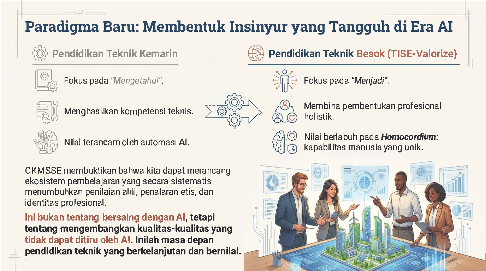

Sebagai penutup, gambar ini merangkum perbandingan paradigma "Pendidikan Teknik Kemarin" yang berfokus pada apa yang mahasiswa "Ketahui", rentan diautomasi, dan sekadar mencetak kompetensi teknis dasar. 
Ini dibandingkan dengan "Pendidikan Teknik Besok (TISE-Valorize)" yang menggeser fokus pada "Menjadi" seorang insinyur profesional. Model ini membina pembentukan profesional holistik yang nilainya berlabuh pada **Homocordium**: kapabilitas manusia yang unik.
Kesimpulannya: CKMS-SE membuktikan bahwa kita dapat merancang ekosistem pembelajaran yang secara sistematis menumbuhkan penilaian ahli, penalaran etis, dan identitas profesional. Hal ini bukan tentang bersaing melawan AI, melainkan tentang **mengembangkan kualitas-kualitas manusia yang tidak dapat ditiru oleh AI**. Inilah masa depan pendidikan teknik yang berkelanjutan dan bernilai di era masa depan.

## 4.2 SARAN

Meski menghasilkan luaran yang impresif, riset saat ini dilakukan secara spesifik pada populasi terbatas (dua mata kuliah di satu institusi) dengan sampel $N=142$. Ke depannya, disarankan agar riset diperluas pada skala multi-institusi dengan besar sampel yang disarankan minimum $N \ge 200-250$ per grup untuk mencapai kekuatan statistik ideal (*statistical power* $\ge 0.80$). Pengukuran yang lebih langsung terhadap beban kognitif (misalnya menggunakan NASA-TLX) juga patut disematkan pada fase riset mendatang.

\newpage
# DAFTAR PUSTAKA

1. Alsaffar, R.D., Alfayly, A. and Ali, N. (2022). *Extended Technology Acceptance Model for Multimedia-Based Learning in Higher Education*, International Journal of Information and Education Technology, 12(12), 1300–1310.
2. Annamalai, N. and Nasor, M. (2025). *Exploring ChatGPT in education: unveiling learners’ experiences through the lens of self-determination theory*, Smart Learning Environments, 12(59), 1–17.
3. Duran, R., Zavgorodniaia, A. and Sorva, J. (2022). *Cognitive Load Theory in Computing Education Research: A Review*, ACM Transactions on Computing Education, 22(4), 1–27.
4. Imbar, R.V. et al. (2025). *Smart Campus Framework: Definition, Model, Measurement from Anthropocentric, Systemic and Technological Perspectives*, Journal of ICT Research and Applications, 18(3), 258–269.
5. Johan, M.C., Langi, A.Z.R. and Imbar, R.V. (2025). *Digital Transformation in Education, Research and Community Service for Smart Campus*, Proceedings of the 1st International Conference on Lifespan Innovation, 364–370. Atlantis Press.
6. Miller, G.A. (1956). *The magical number seven, plus or minus two: some limits on our capacity for processing information*, Psychological Review, 63(2), 81–97.
7. Sweller, J., Van Merrienboer, J.J.G. and Paas, F.G.W.C. (1998). *Cognitive Architecture and Instructional Design*, Educational Psychology Review, 10(3), 251–296.

\newpage
# LAMPIRAN

## Lampiran 1. Formulir Evaluasi Atas Capaian Luaran Kegiatan

**FORMULIR EVALUASI ATAS CAPAIAN LUARAN KEGIATAN**

**Peneliti Utama:** Prof. Ir. Armein Z.R. Langi, M.Sc., Ph.D.  
**Perguruan Tinggi:** Institut Teknologi Bandung  
**Judul:** Pengembangan dan Validasi Model Pembelajaran VALORIZE: Kerangka Pedagogis Berbasis AI untuk Membentuk Identitas Profesional Rekayasawan di Era Digital  
**Tahun Kegiatan:** 2025 - 2026  

**TARGET PUBLIKASI INTERNASIONAL (JOINT PUBLICATION):**

| No. | Nama Jurnal Internasional | Jumlah Artikel |
| :--- | :--- | :--- |
| 1. | Frontiers in Education (Terindeks Scopus Q2) | 1 |

**CAPAIAN SELURUH PUBLIKASI DARI PENELITI UTAMA DAN MITRA:**

**1. PUBLIKASI JURNAL ILMIAH INTERNASIONAL TERINDEKS SCOPUS**

| ARTIKEL JURNAL KE-1 | Detail Keterangan |
| :--- | :--- |
| Nama jurnal yang dituju | Frontiers in Education |
| Klasifikasi jurnal | Jurnal Internasional Terindeks SCOPUS Q1/Q2 (Q2) |
| Judul artikel | Value Co-Creation Through Collaborative Knowledge Management in Smart Engineering Education: An Empirical Validation of the TISE-Valorize Framework |
| Status naskah | - Under Review |

**2. KETERLIBATAN PENELITI UTAMA DAN MITRA PT PADA PUBLIKASI ARTIKEL ILMIAH 1:**
*   **Meliana Christianti Johan**: Penulis Pertama (First Author/Corresponding Author), berperan mengelola pengumpulan data eksperimen di lapangan serta menyusun manuskrip utama.
*   **Armein Z. R. Langi & I Gusti Bagus Baskara Nugraha (ITB)**: Mengawal pondasi desain Sistem Cerdas, konsep kerangka TISE, dan analisis metodologis berbasis teknologi informasi.
*   **Radiant Victor Imbar & Parlindungan Sinaga**: Mendukung tinjauan edukasi teknologi komprehensif serta penyelarasan pedagogi dengan aspek TISE Homocordium.

\vspace{1cm}
Bandung, 7 April 2026  
Peneliti Utama,

(Tanda Tangan)

**Prof. Ir. Armein Z.R. Langi, M.Sc., Ph.D.**  
NIP. 196208171990031002

\newpage
## Lampiran 2. Ringkasan Laporan Kemajuan

**Ringkasan Laporan Kemajuan Program Riset Kolaborasi Indonesia-EQUITY**  
**World Class University (WCU) 2025-2026**

| Komponen | Penjelasan |
| :--- | :--- |
| **Judul Riset** | Pengembangan dan Validasi Model Pembelajaran VALORIZE: Kerangka Pedagogis Berbasis AI untuk Membentuk Identitas Profesional Rekayasawan di Era Digital |
| **Peneliti Utama** | Prof. Ir. Armein Z.R. Langi, M.Sc., Ph.D. |
| **Peneliti Mitra** | Meliana Christianti Johan, I Gusti Bagus Baskara Nugraha, Radiant Victor Imbar, Parlindungan Sinaga |
| **Perguruan Tinggi** | Institut Teknologi Bandung & Universitas Kristen Maranatha |
| **Target Capaian** | Pertengahan riset: Memformulasikan landasan teoritis konseptual TISE-Valorize dalam mengelola memori kerja. Akhir riset: Publikasi luaran *framework* di jurnal bereputasi tinggi yang memvalidasi pergeseran performa mahasiswa secara empiris. |
| **Hasil yang sudah diperoleh** | - Tersusunnya laporan kajian pustaka psikologis kognitif (Teori.doc). - Terukurnya performa uji 142 mahasiswa yang membuktikan efektivitas sistem CKMS-SE pada 3 domain indikator. - Tersusunnya naskah manuskrip Frontiers.pdf yang sudah dikirim (*submitted* / *under review*). |
| **Persentase** | Diperkirakan kemajuan hingga tahap laporan ini sudah mencapai kisaran 80-85% (data sudah disintesis seluruhnya). |
| **Manajemen Riset Kolaborasi** | Koordinasi integratif melalui repositori Git dan sinkronisasi berkala antara pembina teknologi di ITB dan unit pendidikan. |
| **Pendanaan** | Tidak ada hambatan spesifik, dana berjalan lancar dalam pengelolaan kegiatan penelitian dan penyusunan jurnal. |
| **Kelanjutan riset** | Pemantauan progres jurnal *Under Review* ke fase perbaikan (*revision*) lalu tahapan penerbitan (*published*). Serta merekomendasikan pelebaran purwarupa dengan besar sampel ke institusi lain. |
| **Hambatan dan kesulitan** | Diperlukan persiapan *platform* dengan daya analisis *Socratic AI* berskala lebih besar yang menuntut kolaborasi komputasional. Evaluasi jangka panjang (kestabilan retensi ingatan per tahun) belum dapat dicakup di batas waktu semester ini. |

\vspace{1cm}
Bandung, 7 April 2026  
Peneliti Utama,

(Tanda Tangan)

**Prof. Ir. Armein Z.R. Langi, M.Sc., Ph.D.**  
NIP. 196208171990031002
