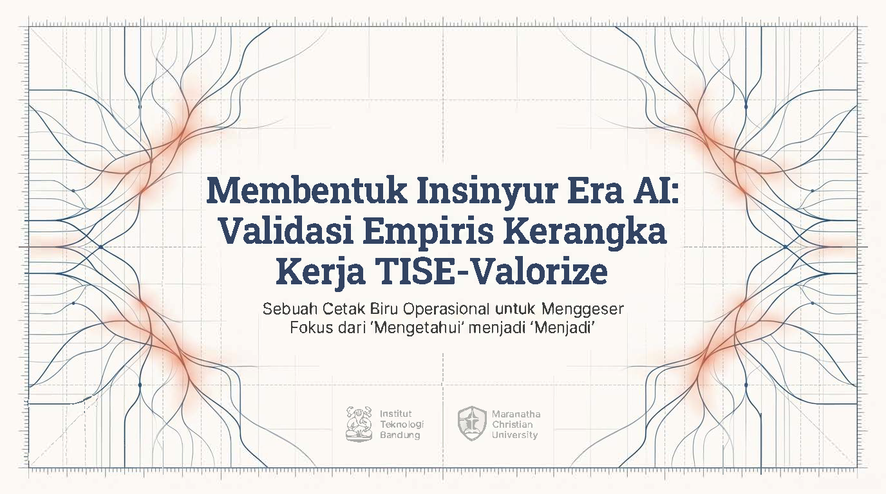

Berikut adalah transkrip lengkap dan terperinci untuk setiap slide dari dokumen presentasi "Validating_the_AI_Engineering_Blueprint.pdf":

# **Slide 1: Halaman Judul**

**Deskripsi Visual:** Slide ini menampilkan desain garis-garis koneksi sirkuit yang elegan berpusat pada judul, melambangkan integrasi teknologi cerdas. Di bagian bawah tengah, terdapat logo institusi yang berkolaborasi dalam riset ini, yaitu **Institut Teknologi Bandung** dan **Maranatha Christian University**.

# **Slide 2: Latar Belakang Masalah**

**Konten:** Profesi insinyur saat ini sedang menghadapi disrupsi fundamental. Pendidikan teknik saat ini memang berhasil mencetak lulusan yang menguasai konten teknis—seperti algoritma, kalkulasi, dan desain perangkat lunak—namun ini adalah kompetensi teknis yang semakin dapat dieksekusi oleh mesin. 
Slide ini menyoroti sebuah grafik donat yang menunjukkan angka **47%** yang merupakan estimasi dari laporan *World Economic Forum* (2023) mengenai tugas insinyur tipikal saat ini yang menghadapi ancaman automasi dalam lima tahun ke depan. Tugas yang dapat diautomasi mencakup kalkulasi dan desain rutin.
**Kesenjangan Pedagogis:** Kondisi ini menciptakan kesenjangan pedagogis yang kritis: Kita selama ini memprioritaskan "pengetahuan" yang dapat diautomasi oleh mesin, sambil mengabaikan **Kapabilitas Manusia Unik** (seperti penalaran etis, pemahaman konteks sosial, dan kreativitas) yang justru merupakan kemampuan yang paling dibutuhkan oleh industri saat ini.

# **Slide 3: Solusi Filosofis**

**Konten:** Terdapat perbandingan antara Paradigma Lama dan Paradigma Baru. 
*   **Paradigma Lama (Knowing / Sekadar Tahu):** Fokus pada penguasaan konten. Sistem ini menilai apa yang mahasiswa *tahu*, yang mana keahlian ini sangat rentan terhadap automasi.
*   **Paradigma Baru (Becoming / Ahli Seutuhnya):** Fokus pada pembentukan karakter, pola pikir, dan penilaian profesional. Sistem ini menilai siapa mahasiswa tersebut akan *menjadi*. Karakteristik ini tangguh dan tahan terhadap ancaman automasi.
Pergeseran fundamental ini berlabuh pada prinsip **Homocordium (TISE)**: yaitu sebuah sintesis dari nilai-nilai, etika, kreativitas, dan tujuan yang mendefinisikan kemanusiaan. Ini adalah proposisi nilai yang bertahan lama untuk pendidikan tinggi di era Kecerdasan Buatan (AI).

# **Slide 4: Pengenalan Platform**

**Konten:** Untuk menjawab tantangan tersebut, dikembangkanlah **CKMS-SE** (*Collaborative Knowledge Management System for Smart Engineering*). Sistem ini bukan sekadar alat, melainkan validasi empiris dan perwujudan operasional pertama dari filosofi TISE-Valorize.
Slide ini mengajukan pertanyaan utama: "Apakah sistem manajemen pengetahuan kolaboratif yang dirancang melalui prinsip TISE-Valorize, yang menggabungkan pemodelan kognitif formal dan alur kerja profesional, dapat meningkatkan pembentukan identitas profesional dan penciptaan nilai yang terukur dalam pendidikan teknik?"
Langkah operasionalisasinya dibagi menjadi tiga tahap:
1.  **Mengoperasionalkan TISE:** Menghubungkan prinsip abstrak (Homocordium) dengan praktik terukur melalui mesin PUDAL & PSKVE.
2.  **Meningkatkan Fidelitas Kognitif:** Menggunakan *Multi-Graph Taxonomy* untuk memodelkan proses berpikir ahli secara eksplisit.
3.  **Menanamkan Alur Kerja Profesional:** Mengintegrasikan *Agile/Scrum* dan Git/GitHub untuk menciptakan simulasi profesi yang otentik.

# **Slide 5: Landasan Teori**

**Konten:** Sistem CKMS-SE diimplementasikan berdasarkan tiga landasan teoritis utama:
1.  **Self-Determination Theory (SDT):** Motivasi intrinsik tumbuh dari pemenuhan kebutuhan dasar akan otonomi, kompetensi, dan keterhubungan. Implementasinya di CKMS-SE adalah melalui *Knowledge Marketplace* (memberikan otonomi memilih masalah), *Knowledge Maps* (membangun kompetensi visualisasi), dan *Peer Review* (mendorong keterhubungan kolaboratif).
2.  **Cognitive Load Theory (CLT):** Pembelajaran dioptimalkan dengan meminimalkan beban kognitif yang tidak relevan (ekstrinsik). Implementasinya menggunakan *Knowledge Maps* yang bertindak sebagai alat visualisasi untuk mengeksternalkan skema berpikir ahli, sehingga secara signifikan mengurangi beban asing dan mendukung konstruksi skema yang relevan di memori kerja.
3.  **Communities of Practice (CoP):** Pengetahuan sejati muncul melalui partisipasi dan kontribusi bermakna di dalam komunitas. Implementasinya adalah melalui penciptaan "Aset Artefak", yang memposisikan mahasiswa sebagai praktisi junior yang artefaknya dikelola menjadi aset komunitas, demi memperkuat identitas profesional mereka.

# **Slide 6: Arsitektur Ekosistem**

**Konten:** Menampilkan diagram hierarki sistem yang digerakkan oleh fondasi filosofis **TISE Homocordium** (Nilai, Etika, Tujuan). 
Di bawahnya, terdapat **Mesin Operasional (Jantung Sistem)** yang berbentuk dua roda gigi besar yang saling mengunci: **Mesin Kognitif PUDAL** (Siklus Peningkatan Berkelanjutan) dan **Mesin Nilai PSKVE** (Portofolio Nilai Holistik).
Kedua mesin ini menggerakkan **Komponen Terintegrasi** yang meliputi *Knowledge Marketplace*, *Knowledge Maps* (*Multi-Graph Taxonomy*), *Socratic AI Coaching*, dan *Agile/Git Workflow*. Semua ini bermuara pada **Hasil Terukur** yaitu peningkatan Motivasi Intrinsik, Identitas Profesional, Pembelajaran Transfer, dan Penciptaan Nilai (Artefak & Penggunaan Kembali).

# **Slide 7: Mesin Kognitif PUDAL**

**Konten:** Menjelaskan bahwa inti kognitif dari sistem ini adalah siklus **PUDAL** yang berulang secara kontinu: **Perceive - Understand - Decision-making - Act - Learning**. Siklus ini berfungsi sebagai "mesin mikro-evolusioner" untuk penyempurnaan pengetahuan secara berkelanjutan.
Pada setiap fasenya, mahasiswa diharuskan menganalisis masalah melalui tiga lensa **Triune Intelligence (TI) TISE**, yang divisualisasikan dengan tiga simbol di tengah lingkaran PUDAL:
*   **Homocordium** (simbol hati/otak): Nilai-nilai kemanusiaan & etika.
*   **Homodeus** (simbol *chip* cerdas): Logika komputasi & Kecerdasan Buatan (AI).
*   **Natural Intelligence** (simbol daun): Hukum fisika dan batasan alam.
Sistem ini secara formal menanamkan pemikiran holistik, yang memaksa sintesis antara nilai-nilai manusia, logika mesin, dan batasan ekologis alam.

# **Slide 8: Penerapan Artefak Kognitif**

**Konten:** Siklus PUDAL bukan sekadar latihan teoritis; siklus ini menuntut mahasiswa memproduksi artefak kognitif spesifik yang sesuai dengan pemikiran Taksonomi Bloom tingkat tinggi, yang dimodelkan menggunakan kerangka *Multi-Graph Taxonomy* formal.
Pemetaan fase dan artefaknya adalah sebagai berikut:
*   **Perceive:** Menghasilkan *Factual Association Map*.
*   **Understand:** Menghasilkan *Directed Acyclic Graph (DAG)* dan *Decomposition Tree*.
*   **Decision-making:** Menghasilkan *Trade-Off Analysis Graph (Weighted Graph)*.
*   **Act:** Menghasilkan *Process Application Map (Flowchart)*.
*   **Learning:** Menghasilkan *Synthesized Design Map (Network Graph)*.
Tujuannya adalah agar mahasiswa tidak hanya sekadar menyelesaikan masalah, melainkan secara eksplisit memodelkan dan mendokumentasikan proses berpikir ahli mereka.

# **Slide 9: Portofolio Nilai PSKVE**

**Konten:** Untuk menyelaraskan insentif dengan filosofi "Menjadi", sistem merekayasa ulang sistem penilaian di dalam *marketplace*. Mata uang yang sebelumnya berbasis pada Taksonomi Bloom digantikan dengan **Portofolio Nilai Multi-Aset PSKVE**. 
Sistem ini memberikan penghargaan kepada mahasiswa karena telah menghasilkan artefak yang menciptakan "nilai holistik", yang secara langsung menyimulasikan tiga pilar nilai rekayasa modern: Ekonomi, Perlindungan, dan Sosial. 
Dimensi portofolio tersebut terdiri dari:
*   **P: Product** (Produk)
*   **S: Service** (Layanan)
*   **K: Knowledge** (Pengetahuan)
*   **V: Value** (Nilai/Pertukaran)
*   **E: Environment** (Lingkungan/Keberlanjutan)

# **Slide 10: Dimensi Nilai PSKVE**

**Konten:** Tabel yang merincikan aset yang diberikan dalam sistem dan contoh konkret penciptaan nilainya oleh mahasiswa:
*   **(K) Knowledge:** Aset berupa *Knowledge Credits (KC)*. Menghargai Kedalaman Kognitif. Contoh: Menghasilkan DAG formal yang memetakan hubungan konseptual yang kompleks.
*   **(P) Product:** Aset berupa *Productivity Units (PU)*. Menghargai Nilai Ekonomi / Efisiensi. Contoh: Menulis skrip Python untuk mengotomatisasi perhitungan.
*   **(S) Service:** Aset berupa *Service Vouchers (SV)*. Menghargai Desain yang Berpusat pada Manusia. Contoh: Membuat analisis pemangku kepentingan yang memprioritaskan aksesibilitas.
*   **(V) Value:** Aset berupa *Economic Shares (ES)*. Menghargai Pertukaran Berkelanjutan. Contoh: Mengusulkan model bisnis yang layak untuk distribusi nilai yang adil.
*   **(E) Environment:** Aset berupa *Sustainability Bonds (SB)*. Menghargai Nilai Perlindungan / Etika. Contoh: Melakukan Penilaian Siklus Hidup (LCA) untuk mitigasi dampak lingkungan.

# **Slide 11: Implementasi Alur Kerja**

**Konten:** Untuk meningkatkan simulasi profesi dari sekadar cerita menjadi metodologi terstruktur, CKMS-SE menanamkan standar alur kerja industri perangkat lunak.
*   **Manajemen Proyek Agile/Scrum:** Semester perkuliahan dibagi menjadi *"sprint"* dengan batasan waktu tertentu. Tujuan *Sprint* mingguan akan diposting oleh instruktur (yang bertindak sebagai "Lead Stakeholder"). Mahasiswa melakukan praktik profesional yang disimulasikan seperti *daily stand-ups*, *sprint reviews* (berupa tinjauan sejawat), dan *retrospectives*.
*   **Manajemen Versi dengan Git/GitHub:** Semua "dokumen hidup" seperti peta pengetahuan dan baris kode dikelola menggunakan Git. Ini menciptakan riwayat *commit* (perubahan) yang dapat diverifikasi, memberikan bukti kepenulisan yang tak terbantahkan, serta mendemonstrasikan praktik kolaboratif yang nyata melalui percabangan fitur (*feature branch*).
Hasil akhirnya: Mahasiswa tidak hanya belajar *tentang* rekayasa perangkat lunak, mereka *mempraktikkan* rekayasa perangkat lunak secara langsung dalam lingkungan yang transparan.

# **Slide 12: Metodologi Penelitian**

**Konten:** Slide ini menguraikan desain studi untuk mengevaluasi dampak CKMS-SE selama satu semester (12 minggu).
*   **Pembagian Kelompok / Populasi:** Melibatkan total **142 mahasiswa** teknik tahun ketiga di ITB. Dibagi menjadi Kelompok Intervensi (n=71) yang menggunakan sistem CKMS-SE dalam simulasi profesi (dosen bertindak sebagai *System Architect*), dan Kelompok Kontrol (n=71) yang mengikuti kurikulum standar konvensional.
*   **Konteks Kursus:** Dilakukan di dua mata kuliah inti paralel, yakni Probabilitas & Statistik dan Sistem Teknik (dipilih karena penekanannya pada pemodelan sistem dan data yang merupakan pusat paradigma TISE).
*   **Instrumen Pengukuran:** Meliputi domain Homocordium/Afektif (menggunakan *Intrinsic Motivation Inventory*, $\alpha = 0.89$, dan LPIPS, $\alpha = 0.84$), domain Homodeus/Kognitif (Penilaian pembelajaran transfer, kesepakatan penilai $\kappa = 0.84$), dan Penciptaan Nilai PSKVE (berdasarkan metrik analitik *platform*).

# **Slide 13: Hasil Capaian Mahasiswa**

**Konten:** Slide ini menampilkan tiga grafik batang yang membandingkan kelompok Kontrol dan Intervensi. Intervensi CKMS-SE menunjukkan efek yang sangat besar dan signifikan ($p < .001$) di seluruh domain kunci, mengkonfirmasi keberhasilan pergeseran metode pendidikan dari "Mengetahui" ke "Menjadi".
Berdasarkan ukuran efek Cohen's d (di mana >0.8 dianggap efek yang sangat besar secara praktis):
1.  **Motivasi Intrinsik:** Peningkatan Luar Biasa dengan skor **d = 0.97**.
2.  **Identitas Profesional:** Peningkatan Sangat Signifikan dengan skor **d = 0.84**.
3.  **Pembelajaran Transfer** (Kemampuan memecahkan masalah baru): Peningkatan Luar Biasa dengan skor **d = 0.95**.

# **Slide 14: Hasil Penciptaan Nilai Platform**

**Konten:** Di luar metrik individu, analisis *platform* memberikan bukti kuantitatif dari konsep "penciptaan nilai holistik". Mahasiswa terbukti tidak hanya sekadar belajar untuk diri sendiri, melainkan secara aktif membangun modal intelektual bersama bagi institusi (menyimulasikan *Communities of Practice*).
Metrik capaian *platform* menunjukkan:
*   **427 Artefak Bernilai Tinggi Diciptakan** oleh mahasiswa dalam satu semester (terdiri dari peta pengetahuan, kode, dan analisis).
*   **16% Tingkat Penggunaan Kembali** (*Reuse Rate*): Artefak yang dibuat oleh angkatan pertama tersebut secara aktif digunakan kembali dan diadopsi oleh angkatan/kohort berikutnya. Ini menunjukkan penciptaan nilai yang bertahan lama.
*   **9.2 Rata-rata Tinjauan Sejawat** (*Peer Review*) per artefak, yang menunjukkan tingginya tingkat keterlibatan dan kolaborasi antar mahasiswa.

# **Slide 15: Kesimpulan Akhir**

**Konten:** Sebagai penutup, slide merangkum perbandingan paradigma "Pendidikan Teknik Kemarin" yang berfokus pada apa yang mahasiswa "Ketahui", rentan diautomasi, dan sekadar mencetak kompetensi teknis dasar. 
Ini dibandingkan dengan "Pendidikan Teknik Besok (TISE-Valorize)" yang menggeser fokus pada "Menjadi" seorang insinyur profesional. Model ini membina pembentukan profesional holistik yang nilainya berlabuh pada **Homocordium**: kapabilitas manusia yang unik.
Kesimpulannya: CKMS-SE membuktikan bahwa kita dapat merancang ekosistem pembelajaran yang secara sistematis menumbuhkan penilaian ahli, penalaran etis, dan identitas profesional. Hal ini bukan tentang bersaing melawan AI, melainkan tentang **mengembangkan kualitas-kualitas manusia yang tidak dapat ditiru oleh AI**. Inilah masa depan pendidikan teknik yang berkelanjutan dan bernilai di era masa depan.