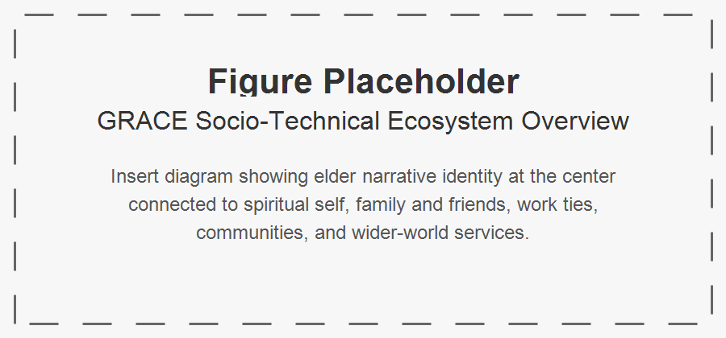
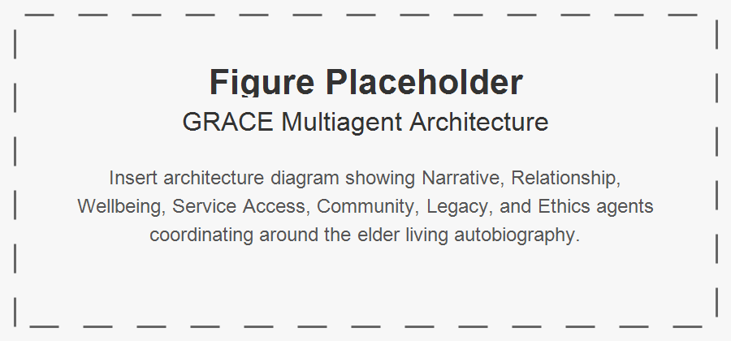
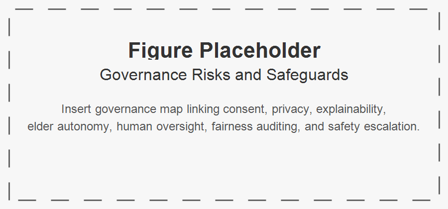
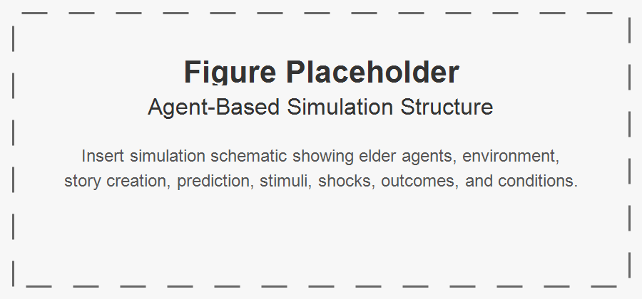

.

```{r}
#| label: setup
#| include: false

ieee_table <- function(data) {
  latex_table <- knitr::kable(
    data,
    format = "latex",
    booktabs = TRUE
  )
  knitr::asis_output(paste0(
    "\\resizebox{\\columnwidth}{!}{%\n",
    latex_table,
    "\n}\n"
  ))
}
```

# I. Introduction

Population aging is reshaping healthcare, labor, family structures, and public services [@un2024wpp]. In response, digital systems for older adults have expanded across telehealth, wearable and in-home monitoring, support for activities of daily living, and care coordination [@baig2019wearable]. These systems are valuable, but ageing-related HCI has often framed later life through health and care needs, declining abilities, and problems to be managed technologically [@vines2015age].

That framing is socially and technically limiting. Older adults are not only patients or service users. They are also storytellers, mentors, workers, caregivers, citizens, spiritual beings, and bearers of memory and legacy. Evidence links strong social relationships with wellbeing and survival, while research on generativity identifies care for and contribution to succeeding generations as an important adult concern [@holt2010social; @mcadams1992generativity]. Narrative-identity research further shows how an internalized, evolving life story integrates reconstructed experience and imagined futures to provide unity and purpose [@mcadams2013narrative]. Together, these findings indicate that elder wellbeing involves not only safety and functional support, but also identity continuity, meaningful relationships, opportunities to contribute, and coherent interpretation of life events.

This paper proposes GRACE—Growing, Resourceful, Active, and Enriched Life—as a socio-technical ecosystem for elder wellbeing. GRACE is an intelligent community computing framework organized around five relational domains: 1) spiritual self, 2) family and friends, 3) working colleagues, 4) communities, and 5) the wider world, including markets and public services. GRACE is grounded in evidence that social integration and relationship quality are consequential for health and wellbeing [@holt2010social], and extends this relational premise to the exchange of care, recognition, participation, and contribution.

The central design claim of GRACE is that narrative identity should be treated as a core systems concept. Narrative identity is not a static attribute but an evolving synthesis of past experience and anticipated future [@mcadams2013narrative]. Accordingly, older adults should not be modeled merely through static profiles, health states, or risk scores, but as persons living through unfolding stories. GRACE therefore acts as a live autobiographical ecosystem, helping elders remain connected to selfhood across daily life, transitions, and adversity. A high-level overview is shown in @fig-grace-ecosystem, with the multiagent architecture shown in @fig-multiagent-architecture and the dynamic closed-loop logic in @fig-predictive-loop.

To operationalize this vision, the paper introduces the GRACE Index, a daily measure of whether a person remains “in the zone” of narrative selfhood. The paper further adds three innovations: 1) a Daily Story Creation Engine that frames lived experience through the hero’s journey, 2) an AI-based Fast State Predictor that forecasts near-future wellbeing state, and 3) a Smart Stimulus Agent that initiates timely, personalized prompts to preserve wellbeing and authorship. Finally, the paper proposes an agent-based simulation design to demonstrate these innovations.

## Contributions

1. A socio-technical framework for elder wellbeing centered on narrative identity, relationship quality, and contribution exchange.
2. The GRACE Index, a daily metric of narrative selfhood and adaptive continuity.
3. Three AI-enabled innovations—daily story creation, fast state prediction, and smart stimuli—for anticipatory wellbeing support.
4. An agent-based simulation design for evaluating these mechanisms before real-world deployment.

# II. Related Work

## A. Aging Technologies and Deficit-Oriented Design

Technologies for older adults have often focused on safety, surveillance, and functional support [@sixsmith2013technologies; @czaja2006factors; @mitzner2010older]. While these systems can improve independence and care delivery, they may also reproduce deficit-oriented assumptions about aging. HCI scholarship has argued that such framings narrow the design space and underplay agency, participation, and dignity [@vines2015age].

## B. Social Connectedness and Wellbeing

Social relationships are strongly associated with wellbeing, resilience, and mortality outcomes [@holt2010social]. Social isolation and perceived loneliness can negatively affect cognition and health [@cacioppo2009isolation]. In later life, relationship quality matters as much as contact frequency, including dimensions such as reciprocity, belonging, and social integration [@cornwell2009disconnectedness; @berkman2000integration].

## C. Narrative Identity and Later Life

Narrative identity theory suggests that individuals construct a sense of self through evolving life stories [@mcadams2001psychology; @habermas2000life; @singer2004identity]. This narrative layer complements relatively stable traits and more contextual goals, values, and beliefs by integrating significant memories, present struggles, and anticipated futures into an evolving answer to the question of who one is [@langi2025author]. Narrative identity therefore provides coherence across time without assuming that the self is fixed.

The practical framework developed by Langi distinguishes several narrative patterns that are especially relevant to wellbeing [@langi2025author]. Redemptive sequences interpret adversity as a source of learning or growth, whereas contamination sequences allow a negative outcome to spoil the meaning of an otherwise positive experience. Agency positions the person as capable of choosing and acting rather than merely receiving events, while communion locates the life story within relationships, belonging, and purposes larger than the individual. For elder-oriented systems, these patterns offer a richer vocabulary than sentiment alone: two people may report similar difficult events while constructing very different meanings concerning resilience, authorship, and connection.

Autobiographical reasoning connects events by explaining how experiences shaped the person or expressed an enduring identity [@langi2025author]. Stories of change support growth and adaptation; stories of stability reinforce continuity in values and character. A mature narrative can use both, enabling an older adult to acknowledge disruption without losing a coherent sense of self. In later life, autobiographical continuity and life review become especially important for meaning-making, legacy, and coping with transition [@butler1963review; @bohlmeijer2007reminiscence]. Yet most digital systems do not operationalize these narrative processes as core computational constructs.

## D. Generativity and Productive Aging

Older adults continue to contribute through mentoring, caregiving, volunteering, advising, and cultural transmission. Generativity is a major source of meaning and self-worth [@mcadams1992generativity; @erikson1982cycle]. Productive aging research likewise emphasizes the value of creating roles and systems that support continued contribution [@morrowhowell2017engagement].

## E. Community Computing, Multiagent Systems, and Human-Centered AI

Community informatics has shown how digital infrastructures can support participation, local engagement, and social inclusion [@gurstein2007community]. Multiagent systems offer a framework for distributed intelligence, coordination, and adaptive decision-making [@jennings1998roadmap; @wooldridge2009introduction]. Human-centered AI emphasizes reliability, safety, and alignment with human values [@shneiderman2020human]. GRACE integrates these strands into a single socio-technical architecture.

## F. Research Gap

Existing work rarely integrates all of the following in one coherent framework: narrative identity, relationship quality, contribution exchange, community participation, institutional and market access, predictive wellbeing support. GRACE addresses this gap by proposing a narrative-centered, socially grounded AI ecosystem for elder wellbeing.

# III. GRACE as a Socio-Technical Ecosystem

The overall socio-technical structure of GRACE is illustrated in @fig-grace-ecosystem. The five relational domains, their functions, and example system supports are summarized in @tbl-domains.

{#fig-grace-ecosystem}

## A. Core Premise

GRACE is based on a simple claim: elder wellbeing emerges from the interaction of identity, relationships, contribution, and access. A person flourishes when they remain connected to who they are, to people who matter, to ways of contributing, and to the broader systems that structure everyday life.

## B. Five Relational Domains

GRACE supports the elder’s relationship with: 1. Spiritual self 2. Family and friends 3. Working colleagues 4. Communities 5. Wider world, including markets and public services. As shown in @tbl-domains, each domain supports different functions that contribute to wellbeing. The system provides tailored supports to help maintain these relationships and their associated benefits.


```{r}
#| label: tbl-domains
#| tbl-cap: "GRACE relational domains and example system supports."
#| echo: false

ieee_table(read.csv("tables/domains.csv", check.names = FALSE))
```

## C. Narrative Identity as System Core

Rather than using a conventional user profile, GRACE maintains a Living Autobiography Model. Its principal constructs are summarized in @tbl-autobiography, which shows how life chapters, relationships, roles, values, places, rituals, memories, concerns, and hopes become computational resources for narrative continuity.

```{r}
#| label: tbl-autobiography
#| tbl-cap: "Core constructs in the GRACE Living Autobiography Model."
#| echo: false

ieee_table(read.csv("tables/autobiography.csv", check.names = FALSE))
```

## D. Theater-of-Life Perspective

GRACE may be understood as a theater of life: the elder is the lead performer and author, life settings are stages, daily events are scenes, human and AI participants form the cast, and narrative identity is the script in progress. This metaphor is not decorative; it is a design principle. It emphasizes authorship, visibility, and continuity.

# IV. The GRACE Index

The GRACE Index model is summarized visually in @fig-grace-index, with dimensions and data sources in @tbl-grace-index and scoring interpretation in @tbl-grace-index-zones.

{#fig-grace-index}

## A. Purpose

The GRACE Index is a daily composite indicator designed to assess whether a person remains “in the zone” of narrative selfhood. This means the person still experiences life as meaningfully their own, even when facing difficulty, grief, illness, or uncertainty. The index is intended to measure narrative integrity, not merely mood or symptom burden.

## B. Dimensions
The GRACE Index is a daily composite indicator designed to assess whether a person remains “in the zone” of narrative selfhood. This means the person still experiences life as meaningfully their own, even when facing difficulty, grief, illness, or uncertainty. The index is intended to measure narrative integrity, not merely mood or symptom burden. The six dimensions, their indicators, and example data sources are summarized in @tbl-grace-index.

```{r}
#| label: tbl-grace-index
#| tbl-cap: "GRACE Index dimensions, indicators, and example data sources."
#| echo: false

ieee_table(read.csv("tables/grace-index.csv", check.names = FALSE))
```

## C. Scoring Model

Let N = Narrative Continuity; S = Spiritual Grounding; R = Relational Vitality; C = Contribution and Usefulness; E = Community and World Engagement; A = Adaptive Resilience.

$$G_t = 0.22N_t + 0.14S_t + 0.20R_t + 0.16C_t + 0.13E_t + 0.15A_t$$

with scores normalized to 0–100. The component weights in @tbl-grace-index-weights reflect the relative importance of each dimension to narrative selfhood.


```{r}
#| label: tbl-grace-index-weights
#| tbl-cap: "Weights used to calculate the GRACE Index."
#| echo: false

ieee_table(read.csv("tables/grace-index-weights.csv", check.names = FALSE))
```

```{r}
#| label: tbl-grace-index-zones
#| tbl-cap: "GRACE Index score zones and interpretations."
#| echo: false

ieee_table(read.csv("tables/grace-index-zones.csv", check.names = FALSE))
```


## D. Zone Interpretation

A person may remain in a stable narrative zone even during distress if selfhood, belonging, and meaning remain intact. As shown in @tbl-grace-index-zones, the zones distinguish flourishing and stable narrative continuity from vulnerability, disruption, and fragmentation risk.

# V. Three AI-Enabled Innovations

These innovations are summarized in @tbl-innovations. The hero’s-journey structure is shown in @fig-heros-journey, while the predictive-intervention loop is shown in @fig-predictive-loop.

```{r}
#| label: tbl-innovations
#| tbl-cap: "Three AI-enabled innovations in GRACE."
#| echo: false

ieee_table(read.csv("tables/innovations.csv", check.names = FALSE))
```

## A. Daily Story Creation Through the Hero’s Journey

GRACE includes a Daily Story Creation Engine that interprets everyday life through the hero’s journey. Instead of storing events as isolated entries, it reframes them through elements such as ordinary world, call to adventure, trial, guide, courage, insight, and return.

{#fig-heros-journey}

$$H_t = \alpha_1T_t + \alpha_2Gd_t + \alpha_3Co_t + \alpha_4In_t$$

This mechanism is intended to buffer narrative fragmentation by preserving meaning under adversity.

## B. AI-Based Fast State Predictor

GRACE includes a Fast State Predictor that forecasts near-future wellbeing state using recent GRACE Index trajectories, event patterns, and story features.

{#fig-predictive-loop}

$$\hat{G}_{t+\tau} = P(G_{t-\ell:t}, X_{t-\ell:t}, H_{t-\ell:t}, U_{t-\ell:t})$$

This predictor enables the system to shift from reactive monitoring to anticipatory support.

## C. Smart Stimulus Agent

GRACE also includes a Smart Stimulus Agent that selects a personalized prompt or support action based on predicted state.

$$a_t \in A = \{a^{nar}, a^{rel}, a^{spi}, a^{con}, a^{com}, a^{prac}, a^{none}\}$$

$$a_t = \pi(\hat{Z}_{t+1}, X_t, p)$$

The aim is not behavior control, but supportive intervention that helps preserve dignity, continuity, and agency.

# VI. Multiagent Architecture and Governance

The architecture is shown in @fig-multiagent-architecture. Agent responsibilities are summarized in @tbl-agents. Governance risks and safeguards are summarized in @tbl-governance and visually in @fig-governance-safeguards.

{#fig-multiagent-architecture}

```{r}
#| label: tbl-agents
#| tbl-cap: "Agent responsibilities in the GRACE ecosystem."
#| echo: false

ieee_table(read.csv("tables/agents.csv", check.names = FALSE))
```


```{r}
#| label: tbl-governance
#| tbl-cap: "Governance risks and safeguards for GRACE."
#| echo: false

ieee_table(read.csv("tables/governance.csv", check.names = FALSE))
```

{#fig-governance-safeguards}

Because GRACE handles intimate autobiographical and relational data, governance is central. The risks and safeguards in @tbl-governance address paternalism, narrative imposition, privacy breaches, over-intervention, family misuse, prediction opacity, bias, emotional harm, and dependency. The system should include consent-based data access, explainable interventions, adjustable autonomy, human override, privacy protection, and safeguards against manipulative prompting.

# VII. Agent-Based Simulation Design

The simulation structure is shown in @fig-simulation-structure, with conditions in @tbl-simulation-conditions, hypotheses in @tbl-simulation-hypotheses, variables in @tbl-simulation-variables, and outcome metrics in @tbl-simulation-outcomes.

## A. Objective

Before real-world deployment, the three innovations should be evaluated in simulation.

{#fig-simulation-structure}

## B. Agents

Elder Agent; Narrative Agent; Predictor Agent; Stimulus Agent; Social Tie Agents; Environment Agent.

## C. State Representation

$$X_{i,t} = [N_{i,t}, S_{i,t}, R_{i,t}, C_{i,t}, E_{i,t}, A_{i,t}]$$

$$G_{i,t} = 0.22N_{i,t} + 0.14S_{i,t} + 0.20R_{i,t} + 0.16C_{i,t} + 0.13E_{i,t} + 0.15A_{i,t}$$

$$X_{i,t+1} = f(X_{i,t}, U_{i,t}, H_{i,t}, A_{i,t}^{stim}, \varepsilon_{i,t})$$


```{r}
#| label: tbl-simulation-conditions
#| tbl-cap: "Simulation conditions for evaluating GRACE innovations."
#| echo: false

ieee_table(read.csv("tables/simulation-conditions.csv", check.names = FALSE))
```


```{r}
#| label: tbl-simulation-hypotheses
#| tbl-cap: "Simulation hypotheses for GRACE."
#| echo: false

ieee_table(read.csv("tables/simulation-hypotheses.csv", check.names = FALSE))
```


```{r}
#| label: tbl-simulation-variables
#| tbl-cap: "State and derived variables tracked in the simulation."
#| echo: false

ieee_table(read.csv("tables/simulation-variables.csv", check.names = FALSE))
```


```{r}
#| label: tbl-simulation-outcomes
#| tbl-cap: "Outcome metrics used to evaluate the simulation."
#| echo: false

ieee_table(read.csv("tables/simulation-outcomes.csv", check.names = FALSE))
```

# VIII. Technology and Society Implications

## A. From Monitoring to Meaning

Many existing systems for older adults are designed around surveillance, compliance, and risk reduction. Although these functions are often necessary, they can narrow the social meaning of technology to observation and behavioral management. GRACE suggests a different orientation: intelligent systems should also support meaning-making, narrative continuity, and relationship quality. This matters because technologies do not merely assist users; they also shape how users are socially perceived. A system that frames older adults mainly as vulnerable subjects of monitoring may reinforce dependency narratives. By contrast, a system that recognizes them as authors, contributors, and relational beings may support dignity and public visibility.

## B. The Social Construction of Aging Through Technology

Technologies embody assumptions about the populations they serve. In aging contexts, these assumptions often center decline, burden, and incapacity. Such framings can indirectly reproduce ageism by embedding deficit-oriented views of later life into interfaces, workflows, and service logics. GRACE instead frames later life as a stage of ongoing identity development, contribution, and relational growth. This shift has implications beyond design. It suggests that socio-technical systems should not merely adapt to older adults as they are socially classified, but should also challenge reductive classifications that limit participation and agency.

## C. Narrative Data as a New Category of Sensitive Data

GRACE relies on autobiographical, relational, and interpretive data in addition to behavioral and service data. This class of information is especially sensitive because it concerns identity, memory, grief, values, and social bonds. Conventional privacy models may be insufficient for such data because the issue is not only exposure, but interpretation and authorship. Questions arise regarding who owns a life story representation, who may correct or extend it, and how conflicting interpretations should be handled when family members or institutions are involved. The use of narrative data therefore requires governance structures that protect not only privacy, but also identity integrity.

## D. Prediction, Intervention, and the Risk of Paternalism

The Fast State Predictor and Smart Stimulus Agent introduce anticipatory action into elder-oriented systems. While this can improve support, it also creates the risk of paternalism. Predictions may be used to steer behavior in ways that are insufficiently transparent or insufficiently aligned with the elder’s own intentions. In contexts where older adults are already socially positioned as dependent, such interventions may amplify rather than reduce power asymmetries. GRACE therefore implies that predictive systems should be explainable, consent-aware, adjustable in intensity, and always open to refusal or override. The goal is not to optimize the person, but to support the person’s own authorship.

## E. Human-Centered AI in Socially Embedded Contexts

GRACE contributes to human-centered AI by expanding what counts as success in intelligent systems. Reliability, safety, and performance remain necessary, but they are not sufficient in socially embedded domains such as aging. Systems should also be evaluated according to whether they preserve agency, dignity, self-interpretation, reciprocity, and belonging. In this sense, GRACE argues for a broader evaluative framework for AI in society: one that includes effects on identity and relational life alongside traditional technical metrics.

## F. Social Infrastructure and Inclusion

Older adult wellbeing depends not only on internal state or family support, but also on access to social infrastructure, including transportation, public services, community groups, and marketplaces. GRACE highlights that intelligent support systems should therefore function not merely as private assistants, but as bridges to institutional and civic participation. This has policy implications. Public-interest technologies for aging should be designed to support inclusion, not just care; participation, not just monitoring; and contribution, not just dependency management.

## G. Implications for Technology Governance

From a technology-and-society perspective, GRACE suggests five governance principles for elder-oriented AI. First, narrative sovereignty: the elder retains primary authority over their life story representation. Second, consentful prediction: predictive analytics must be understandable, optional, and bounded in use. Third, non-manipulative intervention: prompts and actions should support rather than coerce. Fourth, relational accountability: system actions should be evaluated for their effects on family, community, and institutional relationships. Fifth, dignity-centered evaluation: success should include preservation of selfhood, not only efficiency or compliance.

## H. Broader Relevance

Although GRACE is developed for older adults, its implications extend to other domains in which wellbeing depends on identity continuity and social participation, including disability support, chronic illness, rehabilitation, and mental health recovery. More broadly, the framework suggests that intelligent socio-technical systems should be designed not only to predict and intervene, but also to help persons remain present in their own lives.

# IX. Discussion

Taken together, @fig-grace-ecosystem, @fig-multiagent-architecture, @fig-predictive-loop, @fig-heros-journey, @fig-grace-index, @fig-simulation-structure, @fig-governance-safeguards, and Tables I–IX show that GRACE is not merely a collection of tools, but an integrated socio-technical ecosystem.

GRACE reframes elder-oriented AI away from narrow models of surveillance and deficit management. Its central contribution is to treat older adults as ongoing authors of life rather than passive subjects of care. This reframing changes the role of intelligent systems. Instead of merely detecting problems or enforcing routines, such systems can support meaning, relationship quality, contribution, and continuity of self.

The GRACE Index is important in this regard because it shifts measurement away from symptom burden alone and toward narrative integrity. A person may be grieving, ill, or facing uncertainty while still remaining deeply connected to selfhood, belonging, and purpose. Conventional metrics may not capture this distinction. By contrast, the GRACE Index is intended to identify whether the person remains “in the zone” of narrative selfhood, thereby enabling support that is more humane and context-sensitive.

The three added innovations extend this contribution. The Daily Story Creation Engine offers a computational mechanism for narrative reframing. The Fast State Predictor moves the system from reactive to anticipatory operation. The Smart Stimulus Agent transforms prediction into practical support. In combination, these mechanisms suggest a new class of elder-oriented intelligent systems: systems that are reflective, predictive, and supportive, while remaining grounded in dignity and agency.

For IEEE audiences, the broader implication is that intelligent systems in socially sensitive settings should be evaluated not only by technical performance, but also by their effects on identity, autonomy, and social life. GRACE therefore contributes to ongoing conversations about human-centered AI, algorithmic governance, and the social responsibilities of digital infrastructure.

The proposed agent-based simulation design provides a useful intermediate step before real-world deployment. It allows key questions to be examined under controlled conditions: whether narrative reframing buffers decline, whether predictive models can identify vulnerability early, and whether stimulus policies improve recovery without becoming intrusive. It also enables examination of governance concerns such as intervention thresholds, uncertainty handling, and the trade-off between support and paternalism.

At the same time, GRACE should be understood as a framework rather than a finished system. Its value lies in offering a coherent socio-technical direction for future work at the intersection of aging, AI, and community computing.

# X. Limitations and Future Work

This paper is conceptual and simulation-oriented. Several limitations should therefore be acknowledged.

First, the GRACE Index is proposed as a theoretically grounded composite measure, but its weighting scheme and dimensional structure have not yet been empirically validated. The model should be treated as provisional until psychometric testing, longitudinal analysis, and user-centered validation are conducted.

Second, the Daily Story Creation Engine, Fast State Predictor, and Smart Stimulus Agent are presented as design innovations, not as fully implemented and tested modules. Their actual effectiveness will depend on interface quality, data quality, personalization logic, and the degree to which users perceive them as supportive rather than intrusive.

Third, the proposed simulation is an abstraction of real life. Although simulation can help evaluate mechanisms and explore policy behavior, it cannot fully represent the emotional, cultural, and relational complexity of lived aging. Real-world evaluation with older adults, families, and community organizations remains essential.

Fourth, the framework may require substantial cultural adaptation. Narrative identity, spirituality, family expectations, contribution norms, and attitudes toward AI vary across settings. A system designed around autobiographical continuity and relational support must therefore be locally interpretable and culturally responsive.

Fifth, governance challenges remain significant. The use of autobiographical and predictive data introduces risks related to privacy, bias, paternalism, narrative imposition, and over-intervention. Future work should address these issues through fairness testing, explainability design, participatory governance, and careful consent models.

Future research should proceed along at least six directions: 1. participatory co-design with older adults, caregivers, and community stakeholders; 2. prototype implementation of the GRACE ecosystem and GRACE Index interfaces; 3. simulation execution and reporting to evaluate the three innovations under controlled scenarios; 4. psychometric validation of the GRACE Index across diverse elder populations; 5. pilot deployment studies to assess usability, acceptability, and perceived dignity impact; and 6. governance and fairness analysis focused on predictive intervention, consent, and relational accountability.

These steps are necessary to move GRACE from a conceptual socio-technical framework toward a validated and ethically robust intelligent ecosystem.

# XI. Conclusion

GRACE proposes a narrative-centered socio-technical ecosystem for elder wellbeing. By integrating relationship quality, autobiographical continuity, predictive modeling, and anticipatory intervention, it offers an alternative to deficit-oriented aging technologies. Rather than viewing older adults primarily through decline, risk, and service dependency, GRACE understands them as persons who continue to live, interpret, and contribute within unfolding life stories.

The framework contributes four main ideas: a relational and narrative model of elder wellbeing; the GRACE Index as a daily measure of narrative selfhood; three AI-enabled mechanisms for story creation, prediction, and supportive intervention; and an agent-based simulation design for structured evaluation. Together, these elements suggest that intelligent systems for older adults should be designed not only to manage risk, but also to sustain dignity, reciprocity, participation, and the ongoing authorship of life.

More broadly, GRACE argues that the future of elder-oriented AI should be socio-technical rather than merely technical, and human-centered in a deep sense: not simply usable, but respectful of identity, meaning, and relationship. If developed responsibly, systems like GRACE may help ensure that digital innovation in aging supports not only longer life, but more connected, authored, and enriched life.

# References
