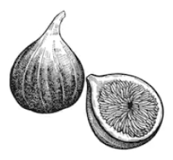

# Introduction {#sec-intro}

[T]{.IEEEPARstart}[his]{}
file is intended to serve as a "sample article file"
for IEEE journal papers produced with (Pandoc/Quarto)-Markdown using `IEEEtran.cls` version 1.8b and later for the PDF output. 
It is based on `bare_jrnl_new_sample4.tex` provided by IEEE Publication Technology, Staff and available from  <https://template-selector.ieee.org/>.
The most common elements are covered in the simplified and updated instructions in `New_IEEEtran_how-to.pdf`.
For less common elements you can refer back to the original `IEEEtran_HOWTO.pdf`. 
It is assumed that the reader has a basic working knowledge of  @mittelbach2023latex and of (Pandoc/Quarto)-Markdown [@MacFarlane_Pandoc; @Allaire_Quarto_2022] markup.


### Figures
An image with nonempty alt text will be rendered as a figure with a caption with Pandoc and Quarto.
Quarto includes a different features to simplify the use of figures and subfigures.
Here, it is recommended to use div block with `#fig-` label to embed your Figures.


:::{#fig-1}
{width="30%"}

An example of figure.
:::


:::{#fig-2  layout-ncol=2}
{#fig-2a}

{#fig-2b}

An example with sub-figure.
:::


The figures is cross-referenced as @fig-2  and even the sub-figures as @fig-2b.

### Tables {#sec-tables}

Similarly, many kind of tables may be used with Pandoc and Quarto.
The latter also includes different features to simplify the table output.
To make tables cross-referenceable use a label with a `#tbl-` prefix. 
\
However, it is recommended to avoid using the commonly used single Markdown table known as a 'pipe table'. 
In fact, Pandoc Markdown uses the  `longtable` package, which does not support the two-column mode, which is required for most `IEEEtran` journals.
`quarto-ieee` uses a hack to temporarily switch to one-column mode. 
However, this hack may break the page layout.
To overcome this issue, a basic way is to use code cells (as for @tbl-other).
Quarto is a multi-language and it uses  `Knitr` to execute `R` code and can execute  Python code blocks within Markdown.

::: {#tbl-panel layout-ncol=2}
| Col1 | Col2 | Col3 |
|------|------|------|
| A    | B    | C    |
| E    | F    | G    |
| A    | G    | G    |

: First Table {#tbl-first}

| Col1 | Col2 | Col3 |
|------|------|------|
| A    | B    | C    |
| E    | F    | G    |
| A    | G    | G    |

: Second Table {#tbl-second}

Main Caption 
:::

The Tables are cross-referenced as @tbl-panel for details, especially @tbl-second.
There is also @tbl-other.

```{r}
#| label: tbl-other
#| tbl-cap: "A table"
#| tbl.env: tabular
#| fig-pos: h

options(knitr.table.format = function() {if (knitr::is_latex_output()) 'latex' else 'pandoc'})
dt <- data.frame(Col1=c('A','B','C'),
                 Col2=c('D','E','F'),
                 Col3=c('G','H','I'))

knitr::kable(head(dt), booktabs = TRUE)
```

## Bibliography

IEEE journal should normally use IEEEtran[^bibtex]  style.
Nevertheless, Pandoc and Quarto do support  with natbib or biblatex. However, neither is officially recommended for normal IEEE use.
For this reason, `quarto-ieee` uses `citeproc` with the `ieee` CSL style sheet.

[^bibtex]: IEEEtran BibTeX  style support  page is: <http://www.michaelshell.org/tex/ieeetran/bibtex/>


# Conclusions
The conclusion goes here.

# Acknowledgment {-}
This should be a simple paragraph before the References to
thank those individuals and institutions who have supported
your work on this article.


[]{.appendix options="An Appendix"}


Use `[]{.appendix options="An Appendix"}` markup if you have a single appendix.
`IEEEtran` state that to do not use `\section{}` anymore after `\appendix`.


::: {.content-visible when-format="pdf"}
# References {-}
:::


[^issues-1023]: ["_[longtable not compatible with 2-column LaTeX documents](https://github.com/jgm/pandoc/issues/1023>)_", 

[^issues-2275]: See the issue here <https://github.com/quarto-dev/quarto-cli/issues/2275>

[IEEEXplore<sup>®</sup>]: <https://ieeexplore.ieee.org/>
